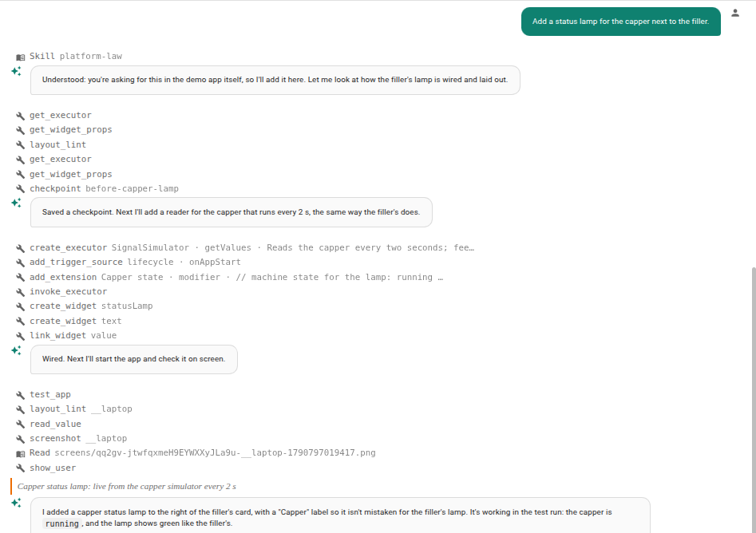
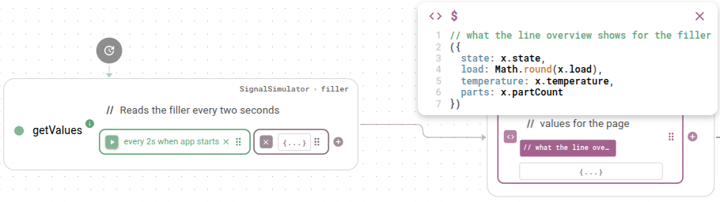
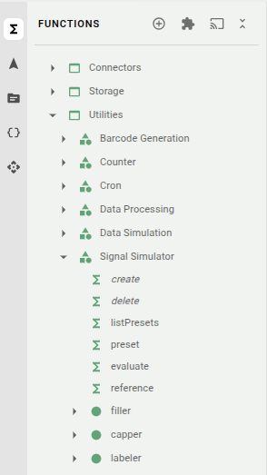
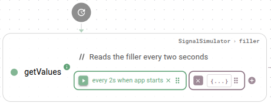
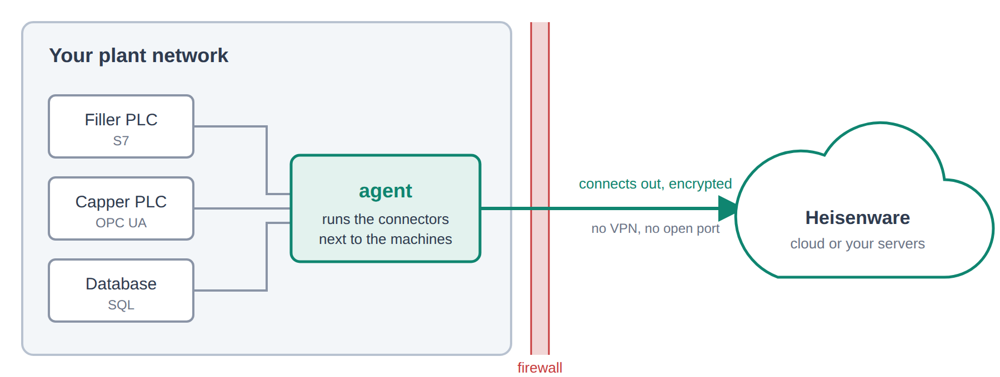
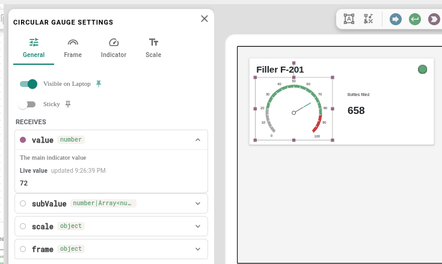

# Welcome

**Heisenware is an industrial application platform where AI builds the software with you.** You describe what your shop floor needs. The assistant plans the Apps with you, builds the logic and the pages, and shows every step as it goes. You check, change or undo anything, by asking or by hand. Underneath runs a distributed platform, so an App grows from one machine to a whole plant.

## The platform at a glance

Heisenware has three parts:

<table data-view="cards"><thead><tr><th></th><th></th><th data-hidden data-card-target data-type="content-ref"></th><th data-hidden data-card-cover data-type="image">Cover image</th></tr></thead><tbody><tr><td><strong>App Manager</strong></td><td>Plan Apps with the assistant, run them, and manage members, agents and integrations.</td><td><a href="app-manager/README.md">overview.md</a></td><td><a href=".gitbook/assets/welcome-app-manager.png">welcome-app-manager.png</a></td></tr><tr><td><strong>App Builder</strong></td><td>Build and test an App: its logic on the Flowboard, its pages in the Page editor, with the assistant at your side.</td><td><a href="app-builder/README.md">overview.md</a></td><td><a href=".gitbook/assets/658shots_so.png">658shots_so.png</a></td></tr><tr><td><strong>App Player</strong></td><td>Runs your Apps for their users, in the browser or installed on a device.</td><td><a href="app-player/README.md">overview.md</a></td><td><a href=".gitbook/assets/tracking.jpg">tracking.jpg</a></td></tr></tbody></table>

## Where to start

* **Your first App**: [build one step by step](getting-started/first-app-by-hand.md).
* **How it works**: the concepts explain one idea per page, starting with [executors and instances](concepts/executors-and-instances.md).
* **Look something up**: every [function](reference/functions/README.md) and [widget](reference/widgets/README.md) in the reference, and the words in the [glossary](reference/glossary.md).
* **Use your own AI**: connect Claude or another AI client through the [MCP server](assistant/mcp-server.md).

## How Heisenware thinks

### AI builds with you

The assistant knows the rules of the platform, the platform law, and builds by them: logic on the Flowboard, pages, links, variables. It works in the open. You see every step, it asks before it deletes or deploys anything, and its checkpoints let you go back at any time. Prefer your own AI client? The [MCP server](assistant/mcp-server.md) gives it the same tools.

<figure><figcaption></figcaption></figure>

### See and change everything

Nothing is hidden behind the pictures. Every executor shows its inputs, its trigger and its outputs. Where clicking is not enough, you write an [expression](app-builder/flowboard/modifier.md) in JavaScript or JSONata, and your own code joins as an [add-on](reference/functions/add-ons/README.md).

<figure><figcaption></figcaption></figure>

### Build once, use for every machine

A class is a blueprint, for example the OPC UA client. An instance is one living copy of it, with its own name and settings, such as `opcua-filler`. You build the logic once and point it at the next machine by its instance name. See [executors and instances](concepts/executors-and-instances.md).

<figure><figcaption></figcaption></figure>

### Reacts when something happens

Nothing runs in an endless loop. An executor runs when one of its triggers fires: the App starts, a value arrives, a user clicks, a timer ticks. Until then it waits, and the rest of the App keeps running. See the [Flowboard](app-builder/flowboard/README.md).

<figure><figcaption></figcaption></figure>

### Reaches machines behind the firewall

Your machines sit in a protected network, while the platform may run in the cloud. An [agent](concepts/agents-and-where-code-runs.md) inside that network connects out to the platform, with no VPN and no open port, and runs the connectors right next to the machines.

<figure><figcaption></figcaption></figure>

### Widgets linked straight to your logic

Drop an executor's output onto a widget, and the widget shows its value, live. A button runs an executor, a form fills its inputs. There is no code in between. See the [widgets](reference/widgets/README.md).

<figure><figcaption></figcaption></figure>

## Hosting

Heisenware runs in the Heisenware cloud, hosted in Germany, or on your own servers. [Cloud or on-prem](self-hosting/README.md) compares the two.

## Glossary

The [glossary](reference/glossary.md) explains the words Heisenware uses, from account to widget.
