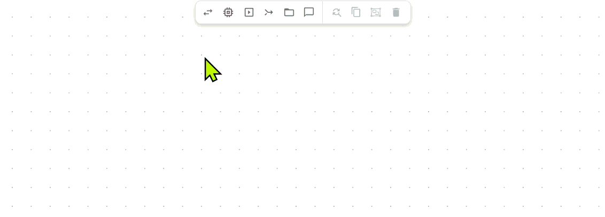

# Build Backend

In the backend, you define the intelligence and connectivity of your application. You build logic visually on a global canvas by connecting functional blocks, allowing for real-time data processing and seamless integration with external systems.

## How the backend works

The backend operates on a few fundamental rules:

* **Event-driven logic**: Nothing happens in a vacuum. [Functions](functions.md) only execute when they receive a trigger or a data update.
* **Persistent environment**: Unlike the UI, which only exists when a user opens the app, your backend logic resides in the Backend Builder and can run processes in the background.
* **Bridge to local data**: If you need data from a local network (like a factory floor), you use [Edge Agents](function-explorer/agents/) to tunnel that information securely into your backend.

### Your backend tools

To build and manage this logic, you use three primary tools located in the App Builder:

* [**Backend Builder**](./#flow-builder): The central canvas where you drag, drop, and wire [functions](functions.md) together.
* [**Function Explorer**](function-explorer/): The searchable panel on the left where you find all available functions.
* [**File Explorer**](file-explorer.md): The searchable panel on the left where you can load and manage files (CSVs, PDFs, etc.) that your logic (but also your UI) needs to read or where it can write to.

## Backend Builder

The Backend Builder is your visual engineering environment. It provides an endless canvas where you build application backend logic by dragging, dropping, and connecting functions.

Unlike traditional programming that relies on variables, the Backend Builder uses a data-driven architecture. Data flows directly from one function's output to another's input, creating reactive, event-driven sequences (flows).

To build your logic, you interact with [functions](functions.md) directly on the canvas using the following core actions:

### Adding functions

* **From the library**: Drag functions from the [functions library](function-explorer/) in the left panel.
* **Quick access**: Use the toolbar for common utilities like `echo`, `memory`, `trigger`, or `combine`.

<figure><figcaption></figcaption></figure>

### Sequencing functions

You create flows by drawing wires between functions. Click on the output of a function (or its [modifier](modifier.md)) from which you want to transfer data or events, and drag it to the part of the next function you intend to receive it.

* **Output to trigger**: Drag a connection to the trigger box of the next function if you want the completion of the first function to execute the second without handing over data.
* **Output to input**: Drag a connection to an input port to hand over specific data.
* **Reactive inputs**: An input on the second function can be internally connected to its own trigger. This ensures the function executes automatically whenever that input value is updated or changed.

#### Logic behavior

* **Event-driven**: Once a function completes, it passes data through the wire to immediately start the next step.
* **Flexible routing**: One output can drive multiple functions, and inputs can receive data from many sources across the canvas or UI.


#### **Session** isolation

Functions and flows execute in an isolated manner for each user session. This ensures that data processing for one user or machine does not interfere with another. Each session maintains its own state and logic execution path, providing a secure and predictable environment for multi-user applications.


### **Grouping (sections)**

As your application grows, use grouping to keep the canvas clean. To group, select multiple functions and click the group icon in the toolbar to create a named container. This is a visual aid that can be collapsed to save space.

<figure><figcaption></figcaption></figure>


&#x20;Sections have no impact on how the logic executes when using production apps.


### **Annotations (documentation of your backend logic)**

Use the annotation tool to place free-text notes anywhere on the canvas. These are ideal for documenting complex logic paths or leaving instructions for other developers.

<figure><figcaption></figcaption></figure>

### Controls to navigate the canvas

* **Panning**: Use your trackpad, or hold Shift + mouse wheel for horizontal movement and just the mouse wheel for vertical movement. You can also use WASD on your keyboard to pan.
* **Zooming:** Use trackpad pinch-to-zoom or hold Ctrl + mouse wheel. You can also zoom in and out using Q and E on your keyboard.


You can customize these controls (like mouse wheel behavior) in the [App Builder settings](/broken/pages/pDUoPQsd9ZlFq3cdGCx6).


### Search and replace

To make bulk configuration changes, select at least two functions to activate the Search and replace tool in the toolbar. This allows you to find a specific string within the selected functions (such as a device's IP address) and replace it with a new value across all of them at once.


Search and replace currently only supports strings without spaces.


<figure><figcaption></figcaption></figure>

### App Builder Settings

You can customize how the Backend Builder behaves and how you control the canvas. To access these, click the Settings icon in the toolbar. These preferences improve your efficiency and help you tailor the environment to your workflow.

<figure><figcaption></figcaption></figure>

#### Viewport Controls

This defines the navigation logic of the canvas. You can choose between two primary modes:

* **Design-tool-like**: Mimics the behavior of tools like Figma or Miro.
* **Google-maps-tool**: Navigation behaves like an interactive map.

#### Grid and Snapping

* **Grid Size**: Defines the size of the canvas grid.
* **Snap to Grid**: When enabled, function blocks will align to the grid for a cleaner layout. Setting the grid size to 0 disables snapping entirely.

#### Navigation (WASD)

For users who prefer keyboard navigation, you can fine-tune your movement:

* **Invert WASD Controls:** Switches the direction of the W, A, S, and D keys. By default, W is up and S is down.
* **Pan Speed**: Controls how fast the camera moves across the canvas when using WASD.
* **Zoom Speed**: Controls the sensitivity of the Q (zoom out) and E (zoom in) keys.

#### Default Modifier Type

Every time you add a [modifier](modifier.md) to a function, Heisenware defaults to a specific type. You can choose which one appears first:

* **JSONata**: Ideal for data transformation and querying.
* **JavaScript**: Use this if you prefer writing standard JS logic for your modifiers.

#### Debug Backend

This enables advanced backend debugging.


This setting should typically remain off. It is intended for support cases when working directly with the Heisenware technical team.


