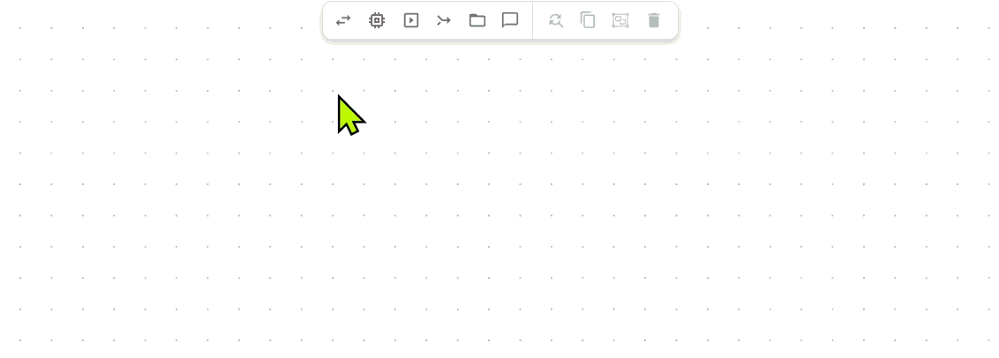

# Build backend

The backend is the working core of your App. It fetches, processes, and stores data, talks to machines and external systems, and drives everything users see in the UI. You build it visually by wiring functions into flows on a global canvas.


#### Always-on logic

Backend logic runs in the background, even when no user has the App open. This makes the backend the central hub for continuous data processing and system monitoring.


## Core backend components

* [**Functions**](functions/): The atomic building blocks of your logic. They fetch data, process information, manage databases, and control devices. Find them all in the [Function Explorer](functions/function-explorer.md).
* [**Extension nodes**](extension-nodes/): Modifiers, filters, recorders, and error handlers that refine data directly inside a flow.
* [**Agents**](agents/): Standalone gateways that execute logic (like connectors) directly inside a local network, for example on a factory floor, and tunnel the data securely into your backend.
* [**Files**](file-explorer.md): CSVs, PDFs, images, and other resources your logic or UI reads from and writes to. Manage them in the File Explorer.

## Backend Builder

Turn individual functions into automated flows inside the Backend Builder. Drag functions onto the endless canvas and wire them together. Data moves directly from one function's output to the next function's input, creating reactive, event-driven sequences. Each function on the canvas is a function node. Together with extension nodes, they form the building blocks of every flow.

### Adding functions

* **From the Explorer**: Drag functions from the [Function Explorer](functions/function-explorer.md) in the left panel onto the canvas.
* **Quick access**: Use the toolbar for common utilities like `echo`, `memory`, `trigger`, or `combine`.

<figure><figcaption></figcaption></figure>

### Sequencing functions

Create flows by drawing wires between functions. Click the output of a function (or a [modifier](extension-nodes/modifier.md) attached to it) and drag the wire to the part of the next function that receives it.

* **Output to trigger**: The completion of the first function executes the second, without handing over data.
* **Output to input**: Hands over specific data to the next function.
* **Reactive inputs**: You can internally connect an input to its trigger. The function then executes automatically whenever that input value updates.

Functions only execute when they receive a trigger or a data update. One output can drive multiple functions, and inputs can receive data from many sources across the canvas or UI.


#### Session isolation

Functions and flows execute in isolation for each user session. Each session keeps its own state and execution path, so data processing for one user or machine never interferes with another.


### Grouping (sections)

Keep a growing canvas clean by grouping functions. Select multiple functions and click the group icon in the toolbar to create a named container that you can collapse to save space. Groups are a visual aid only and have no impact on how the logic executes.

To bundle functions into a reusable custom function instead, use a [subflow](functions/subflows.md).

<figure><figcaption></figcaption></figure>

### Annotations

Place free-text notes anywhere on the canvas using the annotation tool, for example to document complex logic paths or leave instructions for other developers.

<figure><figcaption></figcaption></figure>

### Tidying the canvas

The Backend Builder previews layout changes before applying them: every moved node turns orange. Confirm the new layout with the check icon or revert it with the round arrow icon; both icons appear in the toolbar.

* **Clear collisions** (snowplow): Moves functions, extension nodes, sections, and other canvas elements just enough to remove overlaps between nodes. Start it from the toolbar.
* **Auto-format all**: Rebuilds the entire layout. An algorithm groups connected logic into islands and arranges all elements for readability. Start it from the toolbar.
* **Placing new nodes**: When you drop a new function or extension node onto the canvas, nearby nodes shift automatically to make room. Confirm or revert the shift the same way.

### Navigating the canvas

* **Panning**: Use your trackpad, or hold Shift + mouse wheel for horizontal movement and the mouse wheel alone for vertical movement. You can also pan with WASD on your keyboard.
* **Zooming**: Use trackpad pinch-to-zoom or hold Ctrl + mouse wheel. You can also zoom with Q and E on your keyboard.


Customize these controls (like mouse wheel behavior) in the [App Builder settings](../overview.md#app-builder-settings).


### Search and replace

Change the configuration of many functions at once. Select at least two functions to activate the search and replace tool in the toolbar, then find a specific string (such as a device's IP address) and replace it with a new value across the whole selection.


Search and replace currently only supports strings without spaces.


<figure><figcaption></figcaption></figure>
