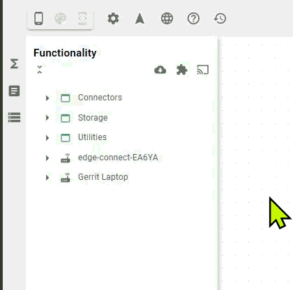

# Function Explorer

The Function Explorer is the structural repository in the left panel that holds all tools required to build your application logic. It organizes available functions into logical categories and hierarchies (such as classes and instances), and allows you to drag and drop them directly onto the Backend Builder canvas.

<figure><figcaption></figcaption></figure>

## Categories

By default, the library organizes functions into three primary categories:

* [**Connectors**](connectors/): A set of integration functions for standard protocols (MQTT, OPC UA, HTTP) and API blocks used to interface with external hardware and software systems. Connectors require a direct network connection or internet accessibility for the systems you intend to connect.
* [**Storage**](storage/): This is your hub for data persistence. It provides direct access to built-in relational (PostgreSQL) and time-series (InfluxDB) databases, and it is also the place where you connect and manage your own external databases.
* [**Utilities**](utilities/): Mathematical operations, logic gates, and data transformation blocks used to refine data flows.
* Custom: All custom made functionality is organized here.

## Extending functionality

If your requirements exceed the default set of functions, you can expand the library through agents, extensions, or custom code.

### Agents

For isolated local networks or systems without internet access, you must use a native or Docker [agent](agents/). Once an agent is installed and started, the agent itself and any connectors built within it appear automatically in the library. These agents act as secure bridges, allowing you to interact with on-premise hardware as if it were natively connected.

### Extensions

[Extensions](./#extensions) allow you to expand the platform's capabilities using container technology. An extension is a standard Docker image that Heisenware executes and exposes as visual functions within your library.

There are two categories of extensions:

* **Official extensions**: Ready-to-use, managed modules maintained by Heisenware.
* **Custom extensions**: Your very own Docker images containing custom algorithms or logic (also known as custom code adapters).

### Smart onboarding

Smart onboarding is a secure mechanism for connecting external clients, such as IoT devices, to your account without manual credential exchange. The process is similar to pairing a Bluetooth device.

To onboard a source, follow these 5 steps:



#### Initiate request

Start a connection request from your external source.



#### Open App Builder

Access the app where you wish to use the integration.



#### Start onboarding

Click the onboarding icon (<i class="fa-screencast">:screencast:</i>) in the functions library panel.



#### Select source

Choose the trusted source you wish to onboard from the appearing list.



#### Stop process

Click the onboarding icon again to close the pairing window.




**Security note:** Only onboard sources you trust. If no source appears while onboarding is active, verify that the connection request from the external device is configured correctly.


<figure><figcaption></figcaption></figure>

Once an external source is successfully onboarded, the new integration is automatically listed in the [integrations panel](../../../app-manager/integrations-inbound-connections.md) within the App Manager. From there, it is globally available to be used across different applications.
