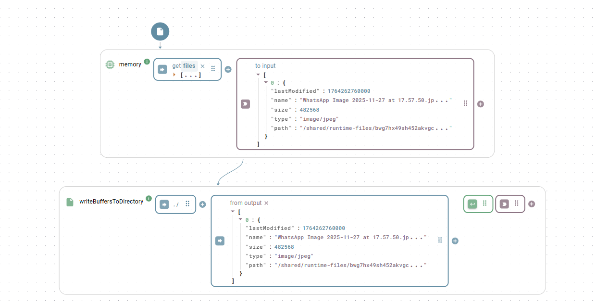

# File I/O

The `File` class is a comprehensive, static utility for handling various file input and output (I/O) operations. It provides a unified interface to read data from multiple file formats, write data to files, and manage files and folders on the local filesystem.

Since all methods in this class are **static**, you do not need to create an instance of it.


IMPORTANT

It is crucial to understand _where_ the `File` functions are executed.&#x20;

1. Heisenware Platform\
   If you use them just directly as they are, all functions are "seeing" the file system of the platform installation itself. This is equivalent of what you can see when using the [Resources](../../file-explorer.md) browser. The route path to all resources is called `/shared`. Hence, to refer to a file in the uploads folder the full path looks like: `/shared/uploads/test.csv`
2. Your local OS\
   Very often you want to deal with files that are physically located on your premises. In that case you first have to compile, download and install an [Agent](../agents/) containing this `File` class. Once, taking the functions out of the agent, the underlying file system reflects the one the agent is running on (your local OS). Now, the file paths are the regular ones that you would use yourself to open your local files, like: `C:\Users\YourUserName\Documents/test.csv`



Pitfall on Windows

When referring to paths on a windows OS, remember to quote the YAML input as otherwise a `C:\Users` would be parsed as an object with key `C` and value `\Users`. So, define it like: `'C:\Users'`


## Universal Read Function

### read

Reads a file from disk and automatically parses its content based on the file extension. This function acts as a convenient wrapper, calling the appropriate specific read function (e.g., `readCsv`, `readPdf`) for you.

**Parameters**

* `filename`: The full path to the file.
* `options`: An optional object containing configuration options specific to the file type being read.

Example

Goal: Automatically parse a file without knowing its type beforehand.

```yaml
# filename
/path/to/my-data.xlsx
```

> This will internally call `readXlsx` and return the parsed JSON content.

## Basic File Operations

### readFileToBuffer

Reads any file from disk and returns its entire content as a **base64 encoded string**.

**Parameters**

* `filePath`: The path of the file to read.

### writeBufferToFile

Writes a base64 encoded string to a new file on disk.

**Parameters**

* `filePath`: The full path where the file will be saved, including the filename and extension.
* `buffer`: The content of the file as a base64 encoded string.

### writeBuffersToDirectory

Writes one or more buffer-[file objects](../../../build-frontend/widgets/input-widgets/photo.md#file-object-structure) to a specified directory

**Parameters**

* `dirname`: The path to the directory into which the provided file(s) should be written.
* `bufferData`: A single object or an array of objects containing at least the `name` and the `base64` property&#x20;

<figure><figcaption><p>This functions plays nice with the <a href="../../../build-frontend/widgets/input-widgets/photo.md">Photo</a> or <a href="../../../build-frontend/widgets/input-widgets/upload.md">File</a> widget when configured use <code>Buffer</code> as storage type. When executing as agent, this allows to realize something like an Image server.</p></figcaption></figure>


Using this two or three simple functions, you can happily realize a file share between your App and your local OS. It allows you for example to store pictures taken with the App (see [Photo](../../../build-frontend/widgets/input-widgets/photo.md) widget) on your own file server.


### moveFile

Moves or renames a file.

**Parameters**

* `oldPath`: The original path of the file.
* `newPath`: The new path for the file.

### copyFile

Copies a file from a source path to a destination path.

**Parameters**

* `src`: The path of the file to copy.
* `dest`: The path where the copy will be created.

### deleteFile

Deletes a file from the filesystem.

**Parameters**

* `filename`: The path of the file to delete.

## Folder Management

### createFolder

Creates a new folder at the specified path.

**Parameters**

* `path`: The path where the new folder should be created.

### deleteFolder

Deletes a folder and all of its contents recursively.

**Parameters**

* `dir`: The path of the folder to delete.

### browse

Recursively scans the content of a folder and returns a JSON object representing its structure, including files and subfolders.

**Parameters**

* `filename`: The path to the folder to browse.

Output

A nested JSON object detailing the folder's contents, including properties like name, path, size, isDir, and a children array for directories.

**Output Example** The function returns a nested JSON object representing the complete directory tree.

```json
{
  "id": "12345",
  "path": "/path/to/project",
  "name": "project",
  "modDate": "2025-08-22T12:02:00.000Z",
  "size": 4096,
  "isDir": true,
  "childrenCount": 2,
  "children": [
    {
      "id": "12346",
      "path": "/path/to/project/report.docx",
      "name": "report.docx",
      "modDate": "2025-08-21T10:30:00.000Z",
      "size": 15360,
      "isDir": false,
      "isFile": true,
      "isSymlink": false
    },
    {
      "id": "12347",
      "path": "/path/to/project/images",
      "name": "images",
      "modDate": "2025-08-22T11:00:00.000Z",
      "size": 4096,
      "isDir": true,
      "childrenCount": 1,
      "children": [
        {
          "id": "12348",
          "path": "/path/to/project/images/logo.png",
          "name": "logo.png",
          "modDate": "2025-08-20T14:00:00.000Z",
          "size": 5120,
          "isDir": false,
          "isFile": true,
          "isSymlink": false
        }
      ]
    }
  ]
}
```

## CSV File Handling

### readCsv

Reads a CSV file or a CSV string and converts it into an array of JSON objects. This function is a powerful wrapper around the `csvtojson` library.

**Parameters**

* `fileInfo`: The path to the `.csv` file, a raw CSV string, OR a base64 encoded string of the file content.
* `options`: An optional configuration object.
  * `delimiter`: The column delimiter. Can be a string (e.g., `;`), `'auto'` for detection, or an array of potential delimiters (e.g., `[',', ';', '|']`).
  * `checkType`: If `true`, automatically converts numbers, booleans, and JSON objects/arrays from strings to their native types. Defaults to `false`.
  * `headers`: An array of strings to manually set the header names for each column. Use this if the CSV has no header row.
  * `noheader`: A boolean indicating the CSV file has no header row. When `true`, the output will be an array of arrays instead of an array of objects.
  * `output`: Can be set to `'json'` (default), `'csv'` (array of arrays), or `'line'` (each line as a string).
  * `ignoreEmpty`: If `true`, empty lines in the CSV will be ignored.
  * `flatKeys`: If `true`, converts nested JSON in headers (e.g., `person.name`) into nested JSON objects in the output.
  * `colParser`: An object to define custom parsing logic for specific columns. Keys are the column headers, and values are functions to transform the data.

**Example 1: Reading a semicolon-delimited CSV with type conversion**

```yaml
# fileInfo
/path/to/data.csv
# options
delimiter: ;
checkType: true
```

**Example 2: Reading a CSV with no header row**

```yaml
# fileInfo
'1,ProductA,19.99\n2,ProductB,25.50'
# options
noheader: true
headers: ['id', 'name', 'price']
checkType: true
```

### writeCsv

Converts an array of JSON objects into a CSV string and writes it to a file.

**Parameters**

* `json`: An array of JSON objects.
* `filename`: The path where the `.csv` file will be saved.
* `options`: An optional configuration object.
  * `keys`: An array of strings specifying which properties to include as columns and in what order.
  * `delimiter`: The delimiter to use. Defaults to `,`.
  * `prependHeader`: If `false`, the header row will not be included in the output. Defaults to `true`.
  * `excelBOM`: If `true`, adds a BOM character to ensure correct UTF-8 display in Excel.

**Example: Writing specific keys to a CSV file without a header**

```yaml
# json
[
  { "id": 1, "name": "Product A", "price": 19.99, "stock": 100 },
  { "id": 2, "name": "Product B", "price": 25.50, "stock": 250 }
]
# filename
/path/to/output.csv
# options
keys: ['id', 'name', 'price']
prependHeader: false
```

## Excel File Handling

### readXlsx

Reads an Excel file and converts its content into JSON. The result is an object where each key is a sheet name when more than one sheet is available (or queried). The result is a simple array of rows in case only one sheet is available (or queried).

**Parameters**

* `fileInput`: The path to the `.xlsx` file OR a base64 encoded string of the file content.
* `options`: An optional configuration object.
  * `header`: An array of strings to use as headers. If not provided, the first row of the sheet is used.
  * `headerRows`: The number of rows to treat as header (counting from top) and exclude from data.
  * `range`: A string specifying a cell range to read (e.g., `'A2:C10'`).
  * `columnToKey`: An object whose keys identify xlsx columns and whose values define the corresponding name in the result.


**Tipps**

* Use `columnToKey: { '*': '{{columnHeader}}' }` to automatically extract the names from the header.
* Use `columnToKey: { A: '{{A1}}', B: '{{B1}}' }` to use names defined anywhere in the sheet.
*   Use any option within a sheet to configure things per sheet:<br>

    ```yaml
    sheets: [
      {
        name: sheet1,
        range: 'A2:B2'
      },
      {
        name: sheet2,
        range: 'A3:B4'
      }
    ]
    ```


**Example 1: Reading only a specific range from the first sheet**

```yaml
# fileInput
/path/to/report.xlsx
# options
range: 'B2:D10'
header: [product, quantity, price]
sheets: [Sheet 1]
```

**Output**

<pre class="language-json"><code class="lang-json">[
  { "product": "Widget", "quantity": 10, "price": 19.99 },
  ...
<strong>]
</strong></code></pre>

**Example 2: Reading a table with a single header column and mapping columns to names**

```yaml
# fileInput
/path/to/assets.xlsx
# options
headerRows: 1
columnToKey: {
  B: barcode, 
  C: name, 
  D: acquired, 
  H: keeper, 
  K: inventoryNo, 
  M: serialNo, 
  N: costCtr
}
```

**Output**

<pre class="language-json"><code class="lang-json">[
  { "barcode": 187552, "name": "HP Laptop", "acquired": "2025-06-01T00:00:00.000Z" ... },
  ...
<strong>]
</strong></code></pre>

**Example 3: Combine xlsx reading with file upload**

<figure><figcaption><p>Uploads an .xlsx file, saves it as buffer (base64) and then feeds it to the <code>readXlsx</code> function</p></figcaption></figure>

### readXlsxCells

Reads the value(s) of one or more specific cells from an Excel sheet.

**Parameters**

* `fileInput`: The path to the `.xlsx` file or its base64 content.
* `cellAddresses`: A single cell address string (e.g., `'B5'`) or an array of strings (e.g., `['A1', 'C5']`).
* `sheetIdentifier`: The name (e.g., `'Sales'`) or zero-based index (`0`) of the sheet. Defaults to the first sheet.

**Example: Reading multiple cells from a sheet named "Summary"**

```yaml
# fileInput
/path/to/report.xlsx
# cellAddresses
['B2', 'D5']
# sheetIdentifier
'Summary'
```

Output

An array containing the values of the requested cells (e.g., \['Total Revenue', 15000]).

### writeXlsx

Writes an array of JSON objects to a new Excel file.

**Parameters**

* `data`: The array of JSON objects to write.
* `filePath`: The path where the new `.xlsx` file will be saved.
* `options`: An optional configuration object.
  * `sheetName`: The name for the worksheet. Defaults to `'Sheet1'`.
  * `headers`: An array of strings to use as the header row. If not provided, keys from the first data object are used.

**Example**

```yaml
# data
[
  { "product": "Widget", "quantity": 10, "price": 19.99 },
  { "product": "Gadget", "quantity": 5, "price": 49.95 }
]
# filePath
/path/to/new_report.xlsx
# options
sheetName: 'Inventory'

```

## Other Document Formats

### readPdf

Reads a PDF file and extracts its text content and metadata.

**Parameters**

* `filename`: The path to the `.pdf` file.
* `options`: Optional configuration (not typically needed).

Output

An object containing text (the full text content), numpages, numrender, and info (metadata).

**Output Example** The function returns a JSON object containing the extracted text, metadata, and parsing information.

```json
{
  "numpages": 2,
  "numrender": 2,
  "info": {
    "PDFFormatVersion": "1.7",
    "IsAcroFormPresent": false,
    "IsXFAPresent": false,
    "Title": "My Annual Report",
    "Author": "John Doe",
    "Subject": "Q4 Financials",
    "Keywords": "finance, report, Q4",
    "Creator": "Microsoft® Word for Office 365",
    "Producer": "Microsoft® Word for Office 365",
    "CreationDate": "D:20250822120200Z",
    "ModDate": "D:20250822120200Z"
  },
  "metadata": null,
  "text": "\n\nPage 1 Content\n\nThis is the first paragraph of the annual report...\n\nPage 2 Content\n\nThis is the second page...\n\n",
  "version": "1.10.100"
}
```

### readXml

Reads an XML file and converts it into a JSON object.

**Parameters**

* `filename`: The path to the `.xml` file.
* `options`: An optional configuration object for the `xml2js` parser.
  * `attrkey`: The key to use for XML attributes. Defaults to `_attr`.
  * `explicitArray`: If `false`, arrays of one element are converted to a single object. Defaults to `true`.
  * `mergeAttrs`: If `true`, merges attributes into their parent object instead of putting them in a separate `_attr` key.
  * `explicitRoot`: If `false`, the root XML element is not included in the final JSON object.

### readDocx / readPptx / readHtml / readTxt / readMd

These functions all read their respective file types and extract the plain text content.

**Parameters**

* `filename`: The path to the file.
* `options`: An optional configuration object for the `textract` library.
  * `preserveLineBreaks`: If `true`, maintains line breaks from the original document.
