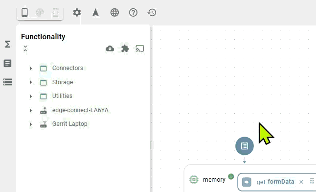

# Extensions

Extensions allow you to expand the platform's capabilities using **Docker** container technology. Fundamentally, an extension is a standard Docker image that the Heisenware platform loads, executes, and exposes as visual functions within the App Builder.

There are two categories of extensions:

1. **Official extensions (Heisenware made)**: Ready-to-use, managed modules maintained by us.
2. **Custom Extensions (user-made)**: Your Docker images containing custom algorithms, drivers, or logic (built by wrapping your code into a [Code Adapter](../../../../account/hosting-and-architecture.md#docker-custom-code-adapter)).

## Official extensions

These are pre-built modules provided by Heisenware to add advanced capabilities without any coding. Currently, we offer the following official extensions:

- [**Industrial blockchain**](industrial-blockchain.md): For immutable data logging and audit trails.
- [**RAG AI**](rag-ai/): Retrieval-Augmented Generation for context-aware AI assistants.
- [**Process simulations**](process-simulations.md): Simulates energy consumption, production and machine data, and silo fill levels.

Once installed, these extensions run alongside the standard platform functionality. They appear as new blocks in your functionality library and can be used immediately in your flows.

<div align="left"><figure><figcaption><p>Adding extensions to the App Builder</p></figcaption></figure></div>

## Custom Extensions

This is a powerful feature that allows you to extend the Heisenware platform to your specific needs.

In essence, we provide you with a project setup into which you can add your custom functionality in a completely non-intrusive fashion. Using the power of our VRPC library under the hood, you can write any valid Node.js code (yes - no APIs nothing, just your code) and make it ready for visual programming in minutes.


We are actively working on having the same idea ready for C++ and Python, stay tuned!


The best place to start is by looking at our [docker-extension-starter-js](https://github.com/heisenware/heisenware-docker-extension-starter-js). Actually, we recommend [downloading](https://github.com/heisenware/heisenware-docker-extension-starter-js/archive/refs/heads/master.zip) this project as a scaffold for you to change it to your needs and place it under your software versioning.

What you end up doing is creating a Docker image whose containers nicely integrate into the platform in one of two possible ways:

### Running in the cloud - _inside_ the platform

Once your Docker image is built, pushed, and publicly accessible ([contact us](mailto:support@heisenware.com) for private registry support), you can easily load it as a `Custom Extension`

<div align="left"><figure><figcaption></figcaption></figure></div>

Once installed and given your code is syntactically correct, it immediately appears in the `Functionality` tree view. Simply install it again if you have a new version (even works with the same label) to be applied.


Any instances you create will be automatically persisted and restarted. You will find them in the [Resources](../../file-explorer.md) under `extensions/my-extension/...`


### Running anywhere - _outside_ the platform

This is a powerful feature. It allows you to run your custom code on-premises but automatically, seamlessly, and securely bridged into the cloud by us. To accomplish that, you simply start a container of the image you created locally and configure it with the correct credentials using environmental variables.

```bash
docker run -it \
-e HW_DOMAIN=<account>.<workspace> \
-e HW_BROKER=mqtts://<account>.heisenware.cloud \
-e HW_USERNAME=<username> \
-e HW_PASSWORD=<password> \
myusername/myimage:1.0.0
```

To retrieve a valid username and password, add a [VRPC Integration ](../../../../app-manager/integrations-inbound-connections.md#method-1-manual-credential-creation)in the App Manager.

_Example_

For an account named `my-company`, an integration with username `agentRunner` and a password called `secret` the call would be:

```bash
docker run -it \
-e HW_DOMAIN=my-company.default \
-e HW_BROKER=mqtts://my-company.heisenware.cloud \
-e HW_USERNAME=agentRunner \
-e HW_PASSWORD=secret \
myusername/myimage:1.0.0
```

When everything is set up correctly, you should see something like this on your console:

<figure><figcaption></figcaption></figure>
