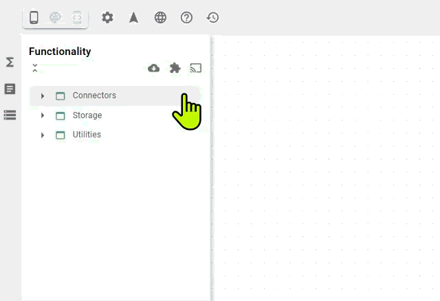

# Process Simulations

The process simulations extension includes various classes that simulate industrial processes and machines. You can use these to generate data that follows specific logic, allowing you to simulate app behavior before connecting real data or simply to get to know the platform better. If you cannot find a process simulation that fits your specific use case, please feel free to reach out, and we will provide a new class for you.

## Energy consumption simulation

The `EnergySimulator` class provides a realistic simulation of utility consumption (power, gas, and hot water) for a typical household or building. It models a continuous, cyclical daily pattern with added randomization to mimic real-world usage fluctuations.

This class is designed to run as a background process. You create an instance with your desired annual consumption targets, start the simulation, and then you can query it at any time to get the live consumption rate or the total accumulated consumption.

### How It Works: The Simulation Model

The simulator's logic is based on a few key principles to achieve realism:

* **Annual Baseline**: You provide the total annual consumption for power, gas, and water. The simulator uses this to calculate an average consumption rate per second.
* **Daily Cycles (Sine Wave)**: Consumption is not constant. It follows a daily rhythm. The simulator uses a sine wave to model this, creating natural peaks and troughs in usage. For example, power usage peaks in the evening, while hot water usage peaks in the morning. This is controlled by a `phaseShift`.
* **Randomization**: To avoid a perfectly predictable pattern, a small amount of random "noise" is added to the calculation every second, making the live consumption values fluctuate slightly, just as they would in reality.

### create

Creates a new energy simulator instance based on total annual consumption figures. The simulation starts automatically upon creation.

<figure><figcaption></figcaption></figure>

**Parameters**

* `config`: An object specifying the total annual consumption for each utility.
  * `power`: Total annual power consumption in kilowatt-hours (kWh).
  * `gas`: Total annual gas consumption in cubic meters (m³).
  * `water`: Total annual hot water consumption in cubic meters (m³).

**Example**

```yaml
# config
power: 4500  // kWh per year
gas: 1200    // m³ per year
water: 90      // m³ per year
```

### start

Starts the simulation loop. Once started, the internal state of the simulator will be updated every second. Note: The simulation starts automatically when the instance is created.

Output

Returns true when the simulation has been started.

### stop

Stops and pauses the simulation loop. The internal consumption values will no longer be updated until `start()` is called again.

Output

Returns true when the simulation has been stopped.

### getLiveValue

Gets the current, instantaneous consumption rate for a specific utility.

**Parameters**

* `mediaType`: The type of utility to query. Must be one of `'power'`, `'gas'`, or `'water'`.

**Example**

```yaml
# mediaType
power
```

Output

A number representing the live consumption rate. The units are:

* **Power**: kilowatts (kW)
* **Gas**: cubic meters per hour (m³/h)
* **Water**: cubic meters per hour (m³/h)

### getAggregatedValue

Gets the total accumulated consumption for a specific utility since the simulator instance was started.

**Parameters**

* `mediaType`: The type of utility to query. Must be one of `'power'`, `'gas'`, or `'water'`.

**Example**

```yaml
# mediaType
gas
```

Output

A number representing the total accumulated consumption. The units are:

* **Power**: kilowatt-hours (kWh)
* **Gas**: cubic meters (m³)
* **Water**: cubic meters (m³)

#### Complete Usage Example

Here’s a step-by-step example showing how to use the `EnergySimulator`.

Step 1: Create a simulator instance

This will immediately start the simulation in the background.

```yaml
# (Call create)
# config
power: 3000
gas: 800
water: 50
```

Step 2: Periodically read live data

You can use another function, like a timer, to periodically query the live values from the simulator.

```yaml
# Triggered by another function that runs every 5 seconds...
# (Call getLiveValue)
# mediaType
power
```

Step 3: Check total consumption after some time

After the simulation has been running for a while, you can check the total accumulated values.

```yaml
# After an hour...
# (Call getAggregatedValue)
# mediaType
water
```

Step 4: Stop the simulation

When you no longer need the data, stop the simulation to free up resources.

```
# (Call stop)
```

## Machine Simulation

The `MachineSimulator` class provides a dynamic, realistic simulation of an industrial CNC machine. It is designed to mimic live telemetry fluctuations (such as temperature, spindle speed, and power load) while simultaneously simulating a production queue by automatically cycling through manufacturing orders and operations.

This class is highly useful for prototyping shopfloor dashboards, testing OEE (Overall Equipment Effectiveness) calculations, or demonstrating real-time data pipelines without needing access to physical hardware.

### create

Creates a new CNC machine simulation instance and configures its basic identity.

Parameters

* `config`: An object specifying the machine's static details.
  * `id`: A unique identifier for the machine (e.g., `'m-01'`).
  * `name`: A human-readable display name (e.g., `'Milling Station A'`).
  * `model`: (Optional) The model number or type. Defaults to `'Generic-CNC'`.

Example

```yaml
# config
id: 'cnc-042'
name: '5-Axis Miller'
model: 'Mazak-X5'
```

### connect

Starts the internal simulation loop. Once connected, the machine's state will automatically transition from `OFFLINE` to `IDLE`, load its first simulated production order, and begin updating its telemetry every second.

Output

Returns `true` (void) when the simulation loop has successfully started.

### disconnect

Stops the internal simulation loop. This halts the production cycle and resets the machine's telemetry sensors back to their `OFFLINE` baseline values (e.g., setting spindle speed and power load to 0, and allowing temperature to return to ambient).

Output

Returns `true` (void) when the simulation has been stopped.

### getData

Retrieves a real-time snapshot of the machine's current state. This is the primary function you will use to pull data into your frontend widgets or record it to a time-series database.

Output

Returns a flat JSON object containing both the machine's hardware telemetry and its active production data.

Output Example

```json
{
  "id": "cnc-042",
  "name": "5-Axis Miller",
  "model": "Mazak-X5",
  "timestamp": "2026-02-19T10:25:14.000Z",
  "status": "RUNNING",
  "spindleSpeed": 11950.4,
  "feedRate": 1495.2,
  "temperature": 64.8,
  "powerLoad": 76.1,
  "currentOrderId": "ORD-8392",
  "operationId": "OP-45",
  "partName": "Flange-X9",
  "targetQuantity": 45,
  "completedQuantity": 12,
  "cycleTime": 4,
  "lastCycleStart": 1708338310000
}
```

#### **Understanding the Output Payload**

The returned data object consists of three distinct categories:

1\. Identity & Status

* `timestamp`: The exact ISO string time the snapshot was taken.
* `status`: The current simulated state. Can be `'OFFLINE'`, `'IDLE'`, `'RUNNING'`, `'ERROR'`, or `'MAINTENANCE'`. The simulator includes built-in logic to occasionally throw minor errors and automatically recover from them to mimic real-world unpredictability.

2\. Hardware Telemetry

* `spindleSpeed`: The speed of the main spindle in RPM (targets \~12,000 when running).
* `feedRate`: The tool feed rate in mm/min (targets \~1,500 when running).
* `temperature`: The engine/tool temperature in °C. Heats up to \~65°C during operation and naturally cools down to ambient (20°C) when idle.
* `powerLoad`: The electrical load as a percentage (0-100%).

3\. Order & Production Specifics

* `currentOrderId` / `operationId` / `partName`: Randomly generated metadata for the current job.
* `targetQuantity`: The total number of pieces required for the current order.
* `completedQuantity`: The number of pieces finished so far.
* `cycleTime`: The time (in seconds) it takes to produce a single piece.

_Note: The simulator handles part completion automatically based on the `cycleTime`. Once the `completedQuantity` reaches the `targetQuantity`, the machine will briefly idle before automatically starting a new randomized order._

## Silo fill level simulation

The `SiloSimulator` class provides a dynamic simulation of a silo's fill level. It models a continuous process where a silo gradually empties over a configurable period and then automatically triggers a rapid refill cycle once it reaches a low threshold (10% of capacity).

This class is an event-driven utility. You start the simulation and then listen for real-time level updates to power dashboards, trigger alerts, or test data pipelines. An instance must be created to represent a single silo.

### create

Creates a new silo simulator instance with a specified capacity and emptying time.

**Parameters**

* `options`: An object for configuring the silo's properties.
  * `capacity`: The maximum fill level of the silo. Defaults to `100`.
  * `timeToEmpty`: The approximate time, in seconds, for the silo to empty from 100% down to the 10% refill threshold. Defaults to `60`.

**Example**

```yaml
# options
capacity: 500  // e.g., in kilograms or tons
timeToEmpty: 300 // 5 minutes

```

### start

Starts the simulation loop. Once started, the silo will begin its emptying/refilling cycle, and level updates will be emitted every second to any registered listeners.

Output

Returns true when the simulation has been started.

### stop

Stops and pauses the simulation loop. No more level updates will be sent until `start()` is called again.

Output

Returns true when the simulation has been stopped.

### getLevel

Manually retrieves the current fill level of the silo at any given moment.

Output

A number representing the current fill level (e.g., 85.34).

### onLevelUpdate

Registers a handler (listener) that is triggered **every second** while the simulation is running. This is the primary way to receive data from the simulator. The listener function receives the current level as its only argument.

**Parameters**

* `callback`: The callback function to execute on each level update.

**Example**

```
# callback
<callback>

```

#### Complete Usage Example

Here’s a step-by-step example showing how to use the `SiloSimulator`.

Step 1: Create a silo instance

First, create the simulator with your desired parameters.

```
# (Call create)
# options
capacity: 200
timeToEmpty: 10

```

Step 2: Register a listener to receive data

Next, set up a handler to process the level updates as they are emitted.

```
# (Call onLevelUpdate)
# callback
<callback that receives the level and, for example, logs it to the console>

```

Step 3: Start the simulation

The silo will now begin emptying, and your listener from Step 2 will be called every second with the new level.

```
# (Call start)

```

> After about 10 seconds, the silo level will drop to near 20 (10% of capacity). It will then automatically switch to "refilling" mode and quickly fill back up to 200 before starting the emptying cycle again.

Step 4: Manually check the level (optional)

At any point while it's running, you can get the current level on demand.

```
# (Call getLevel)

```

Step 5: Stop the simulation

When you no longer need the data, stop the simulation.

```
# (Call stop)
```
