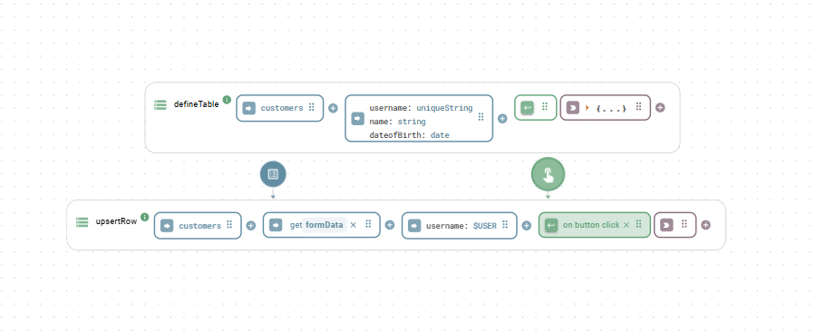

# Relational Database

The `Relational Database` class provides a consistent way to interact with SQL databases (PostgreSQL, MySQL, SQLite) without writing raw SQL.

### Quick start: The internal PostgreSQL instance

Heisenware provides a pre-initialized instance called `internal-postgres`. It is globally available and ready for use.  Simply select `internal-postgres` in your Function's instance field to start creating tables and managing data.

<p align="center"></p>

### Connecting an external database

To connect to your own external database, you must use the `create` function. How you configure this depends on where your database is located:

* **Cloud/public database**: If your database is accessible over the internet, you can create the instance directly in your cloud environment.
* **Local database (via Agent)**: If your database is inside a private network (e.g., on a shopfloor server), you must first deploy an [Edge Agent](../agents/) in that network. You then create the database instance _within_ that Agent to establish a secure bridge.


**One set of functions**: Whether you are using the internal database or an external connection, the functions for querying, inserting, and managing data are identical.


## Connection & Database Management

### **create**

Initializes the database connection. This is the first step for any external database.


Skip this step for the  `internal-postgres`. It is already instantiated for you.


Parameters

* `options`: An object for configuring the database connection.
  * `dialect`: The database dialect (e.g., `'postgres'`, `'mysql'`).
  * `database`: The name of the database.
  * `username`: The username for authentication.
  * `password`: The password for authentication.
  * `host`: The hostname or IP address of the database server.
  * `port`: The port number.
  * `ssl`: Whether to use SSL. Defaults to `true` for some dialects.

Example

```yaml
# options
dialect: 'postgres'
database: 'mydb'
username: 'user'
password: 'pass'
host: 'localhost'
ssl: true
```

### **isConnected**

Checks if the database connection is currently active. Returns `true` if connected, `false` otherwise.

Output&#x20;

Returns `true` if connected, `false` otherwise.

### **getAllTables**

Retrieves a list of all tables that currently exist in the database.

Output An array of table name strings.

### **reset**


DANGER: This function drops and recreates the entire database, deleting ALL tables and data. Use with extreme caution.


Output&#x20;

Returns `true` if the reset was successful.

## Schema & Table Definition

### **defineTable**

Defines a table's schema. If the table doesn't exist, it's created. If it exists, this function will attempt to alter it by adding any new fields.

When creating a table, several fields are automatically added unless you explicitly define an `id` field yourself:

* `id`: A unique `UUID` that serves as the table's primary key.
* `createdAt`: A `date` timestamp recording when the row was created.
* `updatedAt`: A `date` timestamp tracking the last time the row was modified.

Parameters

* `name`: The name of the table (e.g., `'users'`).
* `fields`: An object defining the table's columns.
  * Keys are the field names (must be in camelCase).
  * Values can be a simple string for the data type or an object for more options.
  * Supported data types: `string`, `text`, `integer`, `number`, `boolean`, `date`, `json`, `jsonb`, `file`, `uniquestring`, `uniqueinteger`.
* `options`: An optional object.
  * `trackHistory`: If `true`, a separate history table is created to log all changes to records in this table.


As a best practice, use English and camelCase for naming tables and fields (e.g., firstName, dateOfBirth). Avoid **spaces**, **dashes**, and other special characters.



When using PostgreSQL, we highly recommend the jsonb datatype for JSON data. It's more efficient and allows nested properties to be used in filtering expressions.


Example 1: Simple table

```yaml
# name
users
# fields
name: string
email: uniquestring
age: integer
```

Example 2: Table with custom primary key and JSONB

```yaml
# name
products
# fields
id: { type: string, primaryKey: true }
name: string
price: number
specs: jsonb
```


Always use id for the name of the primary key, even when overriding the default. Other names may cause unexpected behavior.


#### Advanced Field Configuration

For more control, you can provide an object for a field's value with the following properties:

* `type`: The data type string (e.g., `'string'`, `'integer'`). Required.
* `primaryKey` (boolean): Sets this field as the primary key, overriding the default `id` field.
* `unique` (boolean): Ensures all values in this column are unique. Use `'uniquestring'` or `'uniqueinteger'` as a shorthand.
* `allowNull` (boolean): If `false`, this field must have a value.
* `defaultValue`: Sets a default value if none is provided. Can be a literal (`'active'`, `0`) or a special value (like `'NOW'` for the current time).
* `autoIncrement` (boolean): Automatically increments an integer primary key for each new row.

Example 1: Advanced table with constraints

```yaml
# name
employees
# fields
employeeId: { type: integer, primaryKey: true, autoIncrement: true }
email: { type: string, allowNull: false, unique: true }
status: { type: string, defaultValue: active }
hireDate: { type: date, defaultValue: NOW }
```

Example 2: Unique constraint across multiple columns

To make a combination of fields unique, define an arbitrary string (here: `timeAndId`) that is assigned to the corresponding fields.

```yaml
# name
machineHistory
# fields
machineId: { unique: timeAndId, type: string }
timestamp: { unique: timeAndId, type: date }
data: jsonb
```

### **getTableSchema**

Retrieves the schema definition for a given table.

Parameters

* `name`: The name of the table.

### **deleteTable**

Deletes an entire table and all its data.

Parameters

* `name`: The name of the table to delete.

## Querying and Filtering Data

### **getTableData**

Fetches rows from one or more tables, with powerful options for filtering, joining, sorting, and selecting specific fields. This is the primary function for reading data.

#### Parameters

* `name`: The name of the table (`string`) or an array of table names for a multi-table JOIN query.
* `options`: An optional object to refine the query.
  * `filter`: An array defining the conditions rows must meet. For multi-table queries, this must include the JOIN conditions. See "Filtering Explained" below.
  * `fields`: An array of strings to select specific columns. For multi-table queries, use dot notation (e.g., `'users.name'`).
  * `order`: An array specifying the sort order: `['fieldName', 'DIRECTION']`, where `DIRECTION` is `'ASC'` or `'DESC'`.
  * `limit`: The maximum number of rows to return.
  * `offset`: The number of rows to skip. Useful for pagination.
  * `autoJoin` (boolean): For single-table queries, automatically includes data from related tables. Defaults to `true`.
  * `locale`: A locale string (e.g., `'en-US'`) to format date/time values in the output.
  * `dateStyle` / `timeStyle`: Controls the verbosity of formatted dates (`'full'`, `'long'`, `'medium'`, `'short'`, `'hidden'`).

#### Filtering Explained

The `filter` option uses a special array syntax to build precise queries.

**Simple Conditions**

A simple condition is an array of three elements: `[fieldName, operator, value]`.

* `fieldName`: The name of the column. For `jsonb` fields, use dot notation to access nested keys (e.g., `'specs.dimensions.width'`). For multi-table queries, always prefix with the table name (e.g., `'users.name'`).
* `operator`: A string for the comparison (see table below).
* `value`: The value to compare against.

**Compound Conditions**

Combine conditions using `'and'` or `'or'`:

* AND: `[ [condition1], 'and', [condition2] ]` - Both must be true.
* OR: `[ [condition1], 'or', [condition2] ]` - At least one must be true.

**Available Operators**

| Operator(s)         | Description                                        | Example Value              |
| ------------------- | -------------------------------------------------- | -------------------------- |
| `=`, `eq`, `is`     | Equals                                             | `'John'` or `100`          |
| `<>`, `ne`, `isnot` | Not equals                                         | `'John'` or `100`          |
| `>`, `gt`           | Greater than                                       | `99`                       |
| `>=`, `gte`         | Greater than or equal to                           | `100`                      |
| `<`, `lt`           | Less than                                          | `100`                      |
| `<=`, `lte`         | Less than or equal to                              | `100`                      |
| `contains`          | String field contains the value (case-insensitive) | `'oh'` (matches 'John')    |
| `notcontains`       | String field does not contain the value            | `'Peter'`                  |
| `startswith`        | String field starts with the value                 | `'J'`                      |
| `endswith`          | String field ends with the value                   | `'oe'` (matches 'Doe')     |
| `between`           | Value is between two values in an array            | `[18, 30]` or `['A', 'D']` |
| `in`                | Value is one of several possibilities in an array  | `['active', 'pending']`    |

#### Query Examples

**Example 1: Simple Filter and Field Selection**

_Goal: Get the `name` and `email` for all active users._

```yaml
# name
users
# options
filter: ['status', '=', 'active']
fields: ['name', 'email']
```

**Example 2: Date Range Filter**

_Goal: Find all orders placed in January 2025._

```yaml
# name
orders
# options
filter: ['createdAt', 'between', ['2025-01-01', '2025-01-31T23:59:59Z']]
```

**Example 3: Compound 'AND' Filter**

_Goal: Find products that are in stock (`quantity > 0`) and cost more than 50._

```yaml
# name
products
# options
filter: [ ['quantity', '>', 0], 'and', ['price', '>', 50] ]
```

**Example 4: Sorting and Limiting**

_Goal: Get the 5 most recent high-priority (`'high'` or `'critical'`) tickets._

```yaml
# name
tickets
# options
filter: ['priority', 'in', ['high', 'critical']]
order: ['createdAt', 'DESC']
limit: 5
```

**Example 5: Multi-Table JOIN**

_Goal: Retrieve the names of users and the titles of the posts they have created._

```yaml
# name
- users
- posts
# options
# The first filter condition defines the JOIN: users.id must equal posts.userId
filter: [ ['users.id', '=', 'posts.userId'] ]
fields: ['users.name', 'posts.title']
```

**Example 6: JOIN with a `WHERE` Clause**

_Goal: Retrieve the post titles for a specific user named 'Alice'._

```yaml
# name
- users
- posts
# options
filter: [
  ['users.id', '=', 'posts.userId'],       # JOIN condition
  'and',
  ['users.name', '=', 'Alice']            # WHERE condition
]
fields: ['posts.title']
```

**Example 7: JOIN with Nested `JSONB` Filter**

_Goal: Find all orders for 'Alice' where the shipment was marked as high priority in its `details` JSON field._

```yaml
# name
- users
- orders
- shipments
# options
fields: ['users.name', 'orders.product', 'shipments.trackingNumber']
filter: [
  ['users.id', '=', 'orders.userId'],                 # Join 1
  'and',
  ['orders.shipmentId', '=', 'shipments.id'],         # Join 2
  'and',
  ['users.name', '=', 'Alice'],                       # Where 1
  'and',
  ['shipments.details.priority', '=', true]           # Where 2 (JSON)
]
```

Output

An array of objects, where each object represents a row that matches the specified criteria.

### **findRow**

Finds and returns the first row that matches the provided filter. Returns `null` if no match is found.

Parameters

* `table`: The name of the table.
* `options`: An object containing a `filter` and optional `fields`.

## Referencing the Current User with the `$USER` Variable

The `$USER` variable enables referencing the current logged-in user in your app, particularly useful for apps requiring user authentication. A recommended practice involves defining the username as a unique key using the data type `uniqueString` when creating the table. This configuration enables utilizing the [`upsertRow`](relational-database.md#inserting-or-updating-a-row) function, capable of both updating and inserting rows based on the existence of the unique key.

<div align="center"><figure><figcaption><p>$USER in combination with upsertRow function</p></figcaption></figure></div>

## Data Manipulation (CRUD)

### **addRow**

Adds a single new row to a table.

Parameters

* `table`: The name of the table.
* `data`: An object where keys are column names and values are the data to insert.

Example

```yaml
# table
users
# data
name: Jane Doe
email: jane.doe@example.com
age: 34
```

### **addRows**

Adds multiple rows to a table in a single, efficient bulk operation.

Parameters

* `table`: The name of the table.
* `data`: An array of data objects to insert.

Example

```yaml
# table
products
# data
- name: 'Thingamajig'
  price: 19.99
  stock: 100
- name: 'Widget'
  price: 25.50
  stock: 250
```

### **upsertRow**

Atomically "updates or inserts" a row. It checks for a row's existence and either updates it or creates a new one. By default, it checks using the primary key (`id`). The optional `uniqueKey` parameter lets you use another business key (like an email) for the check.

Parameters

* `table`: The name of the table.
* `data`: The data object to upsert.
* `uniqueKey`: (Optional) An object specifying a unique key for collision detection.

Example 1: Upsert using default primary key (id)

Goal: Update the user with a specific ID, or create them if they don't exist.

```yaml
# table
users
# data
id: 'a1b2c3d4-e5f6-4a3b-8c2d-1f2e3d4c5b6a'
name: Jane Smith
age: 36
```

Example 2: Upsert using a custom unique key (email)

Goal: Find a user by email. If they exist, update their age. If not, create them.

```yaml
# table
users
# data
name: Jane Doe
age: 35
# uniqueKey
email: 'jane.doe@example.com'
```

### **changeRow**

Changes the content of a specific row identified by its primary key.

Parameters

* `table`: The name of the table.
* `id`: The primary key (`id`) of the row to change.
* `data`: An object containing the fields and new values.
* `options`: An optional object.
  * `patch`: If `true`, partially updates nested JSON objects instead of replacing them.

Example: Update a user's age and status

```yaml
# table
users
# id
'a1b2c3d4-e5f6-4a3b-8c2d-1f2e3d4c5b6a'
# data
age: 37
status: 'active'
```

### **updateRow**

Updates specific field of an existing row, based on its primary key. This function essentially behaves like a standard SQL UPDATE.


Fields not included in the `data` object are left untouched. For JSON columns, this method **replaces** the entire object with the provided value. To merge data into an existing JSON object, use `patchRow()` instead.


Parameters

* `table`: The name of the table.
* `data`: The data object, which must contain the `id` property.

Example

BEFORE: Row in 'settings' table:

```json
{
  id: 1,
  name: 'Config A',
  settings: { theme: 'dark', notifications: true }
}
```

Call `updateRow` with the following data:

```yaml
# table
settings
# data
id: 1
settings: {
  notifications: false,
  timezone: UTC
}
```

AFTER: The row is now:

```json
{
  id: 1,
  name: 'Config A',
  settings: { notifications: false, timezone: 'UTC' }
}
```

The `name` field was untouched, but the `theme` key in the JSON is gone.

### **patchRow**

Patches a row with new data, intelligently merging nested JSON objects.


This method is ideal for partial updates. For JSON columns, it merges the new data into the existing object, preserving any original keys that are not part of the patch.


Example

BEFORE: Row in 'settings' table:&#x20;

```json
{
  id: 1,
  name: 'Config A',
  settings: { theme: 'dark', notifications: true }
}
```

Call `patchRow` with the following data:

```yaml
# table
settings
# data
id: 1
settings: {
  notifications: false,
  timezone: UTC
}
```

AFTER: The row is now:&#x20;

```json
{
  id: 1,
  name: 'Config A',
  settings: { theme: 'dark', notifications: false, timezone: 'UTC' }
}
```

The original `theme` key is preserved, and the new data is merged in.

### **deleteRow**

Deletes a single row from a table identified by its primary key.

Parameters

* `table`: The name of the table.
* `id`: The primary key of the row to delete.

Example

```yaml
# table
users
# id
'a1b2c3d4-e5f6-4a3b-8c2d-1f2e3d4c5b6a'
```

### **clearTable**

Deletes all rows from a table, but leaves the table structure intact.

Parameters

* `name`: The name of the table to clear.

Example

```yaml
# name
logs
```

## Relationships and Associations

These functions allow you to define the logical connections between your tables, creating a relational data model. Establishing relationships is key to ensuring data integrity and enabling powerful, cross-table queries. The typical workflow is a three-step process:

1. Define Tables: Create your tables using `defineTable`.
2. Define the Relationship: Use one of the association functions (`mandatorilyHasOne`, etc.) to tell the database how the tables are connected.
3. Link Records: Use the foreign key fields created in step 2 to connect specific rows. For many-to-many relationships, you'll use the `associateRow` function.

### **optionallyHasOne**

Creates a one-to-many relationship where the child record can exist without being linked to a parent record. This is achieved by creating a foreign key column that is nullable (can be empty).

* Hint: "A `child` has zero or one `parent`. A `parent` may have many `children`."

Parameters

* `childTable`: The name of the table that will receive the foreign key (e.g., `'posts'`).
* `parentTable`: The name of the table being referenced (e.g., `'users'`).
* `role`: (Optional) A string in `PascalCase` (e.g., `'Owner'`) used to create a distinct relationship when there are multiple connections between the same two tables.

### **mandatorilyHasOne**

Creates a one-to-many relationship where the child record cannot exist without being linked to a parent record. This creates a foreign key column that is non-nullable (must have a value).

* Hint: "A `child` must have exactly one `parent`. A `parent` may have many `children`."

Parameters

* `childTable`: The name of the table that will receive the foreign key (e.g., `'employees'`).
* `parentTable`: The name of the table being referenced (e.g., `'companies'`).
* `role`: (Optional) A string in `PascalCase` (e.g., `'Manager'`) used to create a distinct relationship.

### **optionallyHasMany**

Creates a many-to-many relationship between two tables. This automatically generates a hidden "junction" or "join" table to manage the complex associations.

* Hint: "A `child` can have many `parents`. A `parent` can have many `children`."

Parameters

* `childTable`: The name of the first table in the relationship.
* `parentTable`: The name of the second table in the relationship.

### **associateRow**

Links existing records together. This function is primarily used to create and manage the links for a many-to-many relationship after it has been defined.

Parameters

* `sourceTable`: The name of the source table.
* `sourceId`: The ID of the row in the source table.
* `targetTable`: The name of the target table.
* `targetId`: The ID (`string`) or an array of IDs (`array of strings`) of the row(s) in the target table.

### Relationship Strategies and Examples

This section provides a practical guide to choosing and implementing the correct relationship for your data model.

#### **One-to-Many (Mandatory)**

This is the most common type of relationship. Use it when a record (the "child") would be meaningless or invalid without its corresponding owner (the "parent").

**Scenario**: An `employee` must belong to a `company`. An employee record cannot exist in the database without being assigned to a company.



**Define tables**

First, create the companies and employees tables.

```yaml
# (call defineTable)
# name
companies
# fields
name: string

# (call defineTable)
# name
employees
# fields
firstName: string
lastName: string
```



Define the relationships

Next, declare that an employee mandatorily has one company.

```yaml
# (call mandatorilyHasOne)
# childTable
employees
# parentTable
companies
```


This action adds a non-nullable `companyId` foreign key column to the `employees` table.




Link Records

Because the companyId is mandatory, you must provide it when creating a new employee record.

```yaml
# (call addRow)
# table
employees
# data
firstName: Ada
lastName: Lovelace
# You must provide the ID of an existing company
companyId: 'a1b2c3d4-e5f6-4a3b-8c2d-1f2e3d4c5b6a'
```



#### **One-to-Many (Optional)**

Use this relationship when the link between a child and a parent is optional. The child record can be created first and linked to the parent at a later time.

**Scenario**: A blog `post` can optionally be assigned to a `category`. A post can exist without a category.



Define Tables

```
# (call defineTable)
# name
posts
# fields
title: string
content: text

# (call defineTable)
# name
categories
# fields
name: string
```



Define the Relationship

Declare that a post optionally has one category.

```yaml
# (call optionallyHasOne)
# childTable
posts
# parentTable
categories
```


This adds a nullable `categoryId` foreign key column to the `posts` table.




Link Records

You can create a post without a category. Later, you can link it by updating the record.

```yaml
# (call addRow to create the post initially)
# table
posts
# data
title: 'My First Post'
content: '...'
# categoryId is not needed here

# (call patchRow later to link it to a category)
# table
posts
# data
id: 'f1e2d3c4-b5a6-4a3b-8c2d-1f2e3d4c5b6a' # ID of the post
categoryId: 'c1b2a3d4-e5f6-4a3b-8c2d-1f2e3d4c5b6a' # ID of the category
```



#### **Many-to-Many**

Use this when records in two tables can have multiple links to each other.

**Scenario**: An `order` can contain many `products`, and a `product` can be included in many different `orders`.



Define Tables

```
# (call defineTable)
# name
orders
# fields
orderDate: date

# (call defineTable)
# name
products
# fields
name: string
price: number
```



Define the Relationship

Declare the many-to-many relationship between orders and products.

```yaml
# (call optionallyHasMany)
# childTable
orders
# parentTable
products
```


This automatically creates a hidden "junction table" (e.g., `__orders2products`) to store the links between order IDs and product IDs.




Link Records

To connect the records, you must use the associateRow function. You can link one order to multiple products by providing an array of product IDs.

```yaml
# (call associateRow)
# sourceTable
orders
# sourceId
'o1d2e3r4-b5a6-4a3b-8c2d-1f2e3d4c5b6a' # ID of the order
# targetTable
products
# targetId is an array of product IDs
- 'p1r2o3d4-b5a6-4a3b-8c2d-1f2e3d4c5b6a'
- 'p5r6o7d8-b5a6-4a3b-8c2d-1f2e3d4c5b6a'
```



#### **Advanced: Multiple Relationships with Roles**

Use the `role` parameter when you need to define more than one distinct relationship between the same two tables.

**Scenario**: A `document` has both an `owner` and an `editor`. Both the owner and the editor are records from the `users` table.



Define Tables

```
# (call defineTable)
# name
users
# fields
name: string

# (call defineTable)
# name
documents
# fields
title: string
```



Define Relationships (with Roles)

Create two distinct one-to-many relationships, specifying a role for each.

```yaml
# (call optionallyHasOne for the Owner)
# childTable
documents
# parentTable
users
# role
Owner

# (call optionallyHasOne for the Editor)
# childTable
documents
# parentTable
users
# role
Editor
```


This adds two separate foreign keys to the `documents` table: `ownerId` and `editorId`. The role name directly determines the name of the foreign key.




Link Records

When creating a document, you can now provide IDs for both the owner and the editor using the specific foreign key fields.

```yaml
# (call addRow)
# table
documents
# data
title: 'Q4 Financial Report'
ownerId: 'u1s2e3r4-b5a6-4a3b-8c2d-1f2e3d4c5b6a'  # A user's ID
editorId: 'u5s6e7r8-b5a6-4a3b-8c2d-1f2e3d4c5b6a' # A different user's ID
```



## Audit Logging

The `Database` class features a robust, built-in Audit Logging system. This feature replaces the legacy history tracking (`trackHistory`) and is designed to create a secure, detailed, and queryable trail of all data changes.

Audit logs track exactly what changed, when it changed, and who changed it. It automatically calculates the differences (`diff`) between old and new values for updates, and stores full snapshots for creations and deletions.


**Deprecation Notice**

The `trackHistory` option in `defineTable` and the `getHistoricalData` function are deprecated as of February 2025. Please use `auditLog` and `getAuditLog` for all future implementations.


#### Enabling Audit Logs

To enable audit logging for a table, set the `auditLog` option to `true` when defining the table schema using the `defineTable` function.

```yaml
# name
orders
# fields
orderNumber: string
status: string
total: number
# options
auditLog: true
```

When enabled, the database automatically creates a hidden, parallel table (e.g., `ordersAuditLog`) that securely records all `CREATE`, `UPDATE`, and `DELETE` actions performed on the main table.

#### Tracking the Actor (`actorId`)

To know _who_ made a change, all data manipulation functions (such as `addRow`, `updateRow`, `patchRow`, `upsertRow`, and `deleteRow`) now accept an optional `actorId` within their options object.

In a typical Heisenware application, you will want to bind this to the currently authenticated user using the `$USER` variable or their specific user ID.

Example: Updating a row and logging the actor

```yaml
# table
orders
# data
id: 'order-123'
status: 'shipped'
# options
actorId: 'admin-alice'
```

#### Retrieving Audit Logs (`getAuditLog`)

The `getAuditLog` function allows you to retrieve and filter the recorded history. It provides powerful filtering capabilities, including natural language time parsing (e.g., 'yesterday', '-1h') and field-level tracking.

Parameters

* `table`: The name of the table to query (e.g., `'orders'`).
* `options`: An object for filtering the logs.
  * `id`: Filters logs for a specific record's primary key.
  * `actorId`: Filters logs by the user who made the change.
  * `action`: Filters by the specific action type (`'CREATE'`, `'UPDATE'`, or `'DELETE'`).
  * `changedField`: Only returns logs where a specific field was modified.
  * `start`: Earliest time to include (can be natural language like `'yesterday'` or `'-1h'`).
  * `stop`: Latest time to include. Defaults to `'now'`.

**Example 1: View all changes to a specific record**

_Goal: See the complete lifecycle of order 'order-999'._

```yaml
# table
orders
# options
id: 'order-999'
```

**Example 2: Track specific field modifications**

_Goal: Find out who changed the 'status' field of an order, and when._

```yaml
# table
orders
# options
id: 'order-999'
changedField: status
```

**Example 3: Monitor user activity**

_Goal: See all deletions performed by a specific admin in the last 24 hours._

```yaml
# table
products
# options
action: DELETE
actorId: admin-alice
start: -24h
```

#### Understanding the Log Structure

The `getAuditLog` function returns an array of log entries, ordered from newest to oldest. The most important part of the log is the `diff` object, which varies depending on the `action`:

1\. CREATE

When a record is created, there is no "old" state. The `new` property contains the complete inserted record.

```json
{
  "action": "CREATE",
  "actorId": "admin-alice",
  "diff": {
    "old": null,
    "new": { "id": "order-123", "status": "pending", "total": 150.00 }
  },
  "createdAt": "2025-08-20T10:00:00.000Z"
}
```

2\. UPDATE

When a record is updated, the `diff` object _only_ contains the fields that actually changed, showing both their `old` and `new` values.

```json
{
  "action": "UPDATE",
  "actorId": "admin-alice",
  "diff": {
    "status": {
      "old": "pending",
      "new": "shipped"
    }
  },
  "createdAt": "2025-08-21T14:30:00.000Z"
}
```

3\. DELETE

When a record is deleted, there is no "new" state. The `old` property contains the final snapshot of the record before it was destroyed, allowing for potential data recovery.

```json
{
  "action": "DELETE",
  "actorId": "admin-alice",
  "diff": {
    "old": { "id": "order-123", "status": "shipped", "total": 150.00 },
    "new": null
  },
  "createdAt": "2025-08-25T09:15:00.000Z"
}
```

## "Magic" Functions (Auto-Schema)

These functions create and alter tables on the fly. Use them for rapid prototyping or when dealing with unpredictable data structures.

**autoUpsertRow**

Upserts a row. If the table or columns don't exist, they're created automatically based on the provided data.

Parameters

* `table`: The name of the table.
* `data`: The data object to upsert.
* `uniqueKey`: An optional unique key for collision detection.

### **autoAddRows**

Bulk-inserts data. Like `autoUpsertRow`, it creates or alters the table schema as needed based on the first data object in the array.

Parameters

* `table`: The name of the table.
* `data`: An array of data objects to insert.
