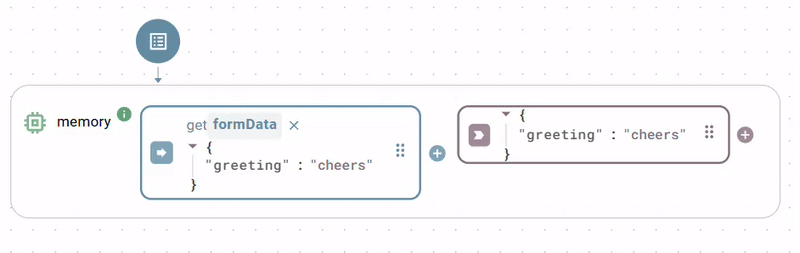

# Data Processing

The `Tools` class is a versatile collection of static utility functions designed to perform common data manipulation, transformation, and logical operations. It provides a wide range of helpers for tasks like working with arrays and objects, handling JSON, mapping numerical ranges, and managing asynchronous delays.

Since all methods in this class are **static**, you do not need to create an instance of it.

### echo

Simply returns the exact input it was given. This is useful for testing or as a placeholder.

**Parameters**

* `value`: Any input argument.

Output

The unchanged input argument.

### combine

Combines two or more arguments into a single array.

**Parameters**

* `arg1`, `arg2`, ...: An arbitrary number of arguments to be combined.

**Example**

```yaml
# arg1
123
# arg2
"hello"
# arg3
{ "key": "value" }

```

**Output**

```json
[
  123,
  "hello",
  {
    "key": "value"
  }
]

```

### mergeObjects

Merges two or more objects into a single new object.

**Note**: If the same key exists in multiple objects, the value from the **last object** in the argument list will be used.

**Parameters**

* `arg1`, `arg2`, ...: Two or more objects to merge.

**Example**

```yaml
# arg1
{ "name": "John", "status": "active" }
# arg2
{ "status": "inactive", "id": 123 }

```

**Output**

```json
{
  "name": "John",
  "status": "inactive",
  "id": 123
}

```

### arrayPush

Pushes one or more items to the end of an array.

**Note**: If an item being pushed is itself an array, its elements will be "unfolded" and added individually to the main array.

**Parameters**

* `array`: The input array.
* `items`: Any number of items to push to the end of the array.

**Example**

```yaml
# array
[1, 2]
# items
[ 3, 4, [5, 6] ]

```

**Output**

```json
[
  1,
  2,
  3,
  4,
  5,
  6
]

```

### mapRange

Maps a numerical value from an original range to a new range.

**Parameters**

* `value`: The number to be mapped.
* `options`: An object defining the ranges.
  * `origMin`, `origMax`: The minimum and maximum of the original range.
  * `newMin`, `newMax`: The minimum and maximum of the new range.

**Example: Map a sensor value (0-1023) to a percentage (0-100)**

```yaml
# value
512
# options
origMin: 0
origMax: 1023
newMin: 0
newMax: 100

```

**Output**: `50`

### delay

Returns the provided value after a specified delay in milliseconds. This is an asynchronous function.

**Parameters**

* `value`: The value to be returned after the delay.
* `options`: An optional object.
  * `timeout`: The delay in milliseconds. Defaults to `1000`.

### areAllParamsTrue

Applies a logical AND operator. Checks if a specific number of provided arguments are all "truthy" (i.e., not `false`, `0`, `""`, `null`, `undefined`).

**Parameters**

* `nParams`: The exact number of arguments that must be provided and be truthy.
* `...args`: The arguments to check.

**Example**

```yaml
# nParams
3
# args
[true, "hello", 1]

```

**Output**: `true` (because 3 arguments were provided and all are truthy)

**Example 2**

```yaml
# nParams
3
# args
[true, ""]

```

**Output**: `false` (because only 2 arguments were provided, not 3)

### isOneOrMoreParamTrue

Applies a logical OR operator. Checks if at least one of the provided arguments is "truthy".

**Parameters**

* `...args`: Any number of input parameters to check.

**Example**

```yaml
# args
[false, 0, "hello", null]

```

**Output**: `true` (because "hello" is truthy)

### jsonStringify

Converts a JavaScript value (like an object or array) into a JavaScript Object Notation (JSON) string.

**Parameters**

* `value`: The JavaScript value to be converted.

**Example**

```yaml
# value
{ "name": "John", "is_active": true, "roles": ["admin", "editor"] }

```

**Output**: `'{"name":"John","is_active":true,"roles":["admin","editor"]}'`

### jsonParse

Converts a JavaScript Object Notation (JSON) string back into a JavaScript object or value.

**Parameters**

* `text`: A valid JSON string.

**Example**

```yaml
# text
'{"name":"John","is_active":true,"roles":["admin","editor"]}'

```

**Output**

```json
{
  "name": "John",
  "is_active": true,
  "roles": [
    "admin",
    "editor"
  ]
}

```

####

### flatten

Takes a nested JavaScript object and flattens it into a single level by creating dot-delimited keys.

**Parameters**

* `target`: The object to flatten.
* `options`: An optional object.
  * `delimiter`: A custom delimiter to use instead of `.`.
  * `safe`: If `true`, arrays and their contents will be preserved instead of flattened.
  * `maxDepth`: The maximum number of levels to flatten.

**Example**

```yaml
# target
{
  "user": {
    "name": "John",
    "address": {
      "city": "New York"
    }
  },
  "tags": ["a", "b"]
}

```

**Output**

```json
{
  "user.name": "John",
  "user.address.city": "New York",
  "tags.0": "a",
  "tags.1": "b"
}

```

### unflatten

The inverse of `flatten`. Takes a flat object with delimited keys and converts it back into a nested object.

**Parameters**

* `target`: The object to unflatten.
* `options`: An optional object (see `flatten` for details).

**Example**

```
# target
{
  "user.name": "John",
  "user.address.city": "New York"
}

```

**Output**

```
{
  "user": {
    "name": "John",
    "address": {
      "city": "New York"
    }
  }
}

```

### mergeArrays

Merges multiple arrays by combining the objects at corresponding indexes.

**Note**: The final array will be truncated to the length of the **shortest** input array.

**Parameters**

* `...args`: Multiple arrays to merge.

**Example**

```yaml
# args
[
  [ { "a": 1 }, { "b": 2 } ],
  [ { "c": 3 }, { "d": 4, "e": 5 } ]
]

```

**Output**

```json
[
  { "a": 1, "c": 3 },
  { "b": 2, "d": 4, "e": 5 }
]

```

### combineArrays

Combines multiple arrays like `mergeArrays`, but it **postfixes** the keys of the objects with `_` and the array's index to prevent key collisions.

**Parameters**

* `...args`: Multiple arrays to combine.

**Example**

```yaml
# args
[
  [ { "value": 10 }, { "value": 20 } ],
  [ { "value": 30 }, { "value": 40 } ]
]

```

**Output**

```json
[
  { "value_0": 10, "value_1": 30 },
  { "value_0": 20, "value_1": 40 }
]

```

### groupArrays

Groups and merges objects from multiple arrays based on a shared key or set of keys. This is a powerful way to join data from different sources.

**Parameters**

* `keys`: A string or an array of strings representing the key(s) to group by.
* `...args`: Multiple arrays of objects to group and merge.

**Example: Grouping by a single `id` key**

```yaml
# keys
id
# args
[
  [ { "id": 1, "name": "Alice" }, { "id": 2, "name": "Bob" } ],
  [ { "id": 1, "age": 25 }, { "id": 2, "age": 30 } ]
]

```

**Output**

```
[
  { "id": 1, "name": "Alice", "age": 25 },
  { "id": 2, "name": "Bob", "age": 30 }
]

```

### renameObjectKeys

Creates a new object with renamed keys based on a provided mapping.

**Parameters**

* `object`: The object whose keys should be renamed.
* `keyMapping`: An object where each key is an original key name and its value is the new key name.

**Example**

```yaml
# object
{ "first_name": "John", "last_name": "Doe" }
# keyMapping
{ "first_name": "firstName", "last_name": "lastName" }

```

**Output**

```json
{
  "firstName": "John",
  "lastName": "Doe"
}

```

### base64Decode

Decodes a base64 encoded string back to its original string representation.

**Parameters**

* `base64String`: The base64 encoded string.
* `encoding`: An optional string for the output encoding. Defaults to `'utf8'`.

**Example**

```yaml
# base64String
'SGVsbG8gV29ybGQ='

```

**Output**: `'Hello World'`

### base64Encode

Encodes a string into its base64 string representation.

**Parameters**

* `bytes`: The string or buffer to encode.

**Example**

```yaml
# bytes
'Hello World'

```

**Output**: `'SGVsbG8gV29ybGQ='`

### memory

A function with an input and output only, and no trigger. The function outputs its input value upon any input update.

<figure><figcaption></figcaption></figure>


The main Backend Builder Toolbar holds a shortcut to the Memory function, as it is useful in many cases.

