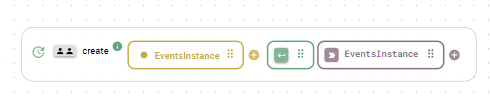
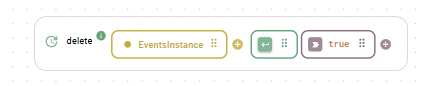
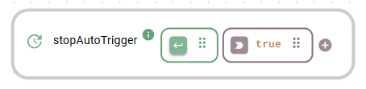
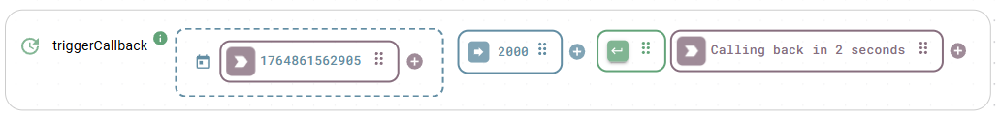

# Event Simulation

This module is designed to simulate various events to test and validate workflows. By generating events, you can ensure that your workflow handles different scenarios and edge cases effectively, providing a robust and reliable system. It is also helpful as a placeholder in your workflow, if you haven't completed your app yet.

The different available functions offer ways to respond to specific events. To learn more about event handlers, see [Callbacks](/broken/pages/64Rg3QELPGYbulaZ30Fx#callbacks).

To access the events simulator, unfold `Simulation` > `Events` in the functionality panel.

## Instance management

### Create an instance

Simply drag the `create` function onto the board, insert a unique name for your instance and trigger the function.

<figure><figcaption>
Creating an events simulator instance
</figcaption></figure>

### Delete an instance

Simply drag the `delete` function onto the board and insert the name of the instance you want to delete.

<figure><figcaption>
Deleting an events simulator instance
</figcaption></figure>

## Instance functions

### Reacting to a manually triggered event

The `onManualTrigger` function catches a manual trigger of the `triggerManually` function in the same instance and outputs the payload, which is a UNIX timestamp in this case. To try this, simply drag both functions onto the Backend Builder and trigger the `triggerManually` function to generate the necessary event.

<figure><figcaption>
After triggering the second function, the first outputs the timestamp
</figcaption></figure>

### Reacting to an automatically triggered event

The `onAutoTrigger` reacts to the automatic trigger set up by startAutoTrigger and displays the UNIX timestamp payload. You can set an interval after which the event should repeat in milliseconds in the `interval` input box. You might need to trigger `onAutoTrigger` once for it to start reacting to the automatically generated events after triggering `startAutoTrigger`.

<figure><figcaption>
Reacting to periodically generated events
</figcaption></figure>

You can stop the automatic trigger with the `stopAutoTrigger` function.

<figure><figcaption>
Stopping the generation of events
</figcaption></figure>

### Reacting with a callback to output of same function&#x20;

The `triggerCallback` function reacts to an event triggered by itself. After triggering the function, there will be a delay, as set by the `timeout` input box in milliseconds. It will NOT react to the output of the callback to avoid an infinite loop.

<figure><figcaption>
Callback output as reaction to function generated event
</figcaption></figure>
