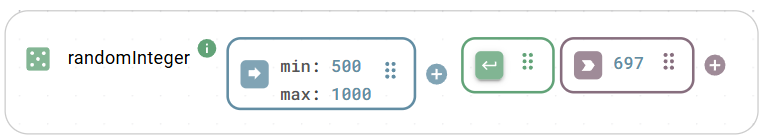
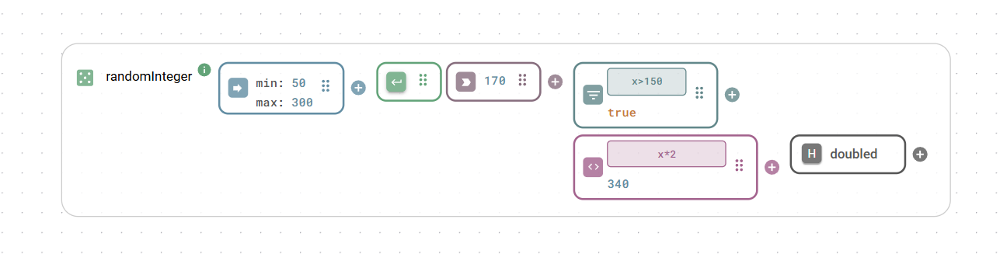
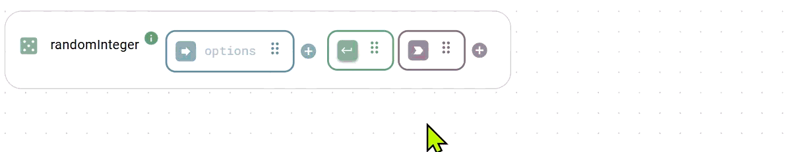
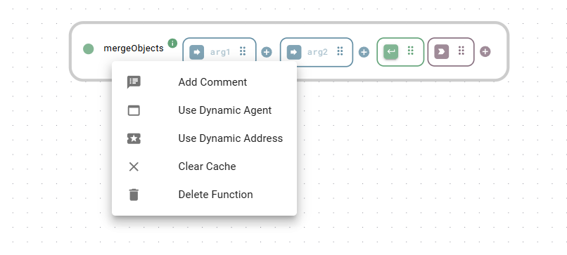

# Functions

Functions are the core building blocks for application logic in Heisenware. They are visual representations of actual code that allow you to fetch data, process information, manage databases, and control devices.

All Functions follow the same anatomy. Each part of it is represented by a colored box with a unique icon inside.

<figure><figcaption><p>A Function merging two (or more) objects</p></figcaption></figure>

* [**Input(s)**](functions.md#inputs-and-data-configuration): Arguments the Function needs to work (e.g., a number to calculate or a string to send). If a Function does not require an input, the box is not shown.
* [**Trigger**](functions.md#triggers-and-execution-logic): The signal that tells the Function to execute (e.g., a button click or a data change).
* [**Output**](functions.md#outputs-and-chaining): The result of the operation also available for the next step in your flow.
* [**Extensions**](functions.md#function-extensions) **(optional)**: Add-ons to [filter](filter.md), [record](recorder.md), or [modify](modifier.md) data on the fly.

### Types of Functions

There are four main types of Functions, defined by how they handle context (state).

<table><thead><tr><th width="227.3770751953125">Type</th><th>Description</th></tr></thead><tbody><tr><td><strong>Static Functions</strong></td><td><p>Standalone utilities that process data without needing context.</p><p></p><p><em>(e.g., <code>mergeObjects</code>, <code>mapRange</code>, <code>echo</code>)</em></p></td></tr><tr><td><strong>Member Functions</strong></td><td>Actions linked to a specific Instance you have created. They use the unique connection settings stored in that instance.<br><br>(e.g., <code>read</code>, <code>write</code>, <code>publish</code>)</td></tr><tr><td><strong>Constructor Functions</strong></td><td><p>Are called <em><code>create</code></em> and used to configure and initialize a new instance.<br></p><p><em>(<code>create</code>)</em></p></td></tr><tr><td><strong>Destructor Functions</strong></td><td>Are called <em><code>delete</code></em> and used to remove an instance and free up system resources.</td></tr></tbody></table>


**💡 Concept example: The OPC UA Client Class**

* **Class:** The generic blueprint for OPC UA Client.
* **`create` Function:** You use the `create` Function to configure a connection (IP, port, security), resulting in an instance named `myMachine`.
* **Member Functions:** You use the `connect` and `read` Functions belonging to `myMachine` to get data. It works because it knows which server to talk to based on the instance.


## Working with Functions on the canvas

* **Add**: Drag a Function from the [Function Explorer](https://docs.heisenware.com/app-builder/build-backend/functions-library) in the left panel onto the canvas.
* **Sequence**: Create a flow by drawing a wire.
  * **To Input**: Passes data (arguments) to the next function.
  * **To Trigger**: Uses the completion of one Function to start the next (no data transfer).
* **Configure**: Click a Function to open its configuration. You can use YAML for static data or binding for dynamic data from other Functions or UI widgets.
* Documentation: Click the info icon (<i class="fa-info">:info:</i>) next to a Function's name to open its specific documentation panel.
* **Comment**: Right-click a Function and select comment to add context for your team.
* **Delete**: Select the Function and press delete on your keyboard or click the trash icon (<i class="fa-trash">:trash:</i>).&#x20;


Deleting a Function permanently removes its configurations and all connected wires. This action cannot be undone.


### Status Indicators

Each Function has a colored status indicator next to its name. Hover over the indicator for details.

* 🟢 **Green**: Ready / OK.
* 🔵 **Blue**: Execution is slow (> 2 seconds).
* 🟡 **Yellow**: Object/Instance does not exist yet.
* 🔴 **Red**: Error or exception occurred.
* ⚪ **Gray**: Function is offline/unavailable.

## Inputs & data configuration

Inputs determine how a Function behaves. You can provide data via three sources:

1. **Static data**: Fixed values typed directly into the Function Input (configured via YAML) or set via a web form (opened with a click on the blue arrow icon inside the Function Input).
2. **Dynamic logic**: Data passed from the Output, [Modifier](modifier.md), or [Filter](filter.md) of a previous Function.
3. **UI binding**: Live data from a [Widget](../build-frontend/widgets/) (e.g., a text field value).

<figure><figcaption><p>Function with object input in YAML format</p></figcaption></figure>

### YAML input

We use YAML for configuration because it is human-readable and handles complex data structures easily.

<details>

<summary><strong>YAML cheat sheet 💡</strong></summary>

#### Basic values (scalars)

Simple data types can usually be typed without quotes.

* **Strings**: `Hello world`. Use quotes if the text looks like a number or boolean (e.g., `'123'`, `'true'`).
* **Numbers**: `101` or `3.14159`.
* **Booleans**: `true` or `false`.
* **Null**: `null` (represents an empty or non-existent value).

#### Lists (arrays)

A collection of items.

*   **Block style**: Start each item on a new line with a hyphen.

    ```yaml
    - Apple
    - Orange
    - Banana
    ```
*   **Compact style**: Enclose in brackets.

    ```yaml
    [Apple, Orange, Banana]
    ```

#### Objects (key-value maps)

Data grouped under specific keys.

*   **Block style**: Each key-value pair gets its line. Use indentation for nesting.

    ```yaml
    user:
      name: Alex
      email: alex@example.com
      permissions:
        can_read: true
        can_write: false
    ```
*   **Compact style**: Enclose comma-separated key-value pairs in curly braces.

    ```yaml
    { name: Alex, email: alex@example.com }
    ```

#### Multiline strings

Essential for large blocks of text, code, or templates.

*   **Literal style (`|`)**: Preserves every line break exactly. Perfect for code (e.g., ZPL).

    ```yaml
    |
      ^XA^FO30,80^BQN,2,3^FDLA,{{assetId}}#{{date}}^FS
      ^FO120,140^A0N,22,22^FD{{assetId}}#{{date}}^FS
      ^RFW,A^FD {{assetId}}^FS
      ^XZ
    ```
*   **Folded style (`>`)**: Use the greater-than symbol to convert single newlines into spaces. This is great for writing long paragraphs that you want to be read as a single line of text. Blank lines will be kept as newlines.

    ```yaml
    description: >
      This is a very long description that is written
      on multiple lines in the editor, but it will be
      processed as a single, continuous sentence.

      A new paragraph starts after a blank line.
    ```

</details>


Right-click an Function Input to switch between YAML and HTML view, or to set an input as a Secret (masking the value).


### Special inputs: Callbacks

Functions with a `on` prefix (e.g., `onMessage`) use callbacks. These listen for external events (like an incoming MQTT message) and provide that data via a specific output nested inside the Function Input.

<figure><figcaption><p>A Function with a callback listening for incoming MQTT messages in binary format</p></figcaption></figure>

## Triggers & execution logic

The Trigger determines _when_ a Function runs.

### Trigger sources

* **Data-driven**: Link an Output, Modifier, or Filter to a Trigger to run `on change`, `on update`, or `on true`.
* **UI events**: Link a widget event (like a [button](../build-frontend/widgets/trigger-widgets/button.md)'s `on Click`) to the Trigger.
* **App lifecycle**: Right-click the Trigger to set execution  `on App Start` (once) or `on App Stop`.
* **Periodically**: Right-click the Trigger to set a recurring execution interval.
* **Page load**: Drag a [page](../build-frontend/page-explorer.md) onto the Trigger to execute the Function when that page loads.
* **Manual (during development)**: Click the Trigger icon inside the Trigger to execute the Function during development.

<figure><figcaption><p>Use page load to execute a Function</p></figcaption></figure>

<figure><figcaption><p>Use a button click to execute a Function</p></figcaption></figure>

### Sequential processing of arrays (looping)

To process an array item-by-item (like a `for` loop):

1. Right-click the Trigger.
2. Select `Process one by one`.
3. Choose the input containing the array. The trigger will change to a dotted line, indicating it will run once for every item in the list.

<details>

<summary><strong>Example: Merging an element into an array</strong></summary>

A common use case for sequential processing is merging a single element into each sub-array of a larger array.

The image below illustrates a `combine` Function where the Trigger is configured to Process One By One on its first input (`On arg 1`). As a result, the Function executes for each sub-array, and the singular element from the second input is merged into both.

<figure><figcaption></figcaption></figure>

</details>

### Delayed execution

You can add a delay (0.1s to 2.0s) to any trigger to manage timing, such as waiting for a UI animation to finish before fetching data.

## Outputs & chaining

The output returns the result of the Function's execution. It is the primary way to pass data and control logic in your application.

### Return data types

Depending on the Function, the output can be:

* **Standard data**: JSON objects, strings, numbers, or arrays.
* **Binary content**: Files or images (e.g., for PDF generation or camera captures).
* **Success flags**: A simple `true`/`false` boolean indicating if an operation (like a database write) succeeded.

### Backend logic (Flows)

You can link an output to another Function to create a chain of logic:

* **Pass data**: Connect Output → Input. The result of Function A becomes the argument for Function B.
* **Control flow**: Connect Output → Trigger. Function B will only execute once Function A completes successfully.

### UI interaction

You can link an output directly to the frontend to drive the user interface:

* **Visualize**: Connect to a widget (e.g., a [Chart](../build-frontend/widgets/display-widgets/chart.md) or [Value Box](../build-frontend/widgets/display-widgets/value-box.md)) to display the data.
* **Control**: Connect to a widget (e.g., a [Button](../build-frontend/widgets/trigger-widgets/button.md)) and select the specific property you want to control (e.g., `disabled` or `toggle`) to dynamically change its behavior.
* **Navigate**: Connect to a `Page Switch` trigger to automatically change screens based on logic.

## Function extensions

Extensions are tools attached directly to a Function's Output. They allow you to [modify](modifier.md), [Filter](filter.md), [record](recorder.md), or [handle errors](error-handler.md) on the fly without adding separate Function blocks.

<div align="center"><figure><figcaption><p>One function with three extensions</p></figcaption></figure></div>

### Working with extensions

* **Add**: Click the + icon on an output and select the desired type. You can add multiple parallel extensions to the same output.
* **Chain**: You can add an extension to the output of _another_ extension to create a multi-step pipeline (e.g., filter data then modify it).
* **Delete**: Right-click an extension and select Delete.

<div align="center"><figure><figcaption><p>Adding extensions</p></figcaption></figure></div>

## Data binding (connecting to UI)

Functions communicate bidirectionally with the frontend widgets via data binding.

* **Input binding**: Link a widget property (e.g., `formData`) to a Function Input.
* **Trigger binding**: Link a user action (e.g., `on Button click`) to a Function Trigger.
* **Output binding**: Link a Function result to a widget property (e.g., `data`) to update the UI.

## Advanced addressing

Any Function inherently addresses the corresponding backend code using a specific structure. To view or edit this, right-click the Function name and select `Use Dynamic Address`.

<figure><figcaption><p>Right click the Function name and choose e.g. <code>Use Dynamic Address</code></p></figcaption></figure>

This reveals the "path" to the underlying code, consisting of up to three boxes:

`<Agent/Service> <Class> [Instance]`

* **Box 1 (Agent/Service):** The program executing the Function. This can be a generic internal service (e.g., "Utility Functions") or a specific Edge Agent running on a machine.
* **Box 2 (Class)**: The actual name of the underlying code class in the programming language (e.g., `Busylight`, `Barcode`, `OpcuaClient`).
* **Box 3 (Instance)**: The specific instance name (e.g., `server1`). This box only appears for member Functions. Static Functions (like `generateBarcode`) do not belong to an instance, so this box is hidden.

<figure><figcaption><p>Addresses of a static Function and a member Function</p></figcaption></figure>

You can edit this address to your liking. If you switch back to the regular (short) view, your changes are kept.


**💡 Use Case: Swapping Agents**&#x20;

This feature is essential when moving logic between environments (e.g., from a test device to a production machine).

Instead of rewiring your flow, simply update the Agent name (Box 1) to match the new Edge Agent.

You can even use [search-and-replace](/broken/pages/9vKr7mso7EW9dCDhxV7Y#search-and-replace) to update the agent name across multiple Functions at once. This works even on addresses that are not explicitly set to "Dynamic" view.

