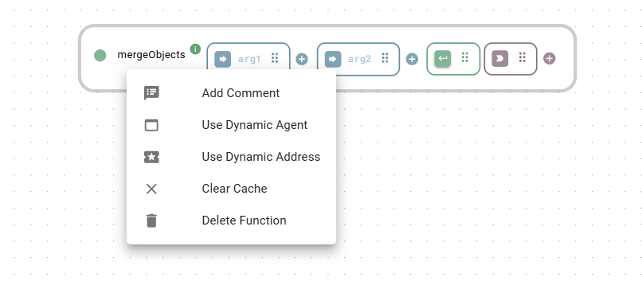

# Functions

Functions are the core building blocks of your App logic. They are visual representations of actual code that fetch data, process information, manage databases, and control devices.

All functions follow the same anatomy. A colored box with a unique icon represents each part.

<figure><figcaption><p>A function merging two (or more) objects</p></figcaption></figure>

* [**Input(s)**](./#inputs-and-data-configuration): Arguments the function needs to work (e.g., a number to calculate or a string to send). The platform hides the box if a function does not require an input. Some functions let you add extra inputs.  Click the pencil icon to modify input data via a form or use YAML during development.
* [**Trigger**](./#triggers-and-execution-logic): The signal that tells the function to execute (e.g., a button click or a data change). Click the play icon to trigger the function manually during development.
* [**Output**](./#outputs-and-chaining): The result of the operation, which passes to the next step in your flow. Click the x icon to empty the output during development.
* [**Extension nodes**](../extension-nodes/) **(optional)**: Separate nodes that take data from a function and [filter](../extension-nodes/filter.md), [record](../extension-nodes/recorder.md), [modify](../extension-nodes/modifier.md), or [handle errors](../extension-nodes/error-handler.md) it on the fly.

## Function categories

All available functions live in the [Function Explorer](function-explorer.md), the panel on the left where you browse them by category. Each category has its reference section:

* [**Connectors**](connectors/): Integration functions for industrial protocols and external systems, from MQTT and OPC UA to Siemens S7 and SAP Digital Manufacturing.
* [**Storage**](storage/): The relational database and timeseries database classes to connect to databases. Both include a built-in internal database (PostgreSQL and InfluxDB). Also holds lightweight stores like the data store and circular buffer.
* [**Utilities**](utilities/): Data processing, timers, cron jobs, barcode generation, PDF processing, and more.
* [**Extensions**](extensions/): Docker-based modules that extend the platform, such as RAG AI or process simulations.
* **Custom**: Your building blocks, including [subflows](subflows.md) and functions loaded via Custom Extensions.

## Types of functions

There are four main types of functions, defined by how they handle context (state).

<table><thead><tr><th width="227.3770751953125">Type</th><th>Description</th></tr></thead><tbody><tr><td><strong>Static functions</strong></td><td><p>Standalone utilities that process data without needing context.</p><p>(e.g., <code>mergeObjects</code>, <code>mapRange</code>, <code>echo</code>)</p></td></tr><tr><td><strong>Member functions</strong></td><td>Actions linked to a specific instance you have created. They use the unique connection settings stored in that instance.<br><br>(e.g., <code>read</code>, <code>write</code>, <code>publish</code>)</td></tr><tr><td><strong>Constructor functions</strong></td><td>Are called <code>create</code> and configure and initialize a new instance.</td></tr><tr><td><strong>Destructor functions</strong></td><td>Are called <code>delete</code> and remove an instance to free up system resources.</td></tr></tbody></table>


#### Concept example: the [OPC UA client](connectors/opc-ua-client.md)

* **Class**: The generic blueprint for the OPC UA client.
* **Create a specific instance**: Use the `create` function to set an instance name and authorization information, resulting in an instance named `myMachine`.
* **Member functions**: Use the `connect` function of `myMachine` to establish the connection to a server (endpoint URL), then `read` to get data. All member functions of `myMachine` share that connection.


## Working with functions on the canvas

* **Add**: Drag a function from the [Function Explorer](function-explorer.md) onto the canvas.
* **Sequence**: Create a flow by drawing a wire, see [sequencing functions](../#sequencing-functions).
* **Configure**: Click a function to open its configuration. Use YAML for static data or binding for dynamic data from other functions or UI widgets.
* **Documentation**: Click the info icon (<i class="fa-info">:info:</i>) next to a function's name to open its documentation panel.
* **Comment**: Right-click a function and select comment to add context for your team.
* **Delete**: Select the function and press delete on your keyboard or click the trash icon (<i class="fa-trash">:trash:</i>).


Deleting a function permanently removes its configuration and all connected wires. This action cannot be undone.


### Status indicators

Each function has a colored status indicator icon next to its name. Hover over the indicator for details.

* **Green**: Ready / OK.
* **Blue**: Execution is slow (> 2 seconds).
* **Yellow**: Instance does not exist yet.
* **Red**: An error or exception occurred.
* **Gray**: Function is offline/unavailable.

## Inputs and data configuration

Inputs determine how a function behaves. Provide data via three sources:

1. **Static data**: Fixed values typed directly into the function input (configured via YAML) or set via a form (opened with a click on the pencil icon inside the function input).
2. **Dynamic logic**: Data passed from the output, [modifier](../extension-nodes/modifier.md), or [filter](../extension-nodes/filter.md) of a previous function.
3. **UI binding**: Live data from a [widget](../../build-frontend/widgets/) (e.g., a text field value).

<figure><figcaption><p>Function with input in YAML format</p></figcaption></figure>

### YAML input

Heisenware uses YAML for configuration because it is human-readable and handles complex data structures easily.

<details>

<summary><strong>YAML cheat sheet 💡</strong></summary>

#### Basic values (scalars)

Simple data types can usually be typed without quotes.

* **Strings**: `Hello world`. Use quotes if the text looks like a number or boolean (e.g., `'123'`, `'true'`).
* **Numbers**: `101` or `3.14159`.
* **Booleans**: `true` or `false`.
* **Null**: `null` (represents an empty or non-existent value).

#### Lists (arrays)

A collection of items.

*   **Block style**: Start each item on a new line with a hyphen.

    ```yaml
    - Apple
    - Orange
    - Banana
    ```
*   **Compact style**: Enclose in brackets.

    ```yaml
    [Apple, Orange, Banana]
    ```

#### Objects (key-value maps)

Data grouped under specific keys.

*   **Block style**: Each key-value pair gets its line. Use indentation for nesting.

    ```yaml
    user:
      name: Alex
      email: alex@example.com
      permissions:
        can_read: true
        can_write: false
    ```
*   **Compact style**: Enclose comma-separated key-value pairs in curly braces.

    ```yaml
    { name: Alex, email: alex@example.com }
    ```

#### Multiline strings

Essential for large blocks of text, code, or templates.

*   **Literal style (`|`)**: Preserves every line break exactly. Perfect for code (e.g., ZPL).

    ```yaml
    |
      ^XA^FO30,80^BQN,2,3^FDLA,{{assetId}}#{{date}}^FS
      ^FO120,140^A0N,22,22^FD{{assetId}}#{{date}}^FS
      ^RFW,A^FD {{assetId}}^FS
      ^XZ
    ```
*   **Folded style (`>`)**: Use the greater-than symbol to convert single newlines into spaces. This is great for writing long paragraphs that should be read as a single line of text. Blank lines are kept as newlines.

    ```yaml
    description: >
      This is a very long description that is written
      on multiple lines in the editor, but it will be
      processed as a single, continuous sentence.

      A new paragraph starts after a blank line.
    ```

</details>


Right-click a function input to switch between YAML and HTML view, or to set an input as a secret (masking the value).


### Special inputs: callbacks

Functions with an `on` prefix (e.g., `onMessage`) use callbacks. They listen for external events (like an incoming MQTT message) and provide that data via a specific output nested inside the function input.

<figure><figcaption><p>A function with a callback listening for incoming MQTT messages in binary format</p></figcaption></figure>

## Triggers and execution logic

The trigger determines _when_ a function runs.

### Trigger sources

* **Data-driven**: Link an output, modifier, or filter to a trigger. The default mode is update (e.g. `on output update`). Click the mode word to switch to change or true.
* **UI events**: Link a widget event (like a [button](../../build-frontend/widgets/trigger-widgets/button.md)'s `on button click`) to the trigger.
* **App lifecycle**: Right-click the trigger to set execution `on App Start` (once) or `on App Stop`.
* **Periodically**: Right-click the trigger to set a recurring execution interval.
* **Page load**: Drag a [page](../../build-frontend/page-explorer.md) onto the trigger to execute the function when that page loads.
* **Manual (during development)**: Click the play icon inside the trigger to execute the function during development.

<figure><figcaption><p>Use page load to execute a function</p></figcaption></figure>

<figure><figcaption><p>Use a button click to execute a function</p></figcaption></figure>

### Sequential processing of arrays (looping)

To process an array item by item (like a `for` loop):

1. Right-click the trigger.
2. Select _Process one by one_.
3. Choose the input containing the array. The trigger changes to a dotted line, indicating it runs once for every item in the list.

<details>

<summary><strong>Example: Merging an element into an array</strong></summary>

A common use case for sequential processing is merging a single element into each sub-array of a larger array.

The image below shows a `combine` function where the trigger is configured to process one by one on its first input (`On arg 1`). As a result, the function executes for each sub-array, and the singular element from the second input is merged into both.

<figure><figcaption></figcaption></figure>

</details>

### Delayed execution

Add a delay (0.1s to 2.0s) to any trigger to manage timing, such as waiting for a UI animation to finish before fetching data.

## Outputs and chaining

The output returns the result of the function's execution. It is the primary way to pass data and control logic in your App.

### Return data types

Depending on the function, the output can be:

* **Standard data**: JSON objects, strings, numbers, or arrays.
* **Binary content**: Files or images (e.g., for PDF generation or camera captures).
* **Success flags**: A simple `true`/`false` boolean indicating if an operation (like a database write) succeeded.

### Backend logic (flows)

Link an output to another function to create a chain of logic:

* **Pass data**: Connect output → input. The result of function A becomes the argument for function B.
* **Control flow**: Connect output → trigger. Function B only executes once function A completes successfully.

### UI interaction

Link an output directly to the frontend to drive the user interface:

* **Visualize**: Connect to a widget (e.g., a [chart](../../build-frontend/widgets/display-widgets/chart.md) or [value box](../../build-frontend/widgets/display-widgets/value-box.md)) to display the data.
* **Control**: Connect to a widget (e.g., a [button](../../build-frontend/widgets/trigger-widgets/button.md)) and select the property you want to control (e.g., `disabled` or `toggle`) to dynamically change its behavior.
* **Navigate**: Connect to a `Page switch` trigger to automatically change screens based on logic.

## Extension nodes

[Extension nodes](../extension-nodes/) are separate nodes that attach to a function's output and process data directly in the flow: [modifiers](../extension-nodes/modifier.md) transform data, [filters](../extension-nodes/filter.md) gate it, [recorders](../extension-nodes/recorder.md) store it, and [error handlers](../extension-nodes/error-handler.md) catch exceptions.

* **Add**: Click the + icon on an output and select the desired type. You can add multiple parallel extension nodes to the same output.
* **Chain**: Add an extension node to the output of _another_ extension node to create a multi-step pipeline (e.g., filter data, then modify it).
* **Delete**: Right-click an extension node and select Delete.

## Data binding (connecting to UI)

Functions communicate bidirectionally with frontend widgets via data binding.

* **Input binding**: Link a widget property (e.g., `formData`) to a function input.
* **Trigger binding**: Link a user action (e.g., `on button click`) to a function trigger.
* **Output binding**: Link a function result to a widget property (e.g., `data`) to update the UI.

## Advanced addressing

Every function addresses its underlying backend code using a specific structure. To view or edit it, right-click the function name and select _Use dynamic address_.

<figure><figcaption><p>Right-click the function name and choose e.g. <code>Use Dynamic Address</code></p></figcaption></figure>

This reveals the "path" to the underlying code, consisting of up to three boxes:

`<Agent/Service> <Class> [Instance]`

* **Box 1 (agent/service)**: The program executing the function. This can be a generic internal service (e.g., "Utility functions") or a specific Agent running on a machine.
* **Box 2 (class)**: The name of the underlying code class (e.g., `Busylight`, `Barcode`, `OpcuaClient`).
* **Box 3 (instance)**: The specific instance name (e.g., `server1`). This box only appears for member functions. Static functions (like `generateBarcode`) do not belong to an instance, so the platform hides this box.

<figure><figcaption><p>Addresses of a static function and a member function</p></figcaption></figure>

Edit this address as needed. If you switch back to the regular (short) view, your changes are kept.


#### Use case: swapping Agents

When moving logic between environments (e.g., from a test device to a production machine), update the Agent name (box 1) to match the new Agent instead of rewiring your flow.

You can even use [search and replace](../#search-and-replace) to update the Agent name across multiple functions at once. This works even on addresses that are not explicitly set to the dynamic view.

