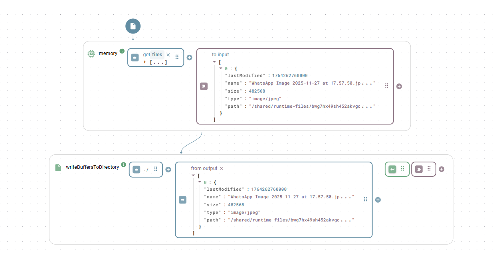

# File I/O

The file I/O functions read data from multiple file formats (CSV, Excel, PDF, XML, Word, and more), write data to files, and manage files and folders on a file system. All functions in this class are static and execute without an instance configuration.

## Where functions execute

The file system these functions access depends on their execution environment:

1. Platform: When executed directly on the platform, functions access the file system of the platform installation itself—the same content visible in the [File Explorer](../../file-explorer.md). The root path is `/shared`, meaning a file in the uploads folder uses the path `/shared/uploads/test.csv`.
2. Local OS: To work with files on your premises, compile, download, and install an [Agent](../../agents/) containing this class. Functions executed via the Agent access the file system where the Agent runs, using standard local paths like `C:\Users\YourUserName\Documents\test.csv`.


#### Pitfall on Windows
When referencing Windows paths, wrap the YAML input in quotes. Without quotes, `C:\Users` parses as an object containing a `C` key and a `\Users` value. Define paths as `'C:\Users'`.


## Reading files

### `read`

Reads a file and automatically parses its content based on the file extension. This function serves as a convenience wrapper that calls the matching specific function (such as `readCsv` or `readXlsx`). Supported extensions include `csv`, `xlsx`, `docx`, `pptx`, `html`, `htm`, `md`, `txt`, `xsl`, `pdf`, and `xml`.

#### Parameters

<table>
  <thead>
    <tr>
      <th width="150">Input</th>
      <th>Description</th>
      <th width="100">Type</th>
    </tr>
  </thead>
  <tbody>
    <tr>
      <td><code>filename</code></td>
      <td>The full path to the file.</td>
      <td>string</td>
    </tr>
    <tr>
      <td><code>options</code></td>
      <td>Options specific to the detected file type. See the respective read function.</td>
      <td>object</td>
    </tr>
  </tbody>
</table>

#### Example

```yaml
# filename
/path/to/my-data.xlsx
```

#### Output

Returns the parsed content of the file (for example, executing this on an `.xlsx` path internally calls `readXlsx` and returns the parsed JSON content). Throws an error for unsupported file types.

### `exists`

Checks whether a file exists at the specified path.

#### Parameters

<table>
  <thead>
    <tr>
      <th width="150">Input</th>
      <th>Description</th>
      <th width="100">Type</th>
    </tr>
  </thead>
  <tbody>
    <tr>
      <td><code>filename</code></td>
      <td>The path of the file to check.</td>
      <td>string</td>
    </tr>
  </tbody>
</table>

#### Output

Returns `true` if the file exists, or `false` if it does not.

## Working with buffers

### `readFileToBuffer`

Reads any file and returns its entire content as a base64 encoded string.

#### Parameters

<table>
  <thead>
    <tr>
      <th width="150">Input</th>
      <th>Description</th>
      <th width="100">Type</th>
    </tr>
  </thead>
  <tbody>
    <tr>
      <td><code>filePath</code></td>
      <td>The path of the file to read.</td>
      <td>string</td>
    </tr>
  </tbody>
</table>

#### Output

Returns the file content as a base64 encoded string.

### `writeBufferToFile`

Writes a base64 encoded string to a new file.

#### Parameters

<table>
  <thead>
    <tr>
      <th width="150">Input</th>
      <th>Description</th>
      <th width="100">Type</th>
    </tr>
  </thead>
  <tbody>
    <tr>
      <td><code>filePath</code></td>
      <td>The full path where the file is saved, including the filename and extension.</td>
      <td>string</td>
    </tr>
    <tr>
      <td><code>buffer</code></td>
      <td>The content of the file as a base64 encoded string.</td>
      <td>string</td>
    </tr>
  </tbody>
</table>

#### Output

Returns `true` on a successful write.

### `writeBuffersToDirectory`

Writes one or more buffer-file objects to a directory. The function creates the directory (including parent folders) if it does not exist.

#### Parameters

<table>
  <thead>
    <tr>
      <th width="150">Input</th>
      <th>Description</th>
      <th width="100">Type</th>
    </tr>
  </thead>
  <tbody>
    <tr>
      <td><code>dirname</code></td>
      <td>The path to the directory where the files are written.</td>
      <td>string</td>
    </tr>
    <tr>
      <td><code>bufferData</code></td>
      <td>A single object or an array of objects, each containing at least the <code>name</code> and <code>base64</code> properties. See the <a href="../../../build-frontend/widgets/input-widgets/photo.md#file-object-structure">file object structure</a>.</td>
      <td>object or array</td>
    </tr>
  </tbody>
</table>

#### Output

Returns `true` when all files are successfully written. Throws an error listing every file that failed.

<figure><figcaption><p>This function integrates directly with the status lamp, photo, or upload widget when configured to use <code>Buffer</code> as the storage type.</p></figcaption></figure>


#### Local file sharing
Using these functions from an Agent establishes a file share between your App and your local OS. For example, you can store pictures taken with the photo widget directly on your own file server.


## Managing files and folders

### `moveFile`

Moves or renames a file.

#### Parameters

<table>
  <thead>
    <tr>
      <th width="150">Input</th>
      <th>Description</th>
      <th width="100">Type</th>
    </tr>
  </thead>
  <tbody>
    <tr>
      <td><code>oldPath</code></td>
      <td>The original path of the file.</td>
      <td>string</td>
    </tr>
    <tr>
      <td><code>newPath</code></td>
      <td>The new path for the file.</td>
      <td>string</td>
    </tr>
  </tbody>
</table>

#### Output

Returns nothing on success. Throws an error on failure.

### `copyFile`

Copies a file from a source path to a destination path.

#### Parameters

<table>
  <thead>
    <tr>
      <th width="150">Input</th>
      <th>Description</th>
      <th width="100">Type</th>
    </tr>
  </thead>
  <tbody>
    <tr>
      <td><code>src</code></td>
      <td>The path of the file to copy.</td>
      <td>string</td>
    </tr>
    <tr>
      <td><code>dest</code></td>
      <td>The path where the copy is created.</td>
      <td>string</td>
    </tr>
  </tbody>
</table>

#### Output

Returns nothing on success. Throws an error on failure.

### `deleteFile`

Deletes a file.


#### Permanent deletion
This permanently deletes the file from the file system. You cannot undo this action.


#### Parameters

<table>
  <thead>
    <tr>
      <th width="150">Input</th>
      <th>Description</th>
      <th width="100">Type</th>
    </tr>
  </thead>
  <tbody>
    <tr>
      <td><code>filename</code></td>
      <td>The path of the file to delete.</td>
      <td>string</td>
    </tr>
  </tbody>
</table>

#### Output

Returns nothing on success. Throws an error if the file does not exist.

### `createFolder`

Creates a new folder at the specified path, including any missing parent folders.

#### Parameters

<table>
  <thead>
    <tr>
      <th width="150">Input</th>
      <th>Description</th>
      <th width="100">Type</th>
    </tr>
  </thead>
  <tbody>
    <tr>
      <td><code>path</code></td>
      <td>The path where the new folder is created.</td>
      <td>string</td>
    </tr>
  </tbody>
</table>

#### Output

Returns nothing on success. Throws an error on failure.

### `deleteFolder`

Deletes a folder and all of its contents recursively. The function does not throw an error if the folder is missing.


#### Permanent deletion
This permanently deletes the folder and all containing files and subfolders. You cannot undo this action.


#### Parameters

<table>
  <thead>
    <tr>
      <th width="150">Input</th>
      <th>Description</th>
      <th width="100">Type</th>
    </tr>
  </thead>
  <tbody>
    <tr>
      <td><code>dir</code></td>
      <td>The path of the folder to delete.</td>
      <td>string</td>
    </tr>
  </tbody>
</table>

#### Output

Returns nothing.

### `browse`

Recursively scans a folder and returns a structure representing its files and subfolders.

#### Parameters

<table>
  <thead>
    <tr>
      <th width="150">Input</th>
      <th>Description</th>
      <th width="100">Type</th>
    </tr>
  </thead>
  <tbody>
    <tr>
      <td><code>filename</code></td>
      <td>The path of the folder to browse.</td>
      <td>string</td>
    </tr>
  </tbody>
</table>

#### Output

Returns a nested JSON object detailing the folder's contents, containing the properties `name`, `path`, `size`, `modDate`, `isDir`, and a `children` array for directories:

```json
{
  "id": "12345",
  "path": "/path/to/project",
  "name": "project",
  "modDate": "2025-08-22T12:02:00.000Z",
  "size": 4096,
  "isDir": true,
  "childrenCount": 2,
  "children": [
    {
      "id": "12346",
      "path": "/path/to/project/report.docx",
      "name": "report.docx",
      "modDate": "2025-08-21T10:30:00.000Z",
      "size": 15360,
      "isDir": false,
      "isFile": true,
      "isSymlink": false
    },
    {
      "id": "12347",
      "path": "/path/to/project/images",
      "name": "images",
      "modDate": "2025-08-22T11:00:00.000Z",
      "size": 4096,
      "isDir": true,
      "childrenCount": 1,
      "children": []
    }
  ]
}
```

## CSV files

### `readCsv`

Reads CSV data and converts it into an array of JSON objects. The function automatically detects whether the input is a file path, a raw CSV string, or a base64 encoded string.

#### Parameters

<table>
  <thead>
    <tr>
      <th width="150">Input</th>
      <th width="120">Key</th>
      <th>Description</th>
      <th width="100">Type</th>
    </tr>
  </thead>
  <tbody>
    <tr>
      <td><code>fileInfo</code></td>
      <td></td>
      <td>The path to the <code>.csv</code> file, a raw CSV string, or a base64 encoded string of the file content.</td>
      <td>string</td>
    </tr>
    <tr>
      <td><code>options</code></td>
      <td><code>delimiter</code></td>
      <td>The column delimiter. Provide a string (such as <code>;</code>), <code>auto</code> for automatic detection, or an array of candidates (such as <code>[',', ';', '|']</code>). Default <code>,</code>.</td>
      <td>string or array</td>
    </tr>
    <tr>
      <td></td>
      <td><code>checkType</code></td>
      <td>If true, automatically converts numbers and booleans from strings to their native types. Default false.</td>
      <td>boolean</td>
    </tr>
    <tr>
      <td></td>
      <td><code>noheader</code></td>
      <td>Indicates that the CSV data has no header row. Default false.</td>
      <td>boolean</td>
    </tr>
    <tr>
      <td></td>
      <td><code>headers</code></td>
      <td>An array of strings used as column headers, such as when the CSV has no header row.</td>
      <td>array</td>
    </tr>
    <tr>
      <td></td>
      <td><code>output</code></td>
      <td>The output format: <code>json</code>, <code>csv</code> (array of arrays), or <code>line</code> (each line as a string). Default <code>json</code>.</td>
      <td>string</td>
    </tr>
    <tr>
      <td></td>
      <td><code>trim</code></td>
      <td>Trims whitespace from headers and values. Default true.</td>
      <td>boolean</td>
    </tr>
    <tr>
      <td></td>
      <td><code>ignoreEmpty</code></td>
      <td>If true, ignores empty lines. Default false.</td>
      <td>boolean</td>
    </tr>
    <tr>
      <td></td>
      <td><code>quote</code></td>
      <td>The character used for quoting columns. Default <code>"</code>.</td>
      <td>string</td>
    </tr>
    <tr>
      <td></td>
      <td><code>includeColumns</code></td>
      <td>A regular expression specifying which columns to include.</td>
      <td>string</td>
    </tr>
    <tr>
      <td></td>
      <td><code>ignoreColumns</code></td>
      <td>A regular expression specifying which columns to ignore.</td>
      <td>string</td>
    </tr>
  </tbody>
</table>

All other [csvtojson](https://www.npmjs.com/package/csvtojson) options pass through directly.

#### Examples

Example 1: Reading a semicolon-delimited CSV with type conversion

```yaml
# fileInfo
/path/to/data.csv
# options
delimiter: ;
checkType: true
```

Example 2: Reading a CSV string with no header row

```yaml
# fileInfo
'1,ProductA,19.99\n2,ProductB,25.50'
# options
noheader: true
headers: ['id', 'name', 'price']
checkType: true
