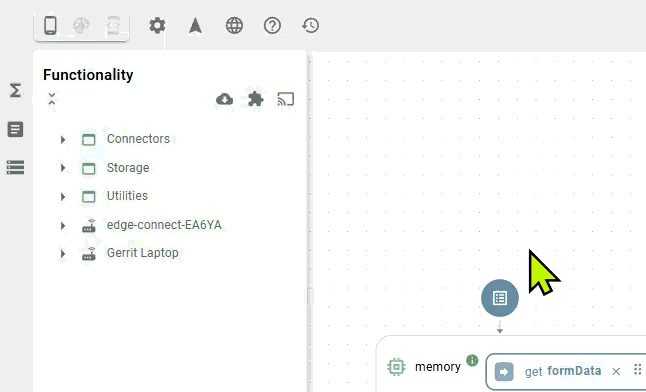

# Extensions

Extensions expand the platform's capabilities using Docker container technology. An extension is a standard Docker image that the Heisenware platform loads, executes, and exposes as functions within the App Builder.


#### Not to be confused with extension nodes

Extensions are Docker-based modules that add whole new function classes to the platform. [Extension nodes](../../extension-nodes.md) (modifiers, filters, recorders, and error handlers) are the small nodes that attach to a function's output on the canvas.


There are two categories of extensions:

1. Official extensions (Heisenware made): ready-to-use, managed modules maintained by us.
2. Custom Extensions (user made): your Docker images containing custom algorithms, drivers, or logic, built by wrapping your code into a [Code Adapter](../../../../account/hosting-and-architecture.md#docker-custom-code-adapter).

## Official extensions

Pre-built modules provided by Heisenware to add advanced capabilities without any coding:

<table><thead><tr><th width="240">Extension</th><th>Description</th></tr></thead><tbody><tr><td><a href="industrial-blockchain.md">Industrial blockchain</a></td><td>Immutable data logging and audit trails.</td></tr><tr><td><a href="rag-ai/">RAG AI</a></td><td>Retrieval-Augmented Generation for context-aware AI assistants.</td></tr><tr><td><a href="process-simulations.md">Process simulations</a></td><td>Simulates energy consumption, production and machine data, and silo fill levels.</td></tr><tr><td><a href="ogc-sensorthings-api.md">OGC SensorThings API</a></td><td>Accesses and manages IoT sensor data via the standardized OGC SensorThings API.</td></tr></tbody></table>

Once installed, these extensions run alongside the standard platform functionality. They appear as new blocks in the [Function Explorer](../function-explorer.md) and can be used immediately in your flows.

<div align="left"><figure><figcaption><p>Adding extensions to the App Builder</p></figcaption></figure></div>

## Custom Extensions

Custom Extensions let you extend the Heisenware platform to your specific needs. We provide a project setup into which you add your custom functionality in a completely non-intrusive fashion. Built on our [VRPC](../../../../advanced/vrpc.md) library, you write plain Node.js code (no APIs to learn) and make it ready for visual programming in minutes.


We are actively working on the same idea for C++ and Python.


The best starting point is our [docker-extension-starter-js](https://github.com/heisenware/heisenware-docker-extension-starter-js). We recommend [downloading](https://github.com/heisenware/heisenware-docker-extension-starter-js/archive/refs/heads/master.zip) this project as a scaffold, changing it to your needs, and placing it under your software versioning.

You end up creating a Docker image whose containers integrate into the platform in one of two ways.

### Running inside the platform

Once your Docker image is built, pushed, and publicly accessible ([contact us](mailto:support@heisenware.com) for private registry support), load it as a Custom Extension.

<div align="left"><figure><figcaption></figcaption></figure></div>

Once installed, and given your code is syntactically correct, it immediately appears in the [Function Explorer](../function-explorer.md). To apply a new version, install it again (works even with the same label).


Any instances you create are automatically persisted and restarted. You find them in the [File Explorer](../../file-explorer.md) under `extensions/my-extension/...`


### Running outside the platform

This lets you run your custom code on-premises while we bridge it automatically, seamlessly, and securely into the cloud. Start a container of your image locally and configure it with the correct credentials using environment variables:

```bash
docker run -it \
-e HW_DOMAIN=<account>.<workspace> \
-e HW_BROKER=mqtts://<account>.heisenware.cloud \
-e HW_USERNAME=<username> \
-e HW_PASSWORD=<password> \
myusername/myimage:1.0.0
```

To retrieve a valid username and password, add a VRPC integration under [Integrations (inbound)](../../../../app-manager/inbound-integrations.md) in the App Manager.

Example: for an account named `my-company`, an integration with username `agentRunner`, and a password `secret`, the call would be:

```bash
docker run -it \
-e HW_DOMAIN=my-company.default \
-e HW_BROKER=mqtts://my-company.heisenware.cloud \
-e HW_USERNAME=agentRunner \
-e HW_PASSWORD=secret \
myusername/myimage:1.0.0
```

When everything is set up correctly, you should see something like this on your console:

<figure><figcaption></figcaption></figure>
