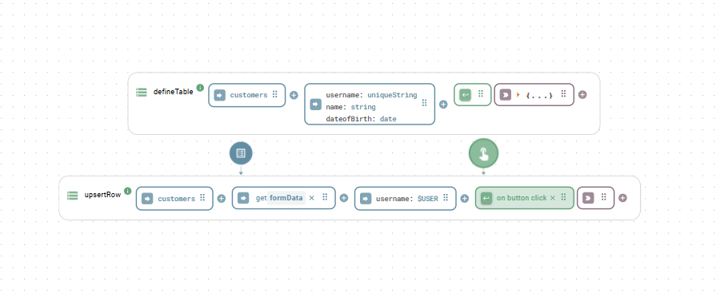

# Relational database

The relational database connector communicates with SQL databases (PostgreSQL, MySQL, MariaDB, MSSQL, SQLite, and more) without writing raw SQL. You can define tables, insert and query rows, model relationships, and track changes with a consistent set of functions.

## Quick start: the internal PostgreSQL instance

Heisenware provides a pre-initialized instance called `internal-postgres`. It is globally available and ready for use. Select `internal-postgres` in your function's instance field to create tables and manage data.

<div align="center"></div>

## Connecting an external database

To connect an external database, use the [`create`](relational-database.md#create) function. How you configure it depends on where the database is located:

* **Cloud or public database**: If the database is accessible over the internet, create the instance directly in your App backend.
* **Local database (via Agent)**: If the database sits inside a private network (such as on a shopfloor server), deploy an [Agent](../../agents/) in that network first and create the database instance within that Agent.


Whether you use the internal database or an external connection, the functions for querying, inserting, and managing data are identical.


## Connection and database management

### `create`

Initializes the connection to an external database.


Skip this step for `internal-postgres`. It is already instantiated for you.


#### Parameters

<table><thead><tr><th width="150">Input</th><th width="120">Key</th><th>Description</th><th width="100">Type</th></tr></thead><tbody><tr><td><code>options</code></td><td><code>dialect</code></td><td>The database dialect (such as <code>postgres</code> or <code>mysql</code>).</td><td>string</td></tr><tr><td></td><td><code>database</code></td><td>The name of the database.</td><td>string</td></tr><tr><td></td><td><code>username</code></td><td>The username for authentication.</td><td>string</td></tr><tr><td></td><td><code>password</code></td><td>The password for authentication.</td><td>string</td></tr><tr><td></td><td><code>host</code></td><td>The hostname or IP address of the database server.</td><td>string</td></tr><tr><td></td><td><code>port</code></td><td>The port number. Default is the standard port of the dialect.</td><td>integer</td></tr><tr><td></td><td><code>ssl</code></td><td>Uses SSL for the connection when <code>true</code>. Default true.</td><td>boolean</td></tr><tr><td></td><td><code>sqlLogging</code></td><td>Logs all SQL statements when <code>true</code>. Default true.</td><td>boolean</td></tr><tr><td></td><td><code>rawOnly</code></td><td>Skips the database introspection for instant startup when <code>true</code>. Use when you only need <code>executeSql</code>.</td><td>boolean</td></tr></tbody></table>


Right-click the `options` input and mark it as a secret to mask the password.


#### Example

```yaml
# options
dialect: 'postgres'
database: 'mydb'
username: 'user'
password: 'pass'
host: 'localhost'
ssl: true
```

### `isConnected`

Checks whether the database connection is currently active.

#### Parameters

None.

#### Output

Returns `true` if connected, or `false` if it is not.

### `getAllTables`

Retrieves all tables that exist in the database.

#### Parameters

None.

#### Output

Returns an array of table name strings.

### `reset`

Drops and recreates the entire database.


#### Destructive action

This permanently deletes all tables and all data in the database. You cannot undo this action.


#### Parameters

None.

#### Output

Returns `true` if the reset succeeds.

### `delete`

Removes the instance and its connection configuration.


#### Destructive action

Deleting an instance removes its configuration. To communicate with the database again, you must create a new instance.


#### Parameters

None.

#### Output

Returns `true` on successful deletion. Throws an error on failure.

## Schema and table definition

### `defineTable`

Defines a table schema. If the table does not exist, the function creates it. If it exists, the function adds any new fields.

Unless you define a custom primary key, the function automatically adds these fields:

* `id`: The table's primary key. A UUID on PostgreSQL, an auto-incrementing integer on other dialects.
* `createdAt`: A timestamp recording when the row was created.
* `updatedAt`: A timestamp tracking the last modification of the row.


When running inside an Agent, the database disables the automatic `createdAt` and `updatedAt` timestamps.


#### Parameters

<table><thead><tr><th width="150">Input</th><th width="120">Key</th><th>Description</th><th width="100">Type</th></tr></thead><tbody><tr><td><code>name</code></td><td></td><td>The name of the table (such as <code>users</code>).</td><td>string</td></tr><tr><td><code>fields</code></td><td></td><td>The table columns. Keys are the field names in camelCase. Values are either a data type string or a configuration object. Supported types: <code>string</code>, <code>text</code>, <code>integer</code>, <code>bigint</code>, <code>float</code>, <code>double</code>, <code>number</code>, <code>boolean</code>, <code>date</code>, <code>uuid</code>, <code>json</code>, <code>jsonb</code>, <code>file</code>, <code>uniquestring</code>, <code>uniqueinteger</code>, <code>uniquebiginteger</code>. Unknown types fall back to <code>string</code>.</td><td>object</td></tr><tr><td><code>options</code></td><td><code>auditLog</code></td><td>Records all changes to this table when <code>true</code>. Replaces the deprecated <code>trackHistory</code>.</td><td>boolean</td></tr></tbody></table>


Use English and camelCase for table and field names (such as `firstName` or `dateOfBirth`). Avoid spaces, dashes, and other special characters. When using PostgreSQL, prefer the `jsonb` type for JSON data: it is more efficient and allows nested properties in filter expressions.


#### Examples

**Example 1: Simple table**

```yaml
# name
users
# fields
name: string
email: uniquestring
age: integer
```

**Example 2: Table with custom primary key and JSONB**

```yaml
# name
products
# fields
id: { type: string, primaryKey: true }
name: string
price: number
specs: jsonb
```


#### Custom primary key naming

Always use `id` as the name of the primary key, even when overriding the default. Other names can cause unexpected behavior.


### Advanced field configuration

For more control, provide an object as a field's value with these properties:

<table><thead><tr><th width="150">Property</th><th>Description</th><th width="100">Type</th></tr></thead><tbody><tr><td><code>type</code></td><td>The data type string (such as <code>string</code> or <code>integer</code>). Required.</td><td>string</td></tr><tr><td><code>primaryKey</code></td><td>Sets this field as the primary key, overriding the default <code>id</code> field.</td><td>boolean</td></tr><tr><td><code>unique</code></td><td>Ensures all values in this column are unique. Assign the same arbitrary string to several fields to make their combination unique.</td><td>boolean or string</td></tr><tr><td><code>allowNull</code></td><td>Allows null values when <code>true</code>. Set to <code>false</code> to require a value.</td><td>boolean</td></tr><tr><td><code>defaultValue</code></td><td>A default value used if none is provided: a literal (such as <code>active</code> or <code>0</code>) or a special value like <code>NOW</code> for the current time.</td><td>any</td></tr><tr><td><code>autoIncrement</code></td><td>Automatically increments an integer primary key for each new row.</td><td>boolean</td></tr><tr><td><code>validate</code></td><td>Adds validation constraints (such as <code>{ isEmail: true, max: 23 }</code>).</td><td>object</td></tr></tbody></table>

**Example 1: Advanced table with constraints**

```yaml
# name
employees
# fields
employeeId: { type: integer, primaryKey: true, autoIncrement: true }
email: { type: string, allowNull: false, unique: true }
status: { type: string, defaultValue: active }
hireDate: { type: date, defaultValue: NOW }
```

**Example 2: Unique constraint across multiple columns**

To make a combination of fields unique, assign an arbitrary string (such as `timeAndId`) to the corresponding fields:

```yaml
# name
machineHistory
# fields
machineId: { unique: timeAndId, type: string }
timestamp: { unique: timeAndId, type: date }
data: jsonb
```

### `getTableSchema`

Retrieves the schema definition of a given table.

#### Parameters

<table><thead><tr><th width="150">Input</th><th>Description</th><th width="100">Type</th></tr></thead><tbody><tr><td><code>name</code></td><td>The name of the table.</td><td>string</td></tr></tbody></table>

#### Output

Returns an object containing schema details for each field, including `type`, `primaryKey`, `allowNull`, `sqlType`, `defaultValue`, `unique`, `autoIncrement`, and any referenced foreign keys.

### `deleteTable`

Deletes an entire table.


#### Destructive action

This permanently deletes the table and all its data. You cannot undo this action.


#### Parameters

<table><thead><tr><th width="150">Input</th><th>Description</th><th width="100">Type</th></tr></thead><tbody><tr><td><code>name</code></td><td>The name of the table to delete.</td><td>string</td></tr></tbody></table>

#### Output

Returns `true` when deletion succeeds.

### `enforceUniqueField`

Retroactively enforces a UNIQUE and NOT NULL constraint on an existing field. It removes duplicate rows and rows with NULL values before applying both constraints.


#### Destructive action

This permanently deletes duplicate and null rows. You cannot undo this action.


#### Parameters

<table><thead><tr><th width="150">Input</th><th width="120">Key</th><th>Description</th><th width="100">Type</th></tr></thead><tbody><tr><td><code>table</code></td><td></td><td>The name of the table.</td><td>string</td></tr><tr><td><code>field</code></td><td></td><td>The field to deduplicate and make unique (such as <code>barcode</code>).</td><td>string</td></tr><tr><td><code>options</code></td><td><code>keep</code></td><td>Which duplicate to keep: <code>newest</code> (latest <code>createdAt</code> or ID) or <code>oldest</code>. Default <code>newest</code>.</td><td>string</td></tr></tbody></table>

#### Output

Returns `true` on success. Throws an error on failure and rolls back all changes.

## Querying and filtering data

### `getTableData`

Retrieves rows from one or more tables, with options for filtering, joining, sorting, and selecting specific fields. This is the primary function for reading data.

#### Parameters

<table><thead><tr><th width="150">Input</th><th width="120">Key</th><th>Description</th><th width="100">Type</th></tr></thead><tbody><tr><td><code>name</code></td><td></td><td>The name of the table, or an array of table names for a multi-table join query.</td><td>string or array</td></tr><tr><td><code>options</code></td><td><code>filter</code></td><td>The conditions rows must meet. For multi-table queries, this must include the join conditions.</td><td>array</td></tr><tr><td></td><td><code>fields</code></td><td>Selects specific columns. For multi-table queries, use dot notation (such as <code>users.name</code>).</td><td>array</td></tr><tr><td></td><td><code>order</code></td><td>The sort order specified as <code>['fieldName', 'DIRECTION']</code>, where direction is <code>ASC</code> or <code>DESC</code>.</td><td>array</td></tr><tr><td></td><td><code>limit</code></td><td>The maximum number of rows to return.</td><td>integer</td></tr><tr><td></td><td><code>offset</code></td><td>The number of rows to skip, useful for pagination.</td><td>integer</td></tr><tr><td></td><td><code>autoJoin</code></td><td>Automatically includes data from related tables for single-table queries. Default <code>true</code>.</td><td>boolean</td></tr><tr><td></td><td><code>locale</code></td><td>A locale string (such as <code>en-US</code>) to format date and time values.</td><td>string</td></tr><tr><td></td><td><code>dateStyle</code></td><td>The formatting style for dates (<code>full</code>, <code>long</code>, <code>medium</code>, <code>short</code>, or <code>hidden</code>).</td><td>string</td></tr><tr><td></td><td><code>timeStyle</code></td><td>The formatting style for times (<code>full</code>, <code>long</code>, <code>medium</code>, <code>short</code>, or <code>hidden</code>).</td><td>string</td></tr></tbody></table>

### Filtering explained

The `filter` option uses an array syntax to build precise queries.

Simple conditions are an array of three elements: `[fieldName, operator, value]`.

* `fieldName`: The column name. For `jsonb` fields, use dot notation to access nested keys (such as `specs.dimensions.width`). For multi-table queries, always prefix with the table name (such as `users.name`).
* `operator`: A comparison string, see the table below.
* `value`: The value to compare against.

Compound conditions combine conditions with `'and'` or `'or'`:

* **AND**: `[ [condition1], 'and', [condition2] ]`, both must be true.
* **OR**: `[ [condition1], 'or', [condition2] ]`, at least one must be true.

Available operators:

| Operator(s)         | Description                                        | Example value              |
| ------------------- | -------------------------------------------------- | -------------------------- |
| `=`, `eq`, `is`     | Equals                                             | `'John'` or `100`          |
| `<>`, `ne`, `isnot` | Not equals                                         | `'John'` or `100`          |
| `>`, `gt`           | Greater than                                       | `99`                       |
| `>=`, `gte`         | Greater than or equal to                           | `100`                      |
| `<`, `lt`           | Less than                                          | `100`                      |
| `<=`, `lte`         | Less than or equal to                              | `100`                      |
| `contains`          | String field contains the value (case-insensitive) | `'oh'` (matches 'John')    |
| `notcontains`       | String field does not contain the value            | `'Peter'`                  |
| `startswith`        | String field starts with the value                 | `'J'`                      |
| `endswith`          | String field ends with the value                   | `'oe'` (matches 'Doe')     |
| `between`           | Value is between two values in an array            | `[18, 30]` or `['A', 'D']` |
| `in`                | Value is one of several possibilities in an array  | `['active', 'pending']`    |

#### Examples

**Example 1: Simple filter and field selection**

Get the `name` and `email` of all active users:

```yaml
# name
users
# options
filter: ['status', '=', 'active']
fields: ['name', 'email']
```

**Example 2: Date range filter**

Find all orders placed in January 2025:

```yaml
# name
orders
# options
filter: ['createdAt', 'between', ['2025-01-01', '2025-01-31T23:59:59Z']]
```

**Example 3: Compound 'and' filter**

Find products that are in stock and cost more than 50:

```yaml
# name
products
# options
filter: [ ['quantity', '>', 0], 'and', ['price', '>', 50] ]
```

**Example 4: Sorting and limiting**

Get the 5 most recent high-priority tickets:

```yaml
# name
tickets
# options
filter: ['priority', 'in', ['high', 'critical']]
order: ['createdAt', 'DESC']
limit: 5
```

**Example 5: Multi-table join**

Retrieve user names and post titles. The first filter condition defines the join:

```yaml
# name
- users
- posts
# options
filter: [ ['users.id', '=', 'posts.userId'] ]
fields: ['users.name', 'posts.title']
```

**Example 6: Join with a where clause**

Retrieve post titles for a specific user named Alice:

```yaml
# name
- users
- posts
# options
filter: [
  ['users.id', '=', 'posts.userId'],
  'and',
  ['users.name', '=', 'Alice']
]
fields: ['posts.title']
```

**Example 7: Join with a nested JSONB filter**

Find all orders for Alice where the shipment details JSON field has priority set to true:

```yaml
# name
- users
- orders
- shipments
# options
fields: ['users.name', 'orders.product', 'shipments.trackingNumber']
filter: [
  ['users.id', '=', 'orders.userId'],
  'and',
  ['orders.shipmentId', '=', 'shipments.id'],
  'and',
  ['users.name', '=', 'Alice'],
  'and',
  ['shipments.details.priority', '=', true]
]
```

#### Output

Returns an array of objects representing matching rows.

### `findRows`

Works like `getTableData`, but returns nothing if you do not provide a filter. Use this when the filter comes from user input (such as a search field) and an empty input should not load the entire table.

#### Parameters

The same as [`getTableData`](relational-database.md#gettabledata), but `filter` is effectively required.

#### Output

Returns an array of matching rows, or nothing when no filter is provided.

### `findRow`

Finds and returns the first row matching the filter. Returns nothing if you do not provide a filter.

#### Parameters

<table><thead><tr><th width="150">Input</th><th width="120">Key</th><th>Description</th><th width="100">Type</th></tr></thead><tbody><tr><td><code>table</code></td><td></td><td>The name of the table.</td><td>string</td></tr><tr><td><code>options</code></td><td><code>filter</code></td><td>The filter conditions.</td><td>array</td></tr><tr><td></td><td><code>fields</code></td><td>An optional array of fields to return.</td><td>array</td></tr></tbody></table>

#### Output

Returns the first matching row object, or `null` if no match is found.

### `getRow`

Retrieves a single row by its primary key.

#### Parameters

<table><thead><tr><th width="150">Input</th><th width="120">Key</th><th>Description</th><th width="100">Type</th></tr></thead><tbody><tr><td><code>table</code></td><td></td><td>The name of the table.</td><td>string</td></tr><tr><td><code>id</code></td><td></td><td>The primary key of the row.</td><td>string</td></tr><tr><td><code>options</code></td><td><code>fields</code></td><td>An optional array of fields to return.</td><td>array</td></tr><tr><td></td><td><code>autoJoin</code></td><td>Automatically includes related data when <code>true</code>. Default <code>true</code>.</td><td>boolean</td></tr></tbody></table>

#### Output

Returns the row object, or `null` if the ID is not found.

## Data manipulation

### `addRow`

Adds a single new row to a table.

#### Parameters

<table><thead><tr><th width="150">Input</th><th>Description</th><th width="100">Type</th></tr></thead><tbody><tr><td><code>table</code></td><td>The name of the table.</td><td>string</td></tr><tr><td><code>data</code></td><td>An object containing the column values to insert.</td><td>object</td></tr></tbody></table>

#### Example

```yaml
# table
users
# data
name: Jane Doe
email: jane.doe@example.com
age: 34
```

#### Output

Returns the created row as saved in the database, including the generated `id`.

### `addRows`

Adds multiple rows to a table in a single, efficient bulk operation.

#### Parameters

<table><thead><tr><th width="150">Input</th><th>Description</th><th width="100">Type</th></tr></thead><tbody><tr><td><code>table</code></td><td>The name of the table.</td><td>string</td></tr><tr><td><code>data</code></td><td>An array of data objects to insert.</td><td>array</td></tr></tbody></table>

#### Example

```yaml
# table
products
# data
- name: 'Thingamajig'
  price: 19.99
  stock: 100
- name: 'Widget'
  price: 25.50
  stock: 250
```

#### Output

Returns the number of rows added.

### `upsertRow`

Atomically updates or inserts a row. The function checks whether the row exists and either updates it or creates a new one. By default, the check uses the primary key (`id`). The optional `uniqueKey` parameter lets you check against another business key (such as an email) instead.

#### Parameters

<table><thead><tr><th width="150">Input</th><th>Description</th><th width="100">Type</th></tr></thead><tbody><tr><td><code>table</code></td><td>The name of the table.</td><td>string</td></tr><tr><td><code>data</code></td><td>The data object to upsert.</td><td>object</td></tr><tr><td><code>uniqueKey</code></td><td>An optional object specifying a unique business key for the existence check.</td><td>object</td></tr></tbody></table>

#### Examples

**Example 1: Upsert using the default primary key**

Update the user with a specific ID, or create them if they do not exist:

```yaml
# table
users
# data
id: 'a1b2c3d4-e5f6-4a3b-8c2d-1f2e3d4c5b6a'
name: Jane Smith
age: 36
```

**Example 2: Upsert using a custom unique key**

Find a user by email. If they exist, update their age; if not, create them:

```yaml
# table
users
# data
name: Jane Doe
age: 35
# uniqueKey
email: 'jane.doe@example.com'
```

#### Output

Returns an array containing the created/updated state and the primary key of the affected row.

### `changeRow`

Changes the content of a specific row identified by its primary key.

#### Parameters

<table><thead><tr><th width="150">Input</th><th width="120">Key</th><th>Description</th><th width="100">Type</th></tr></thead><tbody><tr><td><code>table</code></td><td></td><td>The name of the table.</td><td>string</td></tr><tr><td><code>id</code></td><td></td><td>The primary key of the row to change.</td><td>string</td></tr><tr><td><code>data</code></td><td></td><td>The fields and their new values.</td><td>object</td></tr><tr><td><code>options</code></td><td><code>patch</code></td><td>Partially updates nested JSON objects instead of replacing them when <code>true</code>.</td><td>boolean</td></tr><tr><td></td><td><code>fieldDelimiter</code></td><td>Unflattens the data using the specified delimiter (such as flattening <code>settings.theme</code> to a nested object).</td><td>string</td></tr></tbody></table>

#### Example

Update a user's age and status:

```yaml
# table
users
# id
'a1b2c3d4-e5f6-4a3b-8c2d-1f2e3d4c5b6a'
# data
age: 37
status: 'active'
```

#### Output

Returns the modified row object. Throws an error if the row is not found.

### `updateRow`

Updates specific fields of an existing row, identified by the `id` inside the `data` object or by a `uniqueKey`. Fields not included in `data` remain untouched, but the database replaces JSON columns entirely with the provided value. To merge data into an existing JSON object, use `patchRow` instead.

#### Parameters

<table><thead><tr><th width="150">Input</th><th>Description</th><th width="100">Type</th></tr></thead><tbody><tr><td><code>table</code></td><td>The name of the table.</td><td>string</td></tr><tr><td><code>data</code></td><td>The new values. Must contain the <code>id</code> unless using <code>uniqueKey</code>.</td><td>object</td></tr><tr><td><code>uniqueKey</code></td><td>An optional object identifying the row by a business key instead of the ID.</td><td>object</td></tr></tbody></table>

#### Example

Before, a row in the `settings` table:

```json
{
  "id": 1,
  "name": "Config A",
  "settings": { "theme": "dark", "notifications": true }
}
```

Call `updateRow` with:

```yaml
# table
settings
# data
id: 1
settings: {
  notifications: false,
  timezone: UTC
}
```

After:

```json
{
  "id": 1,
  "name": "Config A",
  "settings": { "notifications": false, "timezone": "UTC" }
}
```

The `name` field stayed untouched, but the `theme` key in the JSON is gone.

#### Output

Returns the updated row object. Throws an error if the row is not found.

### `patchRow`

Patches a row with new data by merging nested JSON objects instead of replacing them. Original JSON keys not included in the patch are preserved.

#### Parameters

<table><thead><tr><th width="150">Input</th><th>Description</th><th width="100">Type</th></tr></thead><tbody><tr><td><code>table</code></td><td>The name of the table.</td><td>string</td></tr><tr><td><code>data</code></td><td>The new values. Must contain the <code>id</code> unless using <code>uniqueKey</code>.</td><td>object</td></tr><tr><td><code>uniqueKey</code></td><td>An optional object identifying the row by a business key instead of the ID.</td><td>object</td></tr></tbody></table>

#### Example

Before, a row in the `settings` table:

```json
{
  "id": 1,
  "name": "Config A",
  "settings": { "theme": "dark", "notifications": true }
}
```

Call `patchRow` with:

```yaml
# table
settings
# data
id: 1
settings: {
  notifications: false,
  timezone: UTC
}
```

After:

```json
{
  "id": 1,
  "name": "Config A",
  "settings": { "theme": "dark", "notifications": false, "timezone": "UTC" }
}
```

The original `theme` key is preserved and the new data is merged in.

#### Output

Returns the patched row object. Throws an error if the row is not found.

### `deleteRow`

Deletes a single row from a table, identified by its primary key.


#### Destructive action

This permanently deletes the row. You cannot undo this action.


#### Parameters

<table><thead><tr><th width="150">Input</th><th>Description</th><th width="100">Type</th></tr></thead><tbody><tr><td><code>table</code></td><td>The name of the table.</td><td>string</td></tr><tr><td><code>id</code></td><td>The primary key of the row to delete.</td><td>string</td></tr></tbody></table>

#### Example

```yaml
# table
users
# id
'a1b2c3d4-e5f6-4a3b-8c2d-1f2e3d4c5b6a'
```

#### Output

Returns `true` if the row is deleted, or `false` if no row with that ID exists.

### `clearTable`

Deletes all rows from a table, leaving the table structure intact.


#### Destructive action

This permanently deletes all data in the table. You cannot undo this action.


#### Parameters

<table><thead><tr><th width="150">Input</th><th width="120">Key</th><th>Description</th><th width="100">Type</th></tr></thead><tbody><tr><td><code>name</code></td><td></td><td>The name of the table to clear.</td><td>string</td></tr><tr><td><code>options</code></td><td><code>nullifyLinkedRecords</code></td><td>Sets foreign keys in other tables pointing to this table to <code>NULL</code> before clearing when <code>true</code>. Default <code>false</code>.</td><td>boolean</td></tr></tbody></table>

#### Example

```yaml
# name
logs
```

#### Output

Returns `true` on success.

## Relationships and associations

These functions define logical connections between tables to create a relational data model. Relationships ensure data integrity and enable cross-table queries. The workflow has three steps:

1. **Define tables**: Create your tables using `defineTable`.
2. **Define the relationship**: Use one of the association functions to declare how the tables connect.
3. **Link records**: Use the foreign key fields created in step 2 to connect specific rows. For many-to-many relationships, use `associateRow`.

### `optionallyHasOne`

Creates a one-to-many relationship where the child record can exist without a parent. This adds a nullable foreign key column to the child table.

#### Parameters

<table><thead><tr><th width="150">Input</th><th>Description</th><th width="100">Type</th></tr></thead><tbody><tr><td><code>childTable</code></td><td>The table that receives the foreign key (such as <code>posts</code>).</td><td>string</td></tr><tr><td><code>parentTable</code></td><td>The table being referenced (such as <code>users</code>).</td><td>string</td></tr><tr><td><code>role</code></td><td>An optional PascalCase string (such as <code>Owner</code>) to create a distinct relationship.</td><td>string</td></tr></tbody></table>

### `mandatorilyHasOne`

Creates a one-to-many relationship where the child record cannot exist without a parent. This adds a non-nullable foreign key column to the child table.

#### Parameters

<table><thead><tr><th width="150">Input</th><th>Description</th><th width="100">Type</th></tr></thead><tbody><tr><td><code>childTable</code></td><td>The table that receives the foreign key (such as <code>employees</code>).</td><td>string</td></tr><tr><td><code>parentTable</code></td><td>The table being referenced (such as <code>companies</code>).</td><td>string</td></tr><tr><td><code>role</code></td><td>An optional PascalCase string (such as <code>Manager</code>) to create a distinct relationship.</td><td>string</td></tr></tbody></table>

### `optionallyHasMany`

Creates a many-to-many relationship between two tables. This automatically generates a hidden junction table to manage the associations.

#### Parameters

<table><thead><tr><th width="150">Input</th><th>Description</th><th width="100">Type</th></tr></thead><tbody><tr><td><code>childTable</code></td><td>The first table in the relationship.</td><td>string</td></tr><tr><td><code>parentTable</code></td><td>The second table in the relationship.</td><td>string</td></tr></tbody></table>

### `associateRow`

Links existing records. Use this to create links for a many-to-many relationship after defining it.

#### Parameters

<table><thead><tr><th width="150">Input</th><th>Description</th><th width="100">Type</th></tr></thead><tbody><tr><td><code>sourceTable</code></td><td>The name of the source table.</td><td>string</td></tr><tr><td><code>sourceId</code></td><td>The ID of the row in the source table.</td><td>string</td></tr><tr><td><code>targetTable</code></td><td>The name of the target table.</td><td>string</td></tr><tr><td><code>targetId</code></td><td>The ID or an array of IDs of the row(s) in the target table.</td><td>string or array</td></tr></tbody></table>

### Relationship strategies and examples

This section guides you through choosing and implementing relationships.

#### One-to-many (mandatory)

The most common relationship. Use it when a child record requires a parent. Example: An employee must belong to a company.



#### Define tables

Create the `companies` and `employees` tables.

```yaml
# (call defineTable)
# name
companies
# fields
name: string

# (call defineTable)
# name
employees
# fields
firstName: string
lastName: string
```



#### Define the relationship

Declare that an employee mandatorily has one company.

```yaml
# (call mandatorilyHasOne)
# childTable
employees
# parentTable
companies
```


This adds a non-nullable `companyId` foreign key column to the `employees` table.




#### Link records

Because `companyId` is mandatory, provide it when creating a new employee record.

```yaml
# (call addRow)
# table
employees
# data
firstName: Ada
lastName: Lovelace
companyId: 'a1b2c3d4-e5f6-4a3b-8c2d-1f2e3d4c5b6a'
```



#### One-to-many (optional)

Use this when the link between child and parent is optional. The child can be created first and linked later. Example: A blog post can optionally be assigned to a category.



#### Define tables

```yaml
# (call defineTable)
# name
posts
# fields
title: string
content: text

# (call defineTable)
# name
categories
# fields
name: string
```



#### Define the relationship

Declare that a post optionally has one category.

```yaml
# (call optionallyHasOne)
# childTable
posts
# parentTable
categories
```


This adds a nullable `categoryId` foreign key column to the `posts` table.




#### Link records

Create a post without a category, and link it later by patching the record.

```yaml
# (call addRow to create the post initially)
# table
posts
# data
title: 'My First Post'
content: '...'

# (call patchRow later to link it to a category)
# table
posts
# data
id: 'f1e2d3c4-b5a6-4a3b-8c2d-1f2e3d4c5b6a'
categoryId: 'c1b2a3d4-e5f6-4a3b-8c2d-1f2e3d4c5b6a'
```



#### Many-to-many

Use this when records in two tables can have multiple links to each other. Example: An order can contain many products, and a product can be part of many orders.



#### Define tables

```yaml
# (call defineTable)
# name
orders
# fields
orderDate: date

# (call defineTable)
# name
products
# fields
name: string
price: number
```



#### Define the relationship

Declare the many-to-many relationship between orders and products.

```yaml
# (call optionallyHasMany)
# childTable
orders
# parentTable
products
```


This automatically creates a hidden junction table (such as `__orders2products`) storing the links between order IDs and product IDs.




#### Link records

Connect the records with `associateRow`. Link one order to multiple products by providing an array of product IDs.

```yaml
# (call associateRow)
# sourceTable
orders
# sourceId
'o1d2e3r4-b5a6-4a3b-8c2d-1f2e3d4c5b6a'
# targetTable
products
# targetId
- 'p1r2o3d4-b5a6-4a3b-8c2d-1f2e3d4c5b6a'
- 'p5r6o7d8-b5a6-4a3b-8c2d-1f2e3d4c5b6a'
```



#### Advanced: multiple relationships with roles

Use the `role` parameter to define multiple distinct relationships between the same two tables (such as a document with both an owner and an editor from the `users` table).



#### Define tables

```yaml
# (call defineTable)
# name
users
# fields
name: string

# (call defineTable)
# name
documents
# fields
title: string
```



#### Define the relationships with roles

Create two distinct one-to-many relationships, specifying a role for each.

```yaml
# (call optionallyHasOne for the owner)
# childTable
documents
# parentTable
users
# role
Owner

# (call optionallyHasOne for the editor)
# childTable
documents
# parentTable
users
# role
Editor
```


This adds two separate foreign keys to the `documents` table: `ownerId` and `editorId`. The role name directly determines the name of the foreign key.




#### Link records

When creating a document, provide IDs for both the owner and the editor using the specific foreign key fields.

```yaml
# (call addRow)
# table
documents
# data
title: 'Q4 Financial Report'
ownerId: 'u1s2e3r4-b5a6-4a3b-8c2d-1f2e3d4c5b6a'
editorId: 'u5s6e7r8-b5a6-4a3b-8c2d-1f2e3d4c5b6a'
```



## Audit logging

The relational database connector (`RelationalDatabase`) features a built-in audit logging system that creates a secure, detailed, and queryable trail of all data changes. It tracks what changed, when, and who changed it. It automatically calculates the differences (diff) between old and new values for updates, and stores full snapshots for creations and deletions.


#### Deprecation notice

The `trackHistory` option in `defineTable` and the `getHistoricalData` function are deprecated. Use `auditLog` and `getAuditLog` instead.


### Enabling audit logs

Set the `auditLog` option to `true` when defining the table schema:

```yaml
# name
orders
# fields
orderNumber: string
status: string
total: number
# options
auditLog: true
```

The database automatically creates a parallel table (such as `ordersAuditLog`) recording all CREATE, UPDATE, and DELETE actions on the main table.

### Tracking the actor

To record who made a change, all data manipulation functions accept an optional `actorId` within their options. In an App, bind this to the authenticated user via the `$USER` variable or their user ID.

```yaml
# table
orders
# data
id: 'order-123'
status: 'shipped'
# options
actorId: 'admin-alice'
```

### `getAuditLog`

Retrieves and filters the recorded history, including natural language time parsing and field-level tracking.

#### Parameters

<table><thead><tr><th width="150">Input</th><th width="120">Key</th><th>Description</th><th width="100">Type</th></tr></thead><tbody><tr><td><code>table</code></td><td></td><td>The name of the table to query.</td><td>string</td></tr><tr><td><code>options</code></td><td><code>id</code></td><td>Filters logs for a specific record's primary key.</td><td>string</td></tr><tr><td></td><td><code>actorId</code></td><td>Filters logs by the user who made the change.</td><td>string</td></tr><tr><td></td><td><code>action</code></td><td>Filters by action type (<code>CREATE</code>, <code>UPDATE</code>, or <code>DELETE</code>).</td><td>string</td></tr><tr><td></td><td><code>changedField</code></td><td>Returns only logs where a specific field was modified.</td><td>string</td></tr><tr><td></td><td><code>start</code></td><td>The earliest time to include, supporting natural language (such as <code>yesterday</code> or <code>-1h</code>).</td><td>string</td></tr><tr><td></td><td><code>stop</code></td><td>The latest time to include. Default <code>now</code>.</td><td>string</td></tr></tbody></table>

#### Examples

**Example 1: View all changes to a specific record**

```yaml
# table
orders
# options
id: 'order-999'
```

**Example 2: Track specific field modifications**

Find out who changed the `status` field of an order, and when:

```yaml
# table
orders
# options
id: 'order-999'
changedField: status
```

**Example 3: Monitor user activity**

See all deletions performed by a specific admin in the last 24 hours:

```yaml
# table
products
# options
action: DELETE
actorId: admin-alice
start: -24h
```

#### Output

An array of log entries, ordered from newest to oldest. The `diff` object varies by action:

**CREATE**: There is no old state; `new` contains the complete inserted record.

```json
{
  "action": "CREATE",
  "actorId": "admin-alice",
  "diff": {
    "old": null,
    "new": { "id": "order-123", "status": "pending", "total": 150.00 }
  },
  "createdAt": "2025-08-20T10:00:00.000Z"
}
```

**UPDATE**: The `diff` contains only the fields that actually changed, with their old and new values.

```json
{
  "action": "UPDATE",
  "actorId": "admin-alice",
  "diff": {
    "status": {
      "old": "pending",
      "new": "shipped"
    }
  },
  "createdAt": "2025-08-21T14:30:00.000Z"
}
```

**DELETE**: There is no new state; `old` contains the final snapshot of the record.

```json
{
  "action": "DELETE",
  "actorId": "admin-alice",
  "diff": {
    "old": { "id": "order-123", "status": "shipped", "total": 150.00 },
    "new": null
  },
  "createdAt": "2025-08-25T09:15:00.000Z"
}
```

## Auto-schema functions

These functions create and alter tables on the fly. Use them for rapid prototyping or unpredictable data structures.

### `autoUpsertRow`

Upserts a row. If the table or columns do not exist, the function creates them automatically based on the provided data.

#### Parameters

<table><thead><tr><th width="150">Input</th><th>Description</th><th width="100">Type</th></tr></thead><tbody><tr><td><code>table</code></td><td>The name of the table.</td><td>string</td></tr><tr><td><code>data</code></td><td>The data object to upsert.</td><td>object</td></tr><tr><td><code>uniqueKey</code></td><td>An optional unique key for the existence check.</td><td>object</td></tr></tbody></table>

#### Output

Returns `true` on success, or `false` if it fails. Errors are logged but not thrown.

### `autoAddRows`

Bulk-inserts data. Like `autoUpsertRow`, it creates or alters the table schema as needed based on the first data object in the array.

#### Parameters

<table><thead><tr><th width="150">Input</th><th>Description</th><th width="100">Type</th></tr></thead><tbody><tr><td><code>table</code></td><td>The name of the table.</td><td>string</td></tr><tr><td><code>data</code></td><td>An array of data objects to insert. The schema is derived from the first object.</td><td>array</td></tr><tr><td><code>uniqueKey</code></td><td>An optional unique key for the existence check.</td><td>object</td></tr></tbody></table>

#### Output

Returns `true` on success, or `false` if it fails. Errors are logged but not thrown.

## Raw SQL and templates

### `executeSql`

Executes a raw SQL statement with template variable substitution. Placeholders such as `{{customer.id}}` are safely replaced with values from the `variables` object. For `SELECT` statements, the query returns an array of row objects.


#### Destructive action

Raw SQL can modify or delete database schemas and records. Run custom scripts with caution.


#### Parameters

<table><thead><tr><th width="150">Input</th><th width="120">Key</th><th>Description</th><th width="100">Type</th></tr></thead><tbody><tr><td><code>template</code></td><td></td><td>The SQL string containing <code>{{double.curly.braces}}</code> placeholders.</td><td>string</td></tr><tr><td><code>variables</code></td><td></td><td>The object containing the data for the placeholders. Nested values are addressed with dot notation.</td><td>object</td></tr><tr><td><code>options</code></td><td><code>type</code></td><td>Forces a specific query type (such as <code>SELECT</code>, <code>UPDATE</code>, or <code>INSERT</code>).</td><td>string</td></tr><tr><td></td><td><code>locale</code></td><td>Formats dates and times in the result using local representation (such as <code>de-DE</code>).</td><td>string</td></tr><tr><td></td><td><code>dateStyle</code></td><td>The formatting style for dates (<code>full</code>, <code>long</code>, <code>medium</code>, or <code>short</code>).</td><td>string</td></tr><tr><td></td><td><code>timeStyle</code></td><td>The formatting style for times (<code>full</code>, <code>long</code>, <code>medium</code>, or <code>short</code>).</td><td>string</td></tr></tbody></table>

#### Example

```yaml
# template
SELECT name, email FROM users WHERE "companyId" = {{company.id}} AND age > {{minAge}}
# variables
company: { id: 'a1b2c3d4' }
minAge: 30
```

#### Output

Returns the result of the query. For `SELECT` statements, this is an array of row objects.

### `fillTemplate`

Fills a template string with data from the first record matching a given condition per table. Placeholders use double curly braces such as `{{table.field}}` or nested keys such as `{{table.jsonField.nestedKey}}`. If you provide a `locale`, the function formats ISO date-time values automatically. Unresolved placeholders are removed from the result.

#### Parameters

<table><thead><tr><th width="150">Input</th><th width="120">Key</th><th>Description</th><th width="100">Type</th></tr></thead><tbody><tr><td><code>template</code></td><td></td><td>The template string containing placeholders.</td><td>string</td></tr><tr><td><code>condition</code></td><td></td><td>An object mapping table names to their filter conditions.</td><td>object</td></tr><tr><td><code>options</code></td><td><code>locale</code></td><td>The locale for date and time formatting (such as <code>en-US</code> or <code>de-DE</code>).</td><td>string</td></tr><tr><td></td><td><code>dateStyle</code></td><td>The formatting style for dates (<code>full</code>, <code>long</code>, <code>medium</code>, or <code>short</code>). Default <code>medium</code>.</td><td>string</td></tr><tr><td></td><td><code>timeStyle</code></td><td>The formatting style for times (<code>full</code>, <code>long</code>, <code>medium</code>, or <code>short</code>). Default <code>medium</code>.</td><td>string</td></tr></tbody></table>

#### Example

Create a notification string for a specific user and their latest order:

```yaml
# template
"Hello {{users.name}}! Your order #{{orders.orderNumber}} will ship on {{orders.details.shippingDate}}."
# condition
users: ['id', '=', 'user-123']
orders: ['userId', '=', 'user-123']
# options
locale: en-GB
dateStyle: long
```

Result (example): "Hello Jane Doe! Your order #98765 will ship on 18 August 2025."

#### Output

Returns the template string with all resolved placeholders.

## Change notifications

### `onChange`

Registers a callback executed whenever the specified table changes (insert, update, or delete).

#### Parameters

<table><thead><tr><th width="150">Input</th><th>Description</th><th width="100">Type</th></tr></thead><tbody><tr><td><code>name</code></td><td>The name of the table to subscribe to.</td><td>string</td></tr><tr><td><code>handler</code></td><td>The callback evaluated on every change to the table.</td><td>callback</td></tr></tbody></table>

#### Output

Returns `'subscribed'` to confirm registration.

## Deprecated functions

The following functions are maintained for backward compatibility. Use their recommended replacements in new flows.

| Deprecated function                       | Use instead                     |
| ----------------------------------------- | ------------------------------- |
| `getHistoricalData` (with `trackHistory`) | `getAuditLog` (with `auditLog`) |
| `findOne`                                 | `findRow`                       |

## Tips and tricks

### Referencing the current user with $USER

The `$USER` variable references the authenticated user of your App. Define the username as a unique key (type `uniquestring`) when creating the table to allow `upsertRow` to update and insert rows based on that unique key.

<div align="center"><figure><figcaption><p>$USER in combination with the upsertRow function</p></figcaption></figure></div>
