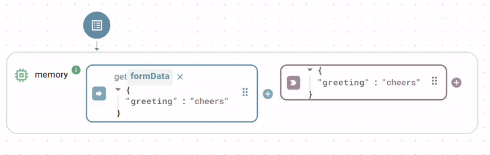

# Data processing

The data processing utility class provides a collection of functions for common data manipulation, transformation, and logical operations. Use these functions to work with arrays and objects, handle JSON payloads, map numerical value ranges, and delay data flows. All functions in this class are static, meaning you do not need to create an instance before using them. The code class name is `Tools`.

### `echo`

Returns the exact input value it receives.

#### Parameters

<table><thead><tr><th width="150">Input</th><th>Description</th><th width="100">Type</th></tr></thead><tbody><tr><td><code>value</code></td><td>Any input argument to return.</td><td>any</td></tr></tbody></table>

#### Output

Returns the unchanged input value.

### `combine`

Combines two or more arguments into a single array. Undefined values beyond the first two arguments are ignored.

#### Parameters

<table><thead><tr><th width="150">Input</th><th>Description</th><th width="100">Type</th></tr></thead><tbody><tr><td><code>arg1</code>, <code>arg2</code>, ...</td><td>An arbitrary number of arguments to combine into an array.</td><td>any</td></tr></tbody></table>

#### Example

```yaml
# arg1
123
# arg2
"hello"
# arg3
{ "key": "value" }
```

#### Output

Returns the combined array:

```json
[
  123,
  "hello",
  { "key": "value" }
]
```

### `mergeObjects`

Merges two or more objects into a single new object. If the same key exists in multiple objects, the value from the last object in the argument list overwrites the previous values. The function ignores any arguments that are not plain objects (including arrays).

#### Parameters

<table><thead><tr><th width="150">Input</th><th>Description</th><th width="100">Type</th></tr></thead><tbody><tr><td><code>arg1</code>, <code>arg2</code>, ...</td><td>Two or more objects to merge together.</td><td>object</td></tr></tbody></table>

#### Example

```yaml
# arg1
{ "name": "John", "status": "active" }
# arg2
{ "status": "inactive", "id": 123 }
```

#### Output

Returns the merged object:

```json
{
  "name": "John",
  "status": "inactive",
  "id": 123
}
```

### `arrayPush`

Pushes one or more items to the end of an array. If an item is itself an array, the function unpacks its elements and adds them individually to the base array. If the first input is not an array, the function wraps it in one; `null` or an empty input starts a new array.

#### Parameters

<table><thead><tr><th width="150">Input</th><th>Description</th><th width="100">Type</th></tr></thead><tbody><tr><td><code>array</code></td><td>The destination input array.</td><td>array</td></tr><tr><td><code>items</code></td><td>Any number of items to push to the end of the array.</td><td>any</td></tr></tbody></table>

#### Example

```yaml
# array
[1, 2]
# items
[ 3, 4, [5, 6] ]
```

#### Output

Returns the updated array:

```json
[1, 2, 3, 4, 5, 6]
```

### `mapRange`

Maps a numerical value from an original range to a new range. The function rounds the final result to the nearest integer.

#### Parameters

<table><thead><tr><th width="150">Input</th><th width="120">Key</th><th>Description</th><th width="100">Type</th></tr></thead><tbody><tr><td><code>value</code></td><td></td><td>The numerical value to map.</td><td>number</td></tr><tr><td><code>options</code></td><td><code>origMin</code></td><td>The minimum value of the original range.</td><td>number</td></tr><tr><td></td><td><code>origMax</code></td><td>The maximum value of the original range.</td><td>number</td></tr><tr><td></td><td><code>newMin</code></td><td>The minimum value of the new range.</td><td>number</td></tr><tr><td></td><td><code>newMax</code></td><td>The maximum value of the new range.</td><td>number</td></tr></tbody></table>

#### Example

Map a sensor value (0 to 1023) to a percentage scale (0 to 100):

```yaml
# value
512
# options
origMin: 0
origMax: 1023
newMin: 0
newMax: 100
```

#### Output

Returns the mapped integer value: `50`

### `delay`

Returns the provided value after a configurable time delay. This function executes asynchronously.

#### Parameters

<table><thead><tr><th width="150">Input</th><th width="120">Key</th><th>Description</th><th width="100">Type</th></tr></thead><tbody><tr><td><code>value</code></td><td></td><td>The value to return after the delay.</td><td>any</td></tr><tr><td><code>options</code></td><td><code>timeout</code></td><td>The delay duration in milliseconds. Default 1000.</td><td>integer</td></tr></tbody></table>

#### Output

Returns the unchanged input value after the specified time delay.

### `areAllParamsTrue`

Applies a logical AND operation. This function checks if the exact number of specified arguments are all truthy (not `false`, `0`, `""`, `null`, or `undefined`).

#### Parameters

<table><thead><tr><th width="150">Input</th><th>Description</th><th width="100">Type</th></tr></thead><tbody><tr><td><code>nParams</code></td><td>The exact number of arguments that must be provided and evaluate to truthy.</td><td>integer</td></tr><tr><td><code>args</code></td><td>The arguments to evaluate.</td><td>any</td></tr></tbody></table>

#### Examples

##### Scenario 1: All elements match and evaluate to truthy

```yaml
# nParams
3
# args
[true, "hello", 1]
```

Output: `true` (3 arguments were provided and all evaluate to truthy)

##### Scenario 2: Insufficient truthy parameters provided

```yaml
# nParams
3
# args
[true, ""]
```

Output: `false` (only 2 truthy arguments were provided instead of 3)

#### Output

Returns `true` if all arguments match `nParams` and evaluate to truthy; otherwise, returns `false`.

### `isOneOrMoreParamTrue`

Applies a logical OR operation. This function checks if at least one of the provided arguments evaluates to truthy.

#### Parameters

<table><thead><tr><th width="150">Input</th><th>Description</th><th width="100">Type</th></tr></thead><tbody><tr><td><code>args</code></td><td>Any number of input parameters to check.</td><td>any</td></tr></tbody></table>

#### Example

```yaml
# args
[false, 0, "hello", null]
```

#### Output

Returns `true` if at least one argument evaluates to truthy (because `"hello"` is truthy); otherwise, returns `false`.

### `jsonStringify`

Converts a JavaScript runtime value (such as an object or array) into a standard JSON string.

#### Parameters

<table><thead><tr><th width="150">Input</th><th>Description</th><th width="100">Type</th></tr></thead><tbody><tr><td><code>value</code></td><td>The JavaScript object or array to convert.</td><td>any</td></tr></tbody></table>

#### Example

```yaml
# value
{ "name": "John", "is_active": true, "roles": ["admin", "editor"] }
```

#### Output

Returns the generated JSON string:

`'{"name":"John","is_active":true,"roles":["admin","editor"]}'`

### `jsonParse`

Converts a valid JSON string back into its corresponding JavaScript object or value representation.

#### Parameters

<table><thead><tr><th width="150">Input</th><th>Description</th><th width="100">Type</th></tr></thead><tbody><tr><td><code>text</code></td><td>A valid JSON string to parse.</td><td>string</td></tr></tbody></table>

#### Example

```yaml
# text
'{"name":"John","is_active":true,"roles":["admin","editor"]}'
```

#### Output

Returns the parsed JavaScript entity. Throws an error if the string is not valid JSON.

```json
{
  "name": "John",
  "is_active": true,
  "roles": ["admin", "editor"]
}
```

### `flatten`

Takes a nested JavaScript object and flattens it into a single-level object structure by generating dot-delimited keys.

#### Parameters

<table><thead><tr><th width="150">Input</th><th width="120">Key</th><th>Description</th><th width="100">Type</th></tr></thead><tbody><tr><td><code>target</code></td><td></td><td>The nested target object to flatten.</td><td>object</td></tr><tr><td><code>options</code></td><td><code>delimiter</code></td><td>A custom delimiter string to separate keys instead of the default dot <code>.</code>.</td><td>string</td></tr><tr><td></td><td><code>safe</code></td><td>If true, preserves arrays and their contents intact instead of flattening their indexes. Default false.</td><td>boolean</td></tr><tr><td></td><td><code>maxDepth</code></td><td>The maximum number of nested levels to flatten.</td><td>integer</td></tr></tbody></table>

#### Example

```yaml
# target
{
  "user": {
    "name": "John",
    "address": {
      "city": "New York"
    }
  },
  "tags": ["a", "b"]
}
```

#### Output

Returns the flattened object:

```json
{
  "user.name": "John",
  "user.address.city": "New York",
  "tags.0": "a",
  "tags.1": "b"
}
```

### `unflatten`

The inverse operation of `flatten`. Takes a flat object containing delimited keys and converts it back into a deeply nested object structure.

#### Parameters

<table><thead><tr><th width="150">Input</th><th width="120">Key</th><th>Description</th><th width="100">Type</th></tr></thead><tbody><tr><td><code>target</code></td><td></td><td>The flat target object to unflatten.</td><td>object</td></tr><tr><td><code>options</code></td><td><code>delimiter</code></td><td>A custom delimiter string to identify nested breaks instead of a dot.</td><td>string</td></tr><tr><td></td><td><code>safe</code></td><td>If true, preserves arrays and their nested contents intact. Default false.</td><td>boolean</td></tr><tr><td></td><td><code>object</code></td><td>If true, prevents the automatic instantiation of arrays when unflattening. Default false.</td><td>boolean</td></tr><tr><td></td><td><code>override</code></td><td>If true, overwrites existing keys if they cannot accommodate a newly encountered nested object value. Default false.</td><td>boolean</td></tr></tbody></table>

#### Example

```yaml
# target
{
  "user.name": "John",
  "user.address.city": "New York"
}
```

#### Output

Returns the unflattened nested object structure:

```json
{
  "user": {
    "name": "John",
    "address": {
      "city": "New York"
    }
  }
}
```

### `mergeArrays`

Merges multiple arrays by combining the objects located at corresponding indexes. The function truncates the final output array to match the length of the shortest provided input array. Non-object elements are included with a key of an underscore `_` followed by the source array index.

#### Parameters

<table><thead><tr><th width="150">Input</th><th>Description</th><th width="100">Type</th></tr></thead><tbody><tr><td><code>args</code></td><td>Multiple arrays of objects to merge together.</td><td>array</td></tr></tbody></table>

#### Example

```yaml
# args
[
  [ { "a": 1 }, { "b": 2 } ],
  [ { "c": 3 }, { "d": 4, "e": 5 } ]
]
```

#### Output

Returns the merged index array:

```json
[
  { "a": 1, "c": 3 },
  { "b": 2, "d": 4, "e": 5 }
]
```

### `combineArrays`

Combines multiple arrays similarly to `mergeArrays`, but appends an underscore `_` followed by the source array index to each object key. This prevents key collisions when the arrays contain objects with identical keys.

#### Parameters

<table><thead><tr><th width="150">Input</th><th>Description</th><th width="100">Type</th></tr></thead><tbody><tr><td><code>args</code></td><td>Multiple arrays to combine.</td><td>array</td></tr></tbody></table>

#### Example

```yaml
# args
[
  [ { "value": 10 }, { "value": 20 } ],
  [ { "value": 30 }, { "value": 40 } ]
]
```

#### Output

Returns the indexed combination array:

```json
[
  { "value_0": 10, "value_1": 30 },
  { "value_0": 20, "value_1": 40 }
]
```

### `groupArrays`

Groups and merges objects compiled from multiple separate arrays based on a shared property key or an array of designated keys. This utility provides an efficient way to execute client-side joins across distinct data streams.

#### Parameters

<table><thead><tr><th width="150">Input</th><th>Description</th><th width="100">Type</th></tr></thead><tbody><tr><td><code>keys</code></td><td>The property key string or array of key strings to group target data items by.</td><td>string or array</td></tr><tr><td><code>args</code></td><td>Multiple arrays composed of data objects to group and merge.</td><td>array</td></tr></tbody></table>

#### Example

Grouping distinct collections using a shared `id` key:

```yaml
# keys
id
# args
[
  [ { "id": 1, "name": "Alice" }, { "id": 2, "name": "Bob" } ],
  [ { "id": 1, "age": 25 }, { "id": 2, "age": 30 } ]
]
```

#### Output

Returns the grouped and structurally merged array:

```json
[
  { "id": 1, "name": "Alice", "age": 25 },
  { "id": 2, "name": "Bob", "age": 30 }
]
```

### `renameObjectKeys`

Generates a new object with renamed keys based on a specified mapping configuration. Keys not present in the mapping remain unchanged.

#### Parameters

<table><thead><tr><th width="150">Input</th><th>Description</th><th width="100">Type</th></tr></thead><tbody><tr><td><code>object</code></td><td>The target object whose keys require renaming.</td><td>object</td></tr><tr><td><code>keyMapping</code></td><td>A dictionary object where each key represents the original property string and its corresponding value defines the new key string identifier.</td><td>object</td></tr></tbody></table>

#### Example

```yaml
# object
{ "first_name": "John", "last_name": "Doe" }
# keyMapping
{ "first_name": "firstName", "last_name": "lastName" }
```

#### Output

Returns the object with updated keys:

```json
{
  "firstName": "John",
  "lastName": "Doe"
}
```

### `base64Decode`

Decodes a base64-encoded string back into its original text representation.

#### Parameters

<table><thead><tr><th width="150">Input</th><th>Description</th><th width="100">Type</th></tr></thead><tbody><tr><td><code>base64String</code></td><td>The base64 encoded source string.</td><td>string</td></tr><tr><td><code>encoding</code></td><td>The character encoding of the returned string. Default <code>utf8</code>.</td><td>string</td></tr></tbody></table>

#### Example

```yaml
# base64String
SGVsbG8gV29ybGQ=
```

#### Output

Returns the decoded text string: `Hello World`

### `base64Encode`

Encodes a plain text string or binary byte collection into a base64 string representation.

#### Parameters

<table><thead><tr><th width="150">Input</th><th>Description</th><th width="100">Type</th></tr></thead><tbody><tr><td><code>bytes</code></td><td>The input text string or raw bytes to encode.</td><td>any</td></tr></tbody></table>

#### Example

```yaml
# bytes
Hello World
```

#### Output

Returns the generated base64-encoded string: `SGVsbG8gV29ybGQ=`

### `memory`

Passes its input value directly to its output immediately upon any input update. This function has input and output slots but no visible trigger; it behaves as if its trigger were permanently set to on input update.

<figure><figcaption></figcaption></figure>

#### Parameters

<table><thead><tr><th width="150">Input</th><th>Description</th><th width="100">Type</th></tr></thead><tbody><tr><td><code>value</code></td><td>Any input argument to pass through.</td><td>any</td></tr></tbody></table>

#### Output

Returns the unchanged input value.

### `trigger`

A function without inputs. Use it to start flows manually or on a schedule via its trigger.

#### Parameters

None.

#### Output

Returns the current Unix timestamp in milliseconds.


#### Toolbar shortcuts

The Backend Builder toolbar includes shortcuts to create `memory`, `echo`, `combine`, and `trigger` nodes directly.

