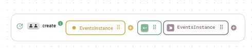
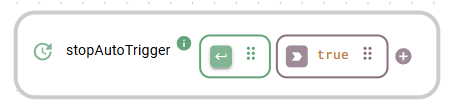
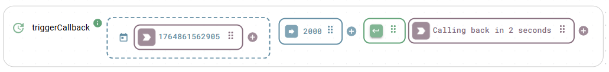
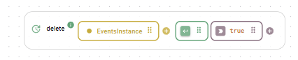

# Event simulation

The event simulation class simulates various events to test and validate workflows. Generating mock events ensures that flows handle different scenarios and edge cases effectively. It also serves as a placeholder in a flow before you complete your App. To learn more about event handlers, see [callbacks](../#callbacks).

This class requires an instance.

### `create`

Constructs a new event simulation instance.

#### Parameters

<table><thead><tr><th width="150">Input</th><th>Description</th><th width="100">Type</th></tr></thead><tbody><tr><td><code>name</code></td><td>A unique name for the event simulation instance.</td><td>string</td></tr></tbody></table>

#### Output

Returns the event simulation instance.

#### Example

<figure><figcaption>
Create an event simulation instance
</figcaption></figure>

### `triggerManually`

Triggers a manual event within the instance to activate the `onManualTrigger` listener.

#### Parameters

None.

#### Output

Returns nothing.

### `onManualTrigger`

Fires when you execute the `triggerManually` function within the same instance.

#### Parameters

<table><thead><tr><th width="150">Input</th><th>Description</th><th width="100">Type</th></tr></thead><tbody><tr><td><code>listener</code></td><td>Callback that executes when the manual event triggers. Payload: a UNIX timestamp integer.</td><td>callback</td></tr></tbody></table>

#### Output

Returns a unique listener ID string.

#### Example

<figure><figcaption>
The listener outputs the timestamp after a manual trigger
</figcaption></figure>

### `startAutoTrigger`

Starts generating periodic automatic events at a specified interval.

#### Parameters

<table><thead><tr><th width="150">Input</th><th>Description</th><th width="100">Type</th></tr></thead><tbody><tr><td><code>interval</code></td><td>The repetition interval in milliseconds.</td><td>integer</td></tr></tbody></table>

#### Output

Returns nothing.

### `onAutoTrigger`

Fires periodically when an automatic trigger is active.


#### Initializing the listener

You may need to trigger `onAutoTrigger` once to start reacting to automatically generated events after calling `startAutoTrigger`.


#### Parameters

<table><thead><tr><th width="150">Input</th><th>Description</th><th width="100">Type</th></tr></thead><tbody><tr><td><code>listener</code></td><td>Callback that executes when the automatic event triggers. Payload: a UNIX timestamp integer.</td><td>callback</td></tr></tbody></table>

#### Output

Returns a unique listener ID string.

#### Example

<figure><figcaption>
React periodically to automatic events
</figcaption></figure>

### `stopAutoTrigger`

Stops the active automatic trigger and halts periodic event generation.

#### Parameters

None.

#### Output

Returns nothing.

#### Example

<figure><figcaption>
Stop event generation
</figcaption></figure>

### `triggerCallback`

Triggers an event that executes its own callback after a specified delay. To prevent infinite loops, the function does not react to the output of its own callback.

#### Parameters

<table><thead><tr><th width="150">Input</th><th>Description</th><th width="100">Type</th></tr></thead><tbody><tr><td><code>timeout</code></td><td>The delay duration in milliseconds before the callback executes.</td><td>integer</td></tr><tr><td><code>listener</code></td><td>Callback that executes after the timeout delay. Payload: <code>&#x3C;callback></code>.</td><td>callback</td></tr></tbody></table>

#### Output

Returns nothing.

#### Example

<figure><figcaption>
Callback execution after a timeout delay
</figcaption></figure>

### `delete`

Removes the instance and clears its configuration.


#### Irreversible action

Deleting an instance removes its configuration permanently.


#### Parameters

None.

#### Output

Returns `true` upon removal.

#### Example

<figure><figcaption>
Delete an event simulation instance
</figcaption></figure>
