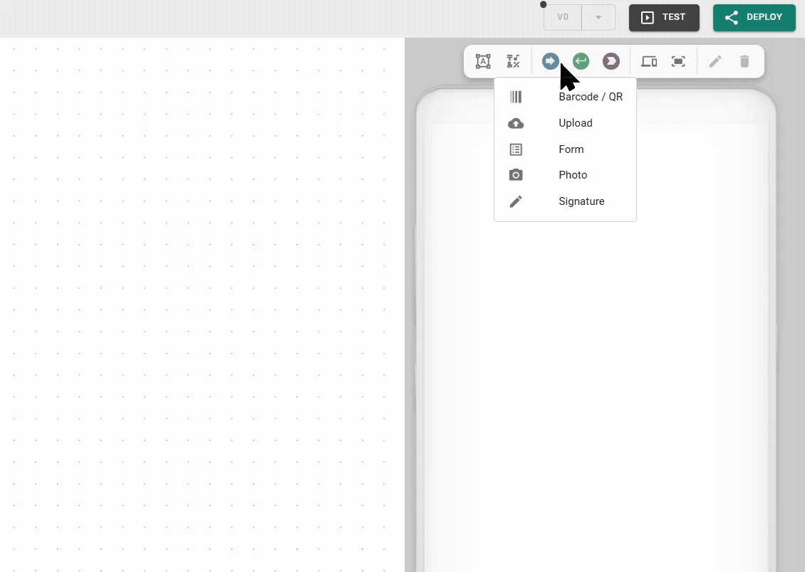

# Build Frontend

The UI is what end users of your apps see and interact with. It can range from simple data visualizations and dashboards to interactive apps for user input, file management, and more.


However, UI is optional. You can build headless applications that consist entirely of backend logic, like a data bridge between a PLC and a SQL database, that run silently without any visual frontend.


## Core UI components

* [**Widgets**](widgets/)**:** The functional components of your app. They display live data, capture user input, or trigger logic.
* [**Pages**](page-explorer.md): The individual screens or views of your application. You can create multiple pages and sub-pages to structure your app logically, then configure navigation elements to allow users to move between them.
* [**Text, icons, and images**](text-icons-and-images.md): Mostly static elements used for branding, instructions, and non-interactive content.
* [**PDF templates**](pdf-template-editor.md): Visual layouts used to generate dynamic documents. You use the PDF template editor to map variables onto a document background, which is then populated by your backend logic.
* [**Theme**](theme-editor.md)**:** The theme defines the global visual DNA of your app. It ensures a consistent look across all widgets and pages.

## Frontend Builder

The Frontend Builder is where you turn backend logic into a functional, user-facing application. On your pages, you place static elements for context and dynamic widgets that are controlled and configured by your backend logic.

You can build apps for any screen size and seamlessly switch the preview during the building process to ensure your layout works on everything from a smartphone to a large desktop monitor.

### The toolbar

The toolbar is your primary toolkit for composing the interface. It holds buttons and icons to:

* Add a text box, icon, or widget (input, trigger, display).
* Switch the screen preview and adjust page height.
* Scale the view.
* Edit or delete the selected widget.

<figure><figcaption></figcaption></figure>

### Placing and moving elements

To add an element, select it from the toolbar and click anywhere on the UI canvas to place it. Once placed, you can:

* **Move**: Drag the element to a new position on the canvas.
* **Resize or rotate**: Use the grab markers on the corners and edges to change the element dimensions or orientation.
* **Align with snaplines**: The Frontend Builder provides snaplines that appear automatically to help you align widgets and other UI elements with each other.
* **Pixel-perfect positioning**: For precise placement, hold the Shift key while moving an element. This temporarily disables the snaplines.
* **Adjust layers and layout**: Right-click any element to adjust the Z-order of overlapping items, stretch it to full width, or toggle tile view.

<figure><figcaption>
Frontend Builder basics
</figcaption></figure>


Changes to an element position or size are saved per device size. Always check your other screen previews to ensure the layout remains clean across all hardware.


### Context menu tools

Right-click any element to open a menu for quick layout actions and layer management.

* **Order**: Adjust the stacking of overlapping elements to control which item appears in the foreground or background.
* **Full width**: Instantly stretches the element to fill the entire horizontal space of your current screen preview.
* **Toggle tile view**: Switches the element into a tiled display mode.

### Screen preview and responsive behavior settings

[Production apps](https://app.gitbook.com/s/E5Ketpww1s7TauSAJrJ8/production-apps) are inherently responsive and adapt automatically to different screen sizes. To control exactly how your app behaves on different hardware, you have several specialized tools in the toolbar:

* **Switching previews**: Click the screens icon (<i class="fa-laptop-mobile">:laptop-mobile:</i>) and then click on a device icon to switch to the corresponding UI editor and adapt your layout.

<figure><figcaption></figcaption></figure>

* **Enable scrolling**: Use the page height icon (<i class="fa-arrows-up-down">:arrows-up-down:</i>) to add vertical space and enable scrolling for the selected device size. This allows you to have a scrolling view on mobile while keeping a fixed dashboard on desktop. If you try to reduce a page height and it does not change, a widget is likely positioned outside the valid area. You must move or delete that widget first.
* **Enable or disable screens:** You can enable or disable specific screen sizes by right-clicking the respective device icon. By default, only the phone, tablet, and laptop are active. If a user opens your app on a disabled screen size, the system automatically scales the layout from the nearest activated device size.
* **Content alignment (L & XL)**: On large monitors, you can decide how the overall content sits on the screen. Right-click the L or XL icons to choose between left-aligned or centered layouts.

<figure><figcaption></figcaption></figure>

* **Scaling**: Use the scaling bar via the scaling icon to zoom in or out of the current preview. This is a design-time aid only and does not change the actual size of the app for the end user.


## Best practice: Mobile-first workflow

By default, Heisenware uses an inheritance system where changes made on smaller screens often propagate to larger ones.

1. **Start with phone**: We recommend designing your layout for the phone first. This ensures your basic structure is solid.
2. **Scale up**: Once the mobile view is set, switch to tablet or laptop. You only need to spread out the widgets to take advantage of the extra horizontal space.
3. **Fine-tuning**: Any adjustment you make on a larger screen stays local to that view. This allows for pixel-perfect optimization for control room monitors without breaking the mobile experience.

