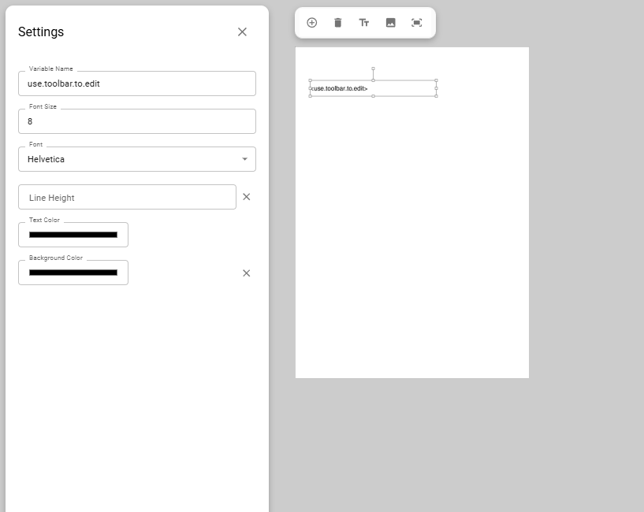

# PDF Template Editor

The PDF Template Editor provides a visual workflow for designing dynamic documents. You create a template by placing dynamic placeholders onto an uploaded PDF background.


The Template Editor works exclusively with the [PDF Template](../build-backend/function-explorer/utilities/pdf-templates.md) class. When you create a template, an instance is automatically generated within this class, containing the `fillTemplate` function required to populate your document with data.

To see the complete process in action, follow our [step-by-step guide](../../tutorials/app-templates/automating-pdf-reports.md).


## Creating a PDF template



#### Open template mode

Select Template Editing mode from the main toolbar. &#x20;



#### Define properties

Enter a unique name for your template and choose a standard page size (`A4`, `A5`, or `Letter`).



#### Generate instance

Click Create Template. This automatically generates the corresponding instance in your logic library.



<figure><figcaption></figcaption></figure>

## Designing the layout

Once your template is created, you need to set up the visual background and place your dynamic fields.

### **Managing pages and backgrounds**

To use an existing document as a layout, you must first upload the pages as separate PDF files to the [Internal File Server](../build-backend/file-explorer.md).



#### Add blank pages

Add a blank page for each page of your source document using the Add Page icon (<i class="fa-circle-plus">:circle-plus:</i>).



#### Set background

Drag each page file from the File Explorer onto the corresponding blank page. This sets the file as a static background.



#### Organize

Right-click a page to open the context menu. Here you can move pages up/down or manage the layering (Bring to Front / Send to Back).




Deleting a page (using the Trash icon) is a permanent action that removes the page, its background, and all placeholders on it. It is not currently possible to simply replace the background of an existing page.


### **Placing and configuring placeholders**

Placeholders are the dynamic "slots" where your logic will insert data.



#### Add placeholder

Click the Text or Image Placeholder icon in the toolbar (<i class="fa-text-size">:text-size:</i>, <i class="fa-image">:image:</i>) then click on the page to place it.



#### Assign variable

Select the placeholder and click the gear icon. Provide a variable name (e.g., `firstName`).



#### Style

Adjust the font, size, or colors for text, or resize the bounding boxes to define the final content area.




#### Data Matching&#x20;

The Variable Name you enter (e.g., `invoiceNumber`) must exactly match the key in the data object you provide in your backend logic later. The editor adds the `<>` tags automatically.


<figure><figcaption></figcaption></figure>

## Populating the template

To bring your PDF to life, use the [`fillTemplate`](../build-backend/function-explorer/utilities/pdf-templates.md#filltemplate) function within your backend logic. This function is the engine: it takes a data object (like a JSON object from a database), merges the values into your visual placeholders, and outputs the finished PDF document. For detailed input/output specifications, refer to the [PDF Templates class documentation](../build-backend/function-explorer/utilities/pdf-templates.md).

To see these concepts in action, follow our step-by-step guide on [automating PDF reports](../../tutorials/app-templates/automating-pdf-reports.md).

## Deleting a template

If you no longer need a PDF template, you can permanently remove it and its associated function:

1. Navigate to the [Functions Library](../build-backend/function-explorer/).
2. Open the PDF Templates Class.
3. Right-click the specific template instance.
4. Select Remove.


This action is irreversible. Deleting an instance removes it completey. Any logic in your Backend Builder referencing this template will break.


<figure><figcaption></figcaption></figure>

