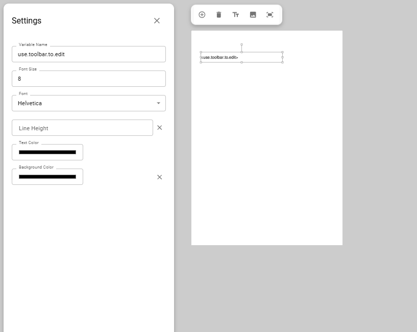

# PDF Template Editor

The PDF Template Editor provides a visual workflow for designing dynamic documents. You create a Template by placing dynamic Placeholders onto an uploaded PDF background.


The Template Editor works exclusively with the [PDF Template](../build-backend/function-explorer/utilities/pdf-templates.md) Class. When you create a Template, an Instance is automatically generated within this Class, containing the `fillTemplate` Function required to populate your document with data.

To see the complete process in action, follow our [step-by-step guide](../../tutorials/app-templates/automating-pdf-reports.md).


## Creating a PDF Template



#### Open Template mode

Select Template Editing mode from the main Toolbar. 



#### Define properties

Enter a unique name for your Template and choose a standard page size (`A4`, `A5`, or `Letter`).



#### Generate Instance

Click Create Template. This automatically generates the corresponding Instance in your Function Explorer.



<figure><figcaption></figcaption></figure>

## Designing the layout

Once your Template is created, set up the visual background and place your dynamic fields.

### Managing pages and backgrounds

To use an existing document as a layout, first upload its pages as separate PDF files to the [File Explorer](../build-backend/file-explorer.md).



#### Add blank pages

Add a blank page for each page of your source document using the Add Page icon (<i class="fa-circle-plus">:circle-plus:</i>).



#### Set background

Drag each page file from the File Explorer onto the corresponding blank page. This sets the file as a static background.



#### Organize

Right-click a page to open the context menu. Here you can move pages up or down, or manage the layering (Bring to Front / Send to Back).




Deleting a page (using the Trash icon) is a permanent action that removes the page, its background, and all Placeholders on it. It is not currently possible to simply replace the background of an existing page.


### Placing and configuring Placeholders

Placeholders are the dynamic slots where your logic inserts data.



#### Add Placeholder

Click the Text or Image Placeholder icon in the Toolbar (<i class="fa-text-size">:text-size:</i>, <i class="fa-image">:image:</i>), then click the page to place it.



#### Assign variable

Select the Placeholder and click the gear icon. Provide a variable name (e.g., `firstName`).



#### Style

Adjust the font, size, or colors for text, or resize the bounding boxes to define the final content area.




#### Data matching

The variable name you enter (e.g., `invoiceNumber`) must exactly match the key in the data object you provide in your backend logic later. The editor adds the `<>` tags automatically.


<figure><figcaption></figcaption></figure>

## Populating the Template

To bring your PDF to life, use the [`fillTemplate`](../build-backend/function-explorer/utilities/pdf-templates.md#filltemplate) Function within your backend logic. This Function is the engine: it takes a data object (like a JSON object from a database), merges the values into your visual Placeholders, and outputs the finished PDF document. For detailed input and output specifications, see the [PDF Templates Class documentation](../build-backend/function-explorer/utilities/pdf-templates.md).

To see these concepts in action, follow our step-by-step guide on [automating PDF reports](../../tutorials/app-templates/automating-pdf-reports.md).

## Deleting a Template

If you no longer need a PDF Template, you can permanently remove it and its associated Function:

1. Navigate to the [Function Explorer](../build-backend/function-explorer/).
2. Open the PDF Templates Class.
3. Right-click the specific Template Instance.
4. Select Remove.


This action is irreversible. Deleting an Instance removes it completely. Any logic in your Backend Builder referencing this Template will break.


<figure><figcaption></figcaption></figure>
