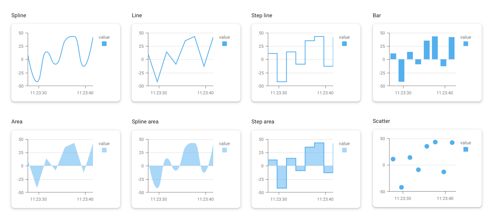

# Chart

The **Chart** widget is a powerful tool for data visualization, allowing you to create a wide variety of charts, including line, bar, area, and scatter plots.

You can configure multiple panes and axes, define complex data series, and control every visual aspect of the chart to create rich, interactive data dashboards.

<figure><figcaption><p>All types of single-series chart</p></figcaption></figure>

<figure><figcaption></figcaption></figure>

## Data Binding

Connect the widget to your application's logic by dragging the corresponding items from the Backend Builder.

### Output

| **Property** | **Type** | **Description**                                      |
| ------------ | -------- | ---------------------------------------------------- |
| **`data`**   | `Array`  | An array of data objects to be plotted on the chart. |

#### Automatic Configuration

If you provide data to the widget without pre-defining any series in the **Data Settings**, the widget will attempt to automatically configure itself. It analyzes the data to determine the most likely `argumentField` and `valueField` and creates a default series. These automatically detected settings will then populate the configuration panel, which you can customize further.

## Configuration

### Chart Settings

These properties control the overall behavior and appearance of the chart canvas.

| **Label**                   | **Description**                                                                 | **Type** | **Property**           |
| --------------------------- | ------------------------------------------------------------------------------- | -------- | ---------------------- |
| **Show Value Tooltips**     | If `true`, a tooltip with the point's value appears when a user hovers over it. | Boolean  | `showTooltips`         |
| **Adjust On Zoom**          | If `true`, the value axis adjusts its range when the user zooms the chart.      | Boolean  | `adjustOnZoom`         |
| **Auto Hide Point Markers** | If `true`, point markers are hidden when there are too many to display clearly. | Boolean  | `autoHidePointMarkers` |
| **Enable Crosshair**        | If `true`, displays crosshair lines to help users track points on the chart.    | Boolean  | `enableCrosshair`      |
| **Negatives As Zeroes**     | If `true`, all negative values are treated as zero.                             | Boolean  | `negativesAsZeroes`    |
| **Rotated**                 | If `true`, rotates the chart, swapping the argument and value axes.             | Boolean  | `rotated`              |
| **Disabled**                | If `true`, disables all user interaction with the chart.                        | Boolean  | `disabled`             |
| **Point Selection Mode**    | Specifies whether a user can select a `single` or `multiple` points.            | String   | `pointSelectionMode`   |
| **Series Selection Mode**   | Specifies whether a user can select a `single` or `multiple` series.            | String   | `seriesSelectionMode`  |
| **Bar Group Padding**       | Controls the padding between groups of bars in a bar chart.                     | Number   | `barGroupPadding`      |
| **Bar Group Width**         | Specifies a fixed width for groups of bars.                                     | Number   | `barGroupWidth`        |
| **Palette**                 | A custom array of colors to use for the chart series.                           | Array    | `palette`              |

### Value Axes Settings

Configure the vertical (or horizontal, if rotated) axes of your chart. You can define multiple axes across different panes.

| **Label**          | **Description**                                                                    | **Type**       | **Property**      |
| ------------------ | ---------------------------------------------------------------------------------- | -------------- | ----------------- |
| **Title**          | The text title displayed for the axis.                                             | String         | `title`           |
| **Position**       | The position of the axis relative to the chart (`left`, `right`, `top`, `bottom`). | String         | `position`        |
| **Axis Width**     | The thickness of the axis line in pixels.                                          | Integer        | `width`           |
| **Color**          | The color of the axis line.                                                        | String (Color) | `color`           |
| **Start Value**    | A fixed starting value for the axis, overriding the automatic range.               | Number         | `fixedStartValue` |
| **End Value**      | A fixed ending value for the axis, overriding the automatic range.                 | Number         | `fixedEndValue`   |
| **Visible**        | Toggles the visibility of the entire axis.                                         | Boolean        | `visible`         |
| **End On Tick**    | If `true`, ensures the axis ends on a major tick mark.                             | Boolean        | `endOnTick`       |
| **Inverted**       | If `true`, inverts the direction of the axis values.                               | Boolean        | `inverted`        |
| **Label**          | An object containing settings for the axis labels (see details below).             | Object         | `label`           |
| **Constant Lines** | An array of constant lines to display on the axis.                                 | Array          | `constantLines`   |
| **Grid & Ticks**   | An object containing settings for the axis grid lines and tick marks.              | Object         | `grid`            |

### Argument Axis Settings

Configure the horizontal (or vertical, if rotated) axis, which represents the argument or independent variable of your data.

| **Label**                | **Description**                                                                | **Type**       | **Property**           |
| ------------------------ | ------------------------------------------------------------------------------ | -------------- | ---------------------- |
| **Title**                | The text title displayed for the axis.                                         | String         | `titleX`               |
| **Argument Type**        | The data type of the argument field (`numeric`, `datetime`, `string`).         | String         | `argumentTypeX`        |
| **Axis Width**           | The thickness of the axis line in pixels.                                      | Integer        | `widthX`               |
| **Color**                | The color of the axis line.                                                    | String (Color) | `colorX`               |
| **Visible**              | Toggles the visibility of the entire axis.                                     | Boolean        | `visibleX`             |
| **End On Tick**          | If `true`, ensures the axis ends on a major tick mark.                         | Boolean        | `endOnTickX`           |
| **Inverted**             | If `true`, inverts the direction of the axis values.                           | Boolean        | `invertedX`            |
| **Tick Interval Unit**   | For date-time axes, sets the unit for tick intervals (e.g., `days`, `months`). | String         | `intervalUnitX`        |
| **Tick Interval**        | The number of units between each major tick mark.                              | Integer        | `intervalX`            |
| **Aggregation Unit**     | The unit by which to group data for aggregation (e.g., `days`, `months`).      | String         | `aggregationUnitX`     |
| **Aggregation Interval** | The number of units in each aggregation group.                                 | Integer        | `aggregationIntervalX` |
| **Label**                | An object containing settings for the axis labels.                             | Object         | `labelX`               |
| **Grid & Ticks**         | An object containing settings for the axis grid lines and tick marks.          | Object         | `gridX`                |

### Legend Settings

Configure the chart's legend, which identifies the different data series.

| **Label**                | **Description**                                                                            | **Type** | **Property**                |
| ------------------------ | ------------------------------------------------------------------------------------------ | -------- | --------------------------- |
| **Visible**              | Toggles the visibility of the legend.                                                      | Boolean  | `legendVisible`             |
| **Title**                | The main title for the legend.                                                             | String   | `legendTitle`               |
| **Subtitle**             | The subtitle for the legend, displayed below the title.                                    | String   | `legendSubtitle`            |
| **Vertical Alignment**   | Aligns the legend vertically (`top` or `bottom`).                                          | String   | `legendVerticalAlignment`   |
| **Horizontal Alignment** | Aligns the legend horizontally (`left`, `center`, `right`).                                | String   | `legendHorizontalAlignment` |
| **Item Text Position**   | The position of the text relative to the series marker (`top`, `bottom`, `left`, `right`). | String   | `legendItemTextPosition`    |
| **Position**             | Positions the legend `inside` or `outside` the chart's plot area.                          | String   | `legendPosition`            |
| **Orientation**          | Arranges legend items `vertically` or `horizontally`.                                      | String   | `legendOrientation`         |

### Data Settings

This is where you map your data to the chart's series.

| **Label**          | **Description**                                                                    | **Type** | **Property**    |
| ------------------ | ---------------------------------------------------------------------------------- | -------- | --------------- |
| **Argument Field** | The field from your data source that provides the arguments (X-axis values).       | String   | `argumentField` |
| **Series Data**    | An array of series objects, where each object defines a set of data to be plotted. | Array    | `seriesData`    |

#### Series Properties

Each object in the `seriesData` array can have the following properties:

| **Label**           | **Description**                                                                    | **Type**       | **Property**       |
| ------------------- | ---------------------------------------------------------------------------------- | -------------- | ------------------ |
| **Pane**            | The name of the pane on which to display this series.                              | String         | `pane`             |
| **Series Name**     | The name of the series, displayed in the legend and tooltips.                      | String         | `name`             |
| **Value Field**     | The field from your data source that provides the values (Y-axis values).          | String         | `valueField`       |
| **Series Type**     | The visual representation of the series (e.g., `line`, `bar`, `area`).             | String         | `type`             |
| **Value Axis**      | The value axis to associate this series with.                                      | String         | `axis`             |
| **Aggregation**     | The aggregation method to apply to data points (`avg`, `min`, `max`, `sum`).       | String         | `aggregation`      |
| **Data Points**     | The symbol used to mark data points on the series line (e.g., `circle`, `square`). | String         | `pointSymbol`      |
| **Custom Color**    | A specific color for this series, overriding the chart palette.                    | String (Color) | `color`            |
| **Tag Field**       | A field whose value will be displayed in the tooltip for each data point.          | String         | `tagField`         |
| Ignore Empty Points | Let the chart ignore empty values in a data series.                                | Boolean        |                    |
| **Range Value 1**   | For `rangearea` and `rangebar` types, the field for the start of the range.        | String         | `rangeValue1Field` |
| **Range Value 2**   | For `rangearea` and `rangebar` types, the field for the end of the range.          | String         | `rangeValue2Field` |
| **Size Field**      | For `bubble` charts, the field that determines the size of each bubble.            | String         | `sizeField`        |

## Tips and Tricks

Here is the article revised with sentence case headings.

### Multi-series charts

To display multiple data series on a single chart (e.g., comparing temperature and humidity over time), the Chart widget requires a specific data format. You cannot simply plug in two separate arrays; instead, you must combine them into a single array of objects where each object shares a common argument (like a timestamp).

#### Prepare the data

Assume you have two separate arrays of data, each containing objects with a `date` and a `value`.



#### Combine the arrays

Use a [combine](../../../build-backend/function-explorer/utilities/data-processing.md#combine) function to merge your two separate data arrays into a single array.



#### Transform with a modifier

Add a JavaScript [modifier](/broken/pages/eybgxpp69PNrUW2fHZ4X#modifier) to the output of the combine function. Use the following code to merge the two datasets based on their timestamps. This script creates a new list of objects containing `date`, `value1` (from the first array), and `value2` (from the second array).

```js
// 'x' represents the input array containing your two datasets

Array.from(new Set((x[0] || []).concat(x[1] || []).map(i => i.date)))
  .sort()
  .map(d => ({
    date: d,
    // Find value in first dataset, or return null if missing
    value1: (x[0] || []).find(i => i.date === d)?.value ?? null,
    // Find value in second dataset, or return null if missing
    value2: (x[1] || []).find(i => i.date === d)?.value ?? null
  }))
```


If your data uses different field names (e.g., `timestamp` instead of `date`), please adjust the property names in the code above accordingly.




#### The required data structure

After the modifier, your data will look like the example below. Notice that some values are `null`. This is normal and happens when a timestamp exists in one dataset but not the other (e.g., the sensors recorded data at slightly different milliseconds).

```json
[
  { "date": "2023-10-27T10:00:01Z", "value1": 25.5, "value2": null },
  { "date": "2023-10-27T10:00:02Z", "value1": 25.6, "value2": 60.2 },
  { "date": "2023-10-27T10:00:03Z", "value1": null, "value2": 60.1 }
]
```

#### Configure the chart

Once your data is transformed:

1. Connect the modifier output to the Chart widget.
2. Enable the "Ignore Empty Values" setting for Series 1. This ensures the chart skips over the `null` points instead of breaking the line.
3. Add a Series 2, bind it to `value2`, and also enable "Ignore Empty Values".

The chart will now seamlessly display both lines on the same time axis, automatically bridging any gaps caused by mismatched timestamps.

#### Video walkthrough

Watch the video below for a complete step-by-step guide on this process.



### Optimizing for Large Datasets

When working with thousands of data points, rendering performance can become a concern. The most effective way to ensure your chart remains fast and responsive is to use **data aggregation**.

Instead of plotting every single point, the chart can group your data into intervals (e.g., days, weeks, months) and display a single, aggregated point for each interval (e.g., the average, sum, min, or max value).

To enable aggregation:

1. **Set the Series Aggregation:** In the **Series Properties**, set the **Aggregation** method to `avg`, `sum`, `min`, or `max`.
2. **Configure the Argument Axis:** In the **Argument Axis Settings**, specify the **Aggregation Unit** (e.g., `days`) and **Aggregation Interval** (e.g., `7` for weekly aggregation).

### Enhancing User Experience

For complex charts, providing interactive features is crucial for usability.

#### **Zooming and Panning**

The chart has built-in support for zooming and panning, which is enabled by default. This allows users to drag to select a region to zoom into and use the mouse wheel to zoom in and out. This is especially powerful when combined with data aggregation, as zooming in can reveal more granular, non-aggregated data.

#### **Intelligent Markers**

For line or area charts with many points, showing a marker for every point can clutter the view. Use the **Auto Hide Point Markers** setting in the **Chart Settings** to automatically hide them when the chart is dense. Markers will reappear as the user zooms in.

#### **Tooltips and Crosshairs**

Enable **Show Value Tooltips** to provide users precise information when they hover over a point. For comparing values across multiple series at the same argument, enable the **Crosshair**. Using a **Tag Field** in your series configuration can add rich, contextual information to the tooltips.

#### **Interacting with the chart**

On desktop, you can zoom the chart by scrolling with a mouse or trackpad. If the cursor is on one of the axes, it zooms in only one dimension while leaving the other unchanged. If the cursor is within the pane, the chart zooms in without warping, and the zoom is centered on the cursor position. On touch-enabled devices, you can zoom using the spread and pinch gestures and pan the chart using the drag gesture.


