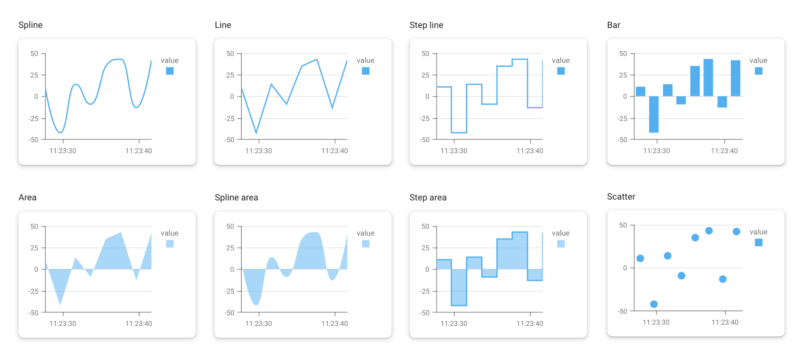

# Chart

The chart widget is a powerful data-visualization tool for building line, bar, area, and scatter charts.

Configure multiple panes and axes, define complex data series, and control every visual detail to build rich, interactive dashboards.

<figure><figcaption><p>All types of single-series chart</p></figcaption></figure>

<figure><figcaption></figcaption></figure>

## Data binding

Link this widget to your logic by dragging items from the [Backend Builder](../../../build-backend/) onto it.

### Output

| **Property** | **Type** | **Description**                                |
| ------------ | -------- | ---------------------------------------------- |
| **`data`**   | `Array`  | An array of data objects to plot on the chart. |

#### Automatic configuration

Feed data to the widget without defining any series in the data settings, and it configures itself. It reads the data to find the most likely `argumentField` and `valueField`, creates a default series, and fills the configuration panel with what it detected, ready for you to customize further.

## Configuration

### Chart settings

These properties control the overall behavior and appearance of the chart canvas.

| **Label**                   | **Description**                                                                 | **Type** | **Property**           |
| --------------------------- | ------------------------------------------------------------------------------- | -------- | ---------------------- |
| **Show value tooltips**     | If `true`, a tooltip with the point's value appears when a user hovers over it. | Boolean  | `showTooltips`         |
| **Adjust on zoom**          | If `true`, the value axis adjusts its range when the user zooms the chart.      | Boolean  | `adjustOnZoom`         |
| **Auto hide point markers** | If `true`, point markers hide when there are too many to display clearly.       | Boolean  | `autoHidePointMarkers` |
| **Enable crosshair**        | If `true`, shows crosshair lines to help users track points on the chart.       | Boolean  | `enableCrosshair`      |
| **Negatives as zeroes**     | If `true`, treats all negative values as zero.                                  | Boolean  | `negativesAsZeroes`    |
| **Rotated**                 | If `true`, rotates the chart, swapping the argument and value axes.             | Boolean  | `rotated`              |
| **Disabled**                | If `true`, disables all user interaction with the chart.                        | Boolean  | `disabled`             |
| **Point selection mode**    | Whether a user can select a `single` or `multiple` points.                      | String   | `pointSelectionMode`   |
| **Series selection mode**   | Whether a user can select a `single` or `multiple` series.                      | String   | `seriesSelectionMode`  |
| **Bar group padding**       | Controls the padding between groups of bars in a bar chart.                     | Number   | `barGroupPadding`      |
| **Bar group width**         | Sets a fixed width for groups of bars.                                          | Number   | `barGroupWidth`        |
| **Palette**                 | A custom array of colors for the chart series.                                  | Array    | `palette`              |

### Value axes settings

Configure the vertical (or horizontal, if rotated) axes of your chart. You can define multiple axes across different panes.

| **Label**          | **Description**                                                             | **Type**       | **Property**      |
| ------------------ | --------------------------------------------------------------------------- | -------------- | ----------------- |
| **Title**          | The text title displayed for the axis.                                      | String         | `title`           |
| **Position**       | The axis position relative to the chart (`left`, `right`, `top`, `bottom`). | String         | `position`        |
| **Axis width**     | The thickness of the axis line in pixels.                                   | Integer        | `width`           |
| **Color**          | The color of the axis line.                                                 | String (Color) | `color`           |
| **Start value**    | A fixed starting value for the axis, overriding the automatic range.        | Number         | `fixedStartValue` |
| **End value**      | A fixed ending value for the axis, overriding the automatic range.          | Number         | `fixedEndValue`   |
| **Visible**        | Toggles the visibility of the entire axis.                                  | Boolean        | `visible`         |
| **End on tick**    | If `true`, ensures the axis ends on a major tick mark.                      | Boolean        | `endOnTick`       |
| **Inverted**       | If `true`, inverts the direction of the axis values.                        | Boolean        | `inverted`        |
| **Label**          | An object holding settings for the axis labels (see below).                 | Object         | `label`           |
| **Constant lines** | An array of constant lines to display on the axis.                          | Array          | `constantLines`   |
| **Grid and ticks** | An object holding settings for the axis grid lines and tick marks.          | Object         | `grid`            |

### Argument axis settings

Configure the horizontal (or vertical, if rotated) axis, which represents the argument, the independent variable of your data.

| **Label**                | **Description**                                                               | **Type**       | **Property**           |
| ------------------------ | ----------------------------------------------------------------------------- | -------------- | ---------------------- |
| **Title**                | The text title displayed for the axis.                                        | String         | `titleX`               |
| **Argument type**        | The data type of the argument field (`numeric`, `datetime`, `string`).        | String         | `argumentTypeX`        |
| **Axis width**           | The thickness of the axis line in pixels.                                     | Integer        | `widthX`               |
| **Color**                | The color of the axis line.                                                   | String (Color) | `colorX`               |
| **Visible**              | Toggles the visibility of the entire axis.                                    | Boolean        | `visibleX`             |
| **End on tick**          | If `true`, ensures the axis ends on a major tick mark.                        | Boolean        | `endOnTickX`           |
| **Inverted**             | If `true`, inverts the direction of the axis values.                          | Boolean        | `invertedX`            |
| **Tick interval unit**   | For date-time axes, sets the unit for tick intervals (e.g. `days`, `months`). | String         | `intervalUnitX`        |
| **Tick interval**        | The number of units between each major tick mark.                             | Integer        | `intervalX`            |
| **Aggregation unit**     | The unit by which to group data for aggregation (e.g. `days`, `months`).      | String         | `aggregationUnitX`     |
| **Aggregation interval** | The number of units in each aggregation group.                                | Integer        | `aggregationIntervalX` |
| **Label**                | An object holding settings for the axis labels.                               | Object         | `labelX`               |
| **Grid and ticks**       | An object holding settings for the axis grid lines and tick marks.            | Object         | `gridX`                |

### Legend settings

Configure the chart's legend, which identifies the different data series.

| **Label**                | **Description**                                                                            | **Type** | **Property**                |
| ------------------------ | ------------------------------------------------------------------------------------------ | -------- | --------------------------- |
| **Visible**              | Toggles the visibility of the legend.                                                      | Boolean  | `legendVisible`             |
| **Title**                | The main title for the legend.                                                             | String   | `legendTitle`               |
| **Subtitle**             | The subtitle for the legend, shown below the title.                                        | String   | `legendSubtitle`            |
| **Vertical alignment**   | Aligns the legend vertically (`top` or `bottom`).                                          | String   | `legendVerticalAlignment`   |
| **Horizontal alignment** | Aligns the legend horizontally (`left`, `center`, `right`).                                | String   | `legendHorizontalAlignment` |
| **Item text position**   | The position of the text relative to the series marker (`top`, `bottom`, `left`, `right`). | String   | `legendItemTextPosition`    |
| **Position**             | Positions the legend `inside` or `outside` the chart's plot area.                          | String   | `legendPosition`            |
| **Orientation**          | Arranges legend items `vertically` or `horizontally`.                                      | String   | `legendOrientation`         |

### Data settings

Map your data to the chart's series here.

| **Label**          | **Description**                                                              | **Type** | **Property**    |
| ------------------ | ---------------------------------------------------------------------------- | -------- | --------------- |
| **Argument field** | The field from your data source that provides the arguments (X-axis values). | String   | `argumentField` |
| **Series data**    | An array of series objects, each defining a set of data to plot.             | Array    | `seriesData`    |

#### Series properties

Each object in the `seriesData` array can have these properties:

| **Label**               | **Description**                                                              | **Type**       | **Property**        |
| ----------------------- | ---------------------------------------------------------------------------- | -------------- | ------------------- |
| **Pane**                | The pane on which to display this series.                                    | String         | `pane`              |
| **Series name**         | The series name, shown in the legend and tooltips.                           | String         | `name`              |
| **Value field**         | The field from your data source that provides the values (Y-axis values).    | String         | `valueField`        |
| **Series type**         | The visual representation of the series (e.g. `line`, `bar`, `area`).        | String         | `type`              |
| **Value axis**          | The value axis to associate this series with.                                | String         | `axis`              |
| **Aggregation**         | The aggregation method to apply to data points (`avg`, `min`, `max`, `sum`). | String         | `aggregation`       |
| **Data points**         | The symbol marking data points on the series line (e.g. `circle`, `square`). | String         | `pointSymbol`       |
| **Custom color**        | A specific color for this series, overriding the chart palette.              | String (Color) | `color`             |
| **Tag field**           | A field whose value appears in the tooltip for each data point.              | String         | `tagField`          |
| **Ignore empty points** | Lets the chart ignore empty values in a data series.                         | Boolean        | `ignoreEmptyPoints` |
| **Range value 1**       | For `rangearea` and `rangebar` types, the field for the start of the range.  | String         | `rangeValue1Field`  |
| **Range value 2**       | For `rangearea` and `rangebar` types, the field for the end of the range.    | String         | `rangeValue2Field`  |
| **Size field**          | For `bubble` charts, the field that sets each bubble's size.                 | String         | `sizeField`         |

## Tips and tricks

### Multi-series charts

To show several data series on one chart (comparing temperature and humidity over time, for example), the chart needs a specific data format. You can't plug in two separate arrays; you combine them into a single array of objects, where each object shares a common argument like a timestamp.

#### Prepare the data

Assume you have two separate arrays, each holding objects with a `date` and a `value`.



#### Combine the arrays

Use a [combine](../../../build-backend/function-explorer/utilities/data-processing.md#combine) function to merge your two data arrays into one.



#### Transform with a modifier

Add a JavaScript [modifier](../../../build-backend/extension-nodes/modifier.md) to the output of the combine function. The code below merges the two datasets by timestamp, producing a new list of objects with `date`, `value1` (from the first array), and `value2` (from the second).

```js
// 'x' represents the input array containing your two datasets

Array.from(new Set((x[0] || []).concat(x[1] || []).map(i => i.date)))
  .sort()
  .map(d => ({
    date: d,
    // Find value in first dataset, or return null if missing
    value1: (x[0] || []).find(i => i.date === d)?.value ?? null,
    // Find value in second dataset, or return null if missing
    value2: (x[1] || []).find(i => i.date === d)?.value ?? null
  }))
```


If your data uses different field names (`timestamp` instead of `date`, say), adjust the property names in the code above to match.




#### The required data structure

After the modifier, your data looks like the example below. Some values are `null`, which is normal: it happens when a timestamp exists in one dataset but not the other (the sensors recorded at slightly different milliseconds, for example).

```json
[
  { "date": "2023-10-27T10:00:01Z", "value1": 25.5, "value2": null },
  { "date": "2023-10-27T10:00:02Z", "value1": 25.6, "value2": 60.2 },
  { "date": "2023-10-27T10:00:03Z", "value1": null, "value2": 60.1 }
]
```

#### Configure the chart

Once your data is transformed:

1. Connect the modifier output to the chart widget.
2. Enable **Ignore empty points** for series 1, so the chart skips the `null` points instead of breaking the line.
3. Add a series 2, bind it to `value2`, and enable **Ignore empty points** there too.

The chart now displays both lines on the same time axis, bridging any gaps from mismatched timestamps.

#### Video walkthrough



### Optimizing for large datasets

With thousands of data points, rendering performance becomes a concern. The most effective fix is data aggregation.

Instead of plotting every point, the chart groups your data into intervals (days, weeks, months) and shows a single aggregated point per interval (the average, sum, min, or max).

To enable aggregation:

1. **Set the series aggregation**: In the series properties, set the aggregation method to `avg`, `sum`, `min`, or `max`.
2. **Configure the argument axis**: In the argument axis settings, set the aggregation unit (e.g. `days`) and aggregation interval (e.g. `7` for weekly).

### Enhancing the user experience

For complex charts, interactive features make all the difference.

#### Zooming and panning

The chart supports zooming and panning out of the box. Users drag to select a region to zoom into and scroll the mouse wheel to zoom in and out. It pairs well with aggregation: zooming in can reveal more granular, non-aggregated data.

#### Intelligent markers

On line or area charts with many points, a marker on every point clutters the view. Turn on **Auto hide point markers** in the chart settings to hide them when the chart is dense; they reappear as the user zooms in.

#### Tooltips and crosshairs

Enable **Show value tooltips** to give users precise values on hover. To compare values across series at the same argument, enable the crosshair. A tag field in your series configuration adds rich, contextual information to the tooltips.

#### Interacting with the chart

On desktop, zoom by scrolling with a mouse or trackpad. With the cursor on an axis, the chart zooms that dimension only, leaving the other unchanged. With the cursor inside the pane, it zooms without warping, centered on the cursor. On touch devices, zoom with spread and pinch gestures, and pan with a drag.
