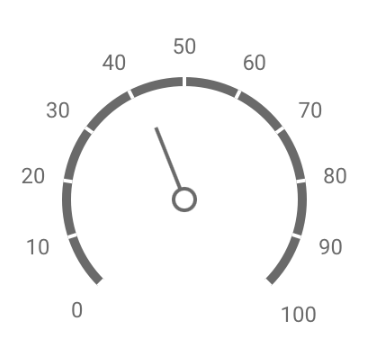

# Circular Gauge

The **Circular Gauge** widget indicates a value on a circular scale. It is a powerful visualization tool for dashboards, capable of displaying measurements, progress, or key performance indicators.

The gauge's appearance and behavior are fully customizable through the App Builder.

<figure><figcaption></figcaption></figure>

## Data Binding

Connect the widget to your application's logic by dragging the corresponding items from the Flow Builder.

### Output

| Property       | Type     | Description                                                            |
| -------------- | -------- | ---------------------------------------------------------------------- |
| **`value`**    | `Number` | Sets the value for the primary indicator on the gauge.                 |
| **`subValue`** | `Number` | Sets the value for the secondary (or subvalue) indicator on the gauge. |

## Configuration

### Frame

These properties control the main body and geometry of the gauge.

<figure><figcaption>
Visual explanation of the properties <code>startAngle</code> and <code>circleSize</code>
</figcaption></figure>

| Label                | Description                                                                                                  | Type           | Property          |
| -------------------- | ------------------------------------------------------------------------------------------------------------ | -------------- | ----------------- |
| **Start Angle**      | The angle in degrees where the gauge's scale begins.                                                         | Integer        | `startAngle`      |
| **Circle Size**      | The total size of the gauge's arc in degrees (e.g., 360 for a full circle).                                  | Integer        | `circleSize`      |
| **Frame Width**      | The thickness of the gauge's frame in pixels.                                                                | Integer        | `width`           |
| **Background Color** | The background color of the gauge's range container.                                                         | String (Color) | `backgroundColor` |
| **Color Sections**   | Defines colored sections (ranges) on the gauge frame to represent different zones (e.g., low, medium, high). | Array          | `ranges`          |

<figure><figcaption>
A circular gauge with adjusted frame
</figcaption></figure>

### Indicator

Configure the pointers that display the `value` and `subValue` on the gauge.

<figure><figcaption>
Indicator Types (top-left to bottom-right):  <code>rectangleNeedle, twoColorNeedle, triangleNeedle, rangeBar, triangleMarker, textCloud</code>
</figcaption></figure>

| Label                  | Description                                                      | Type   | Property            |
| ---------------------- | ---------------------------------------------------------------- | ------ | ------------------- |
| **Primary Indicator**  | An object containing settings for the main value indicator.      | Object | `valueIndicator`    |
| **Subvalue Indicator** | An object containing settings for the secondary value indicator. | Object | `subvalueIndicator` |

#### Indicator Properties

Both the primary and subvalue indicators share these properties.

| Label              | Description                                                      | Type           | Property |
| ------------------ | ---------------------------------------------------------------- | -------------- | -------- |
| **Indicator Type** | The shape of the indicator.                                      | String         | `type`   |
| **Width**          | The width or thickness of the indicator.                         | Integer        | `width`  |
| **Scale Offset**   | A custom offset in pixels from the indicator to the gauge scale. | Number         | `offset` |
| **Color**          | The color of the indicator.                                      | String (Color) | `color`  |

Depending on the **Indicator Type**, additional properties are available:

* **For `Rectangle Needle`, `Two-Color Needle`, `Triangle Needle`**: `indentFromCenter`, `spindleSize`, `spindleGapSize`. The `Two-Color Needle` also has `secondColor` and `secondFraction`.
* **For `Range Bar`**: `backgroundColor`, `size`, `baseValue`.
* **For `Triangle Marker`**: `length`.
* **For `Text Cloud`**: `arrowLength`.

### Scale

These properties control the scale, ticks, and labels that provide context to the gauge's values.

| Label           | Description                                                   | Type   | Property     |
| --------------- | ------------------------------------------------------------- | ------ | ------------ |
| **Start Value** | The minimum value of the scale.                               | Number | `startValue` |
| **End Value**   | The maximum value of the scale.                               | Number | `endValue`   |
| **Label**       | An object containing settings for the scale's numeric labels. | Object | `label`      |
| **Major Tick**  | An object containing settings for the major tick marks.       | Object | `tick`       |
| **Minor Tick**  | An object containing settings for the minor tick marks.       | Object | `minorTick`  |

#### Label and Tick Properties

| Label                  | Description                                                                        | Type           | Property   |
| ---------------------- | ---------------------------------------------------------------------------------- | -------------- | ---------- |
| **Display Label/Tick** | Toggles the visibility of the labels or ticks.                                     | Boolean        | `visible`  |
| **Font Size**          | (`Label` only) The font size of the labels.                                        | Integer        | `size`     |
| **Font Weight**        | (`Label` only) The font weight of the labels (e.g., 400 for normal, 700 for bold). | Integer        | `weight`   |
| **Font Color**         | (`Label` only) The color of the label text.                                        | String (Color) | `color`    |
| **Interval**           | (`Tick` only) The interval between major or minor ticks.                           | Number         | `interval` |
| **Length**             | (`Tick` only) The length of the tick marks in pixels.                              | Integer        | `length`   |

