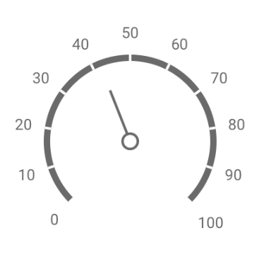

# Circular gauge

The circular gauge widget displays numeric values and secondary benchmarks on a radial scale. It visualizes measurements, operational progress, or key performance indicators on your dashboards.

<figure><figcaption></figcaption></figure>

## Data binding

### Function output or modifier to widget

| **Property**               | **Description**                                                                                   | **Type**       |
| -------------------------- | ------------------------------------------------------------------------------------------------- | -------------- |
| `value`                    | Sets the main indicator pointer value on the radial scale.                                        | number         |
| `subValue`                 | Sets a single secondary value pointer coordinate. If defined, it overrides the `subvalues` array. | number         |
| `subvalues`                | An array of secondary values to plot multiple subvalue indicators simultaneously.                 | array\<number> |
| `disabled`                 | Toggles whether user interactions and tooltips are disabled.                                      | boolean        |
| `containerBackgroundColor` | Sets the solid background fill color of the gauge bounding box.                                   | string         |
| `animation`                | Configures gauge movement animations, accepting an object with `enabled` and `duration`.          | object         |
| `tooltip`                  | Controls contextual hover tooltips, accepting an object with `enabled`.                           | object         |
| `frame`                    | Overrides the geometry layout, ranges, and background color profiles at runtime.                  | object         |
| `scale`                    | Overrides scale boundaries, intervals, and labels at runtime.                                     | object         |
| `valueIndicator`           | Overrides properties for the primary pointer style at runtime.                                    | object         |
| `subvalueIndicator`        | Overrides properties for the secondary pointer style at runtime.                                  | object         |

## Configuration

Set the widget's defaults in the settings panel.

### General settings

| **Property**               | **Label**                  | **Description**                                                                                    | **Type** |
| -------------------------- | -------------------------- | -------------------------------------------------------------------------------------------------- | -------- |
| `containerBackgroundColor` | Container background color | Sets the solid background fill color of the gauge canvas area.                                     | string   |
| `disabled`                 | Disabled                   | Disables all animations, hover tracking highlights, and tooltips when checked.                     | boolean  |
| `animation`                | Animation                  | Configuration object managing pointer motion, supporting nested `enabled` and `duration` controls. | object   |
| `tooltip`                  | Tooltip                    | Configuration object managing hover information popups, supporting an `enabled` toggle.            | object   |

### Frame

These settings control the structural layout and radial architecture of the gauge wheel.

<figure><figcaption>
Visual explanation of the properties <code>startAngle</code> and <code>endAngle</code>
</figcaption></figure>

| **Property**      | **Label**        | **Description**                                                                                    | **Type** |
| ----------------- | ---------------- | -------------------------------------------------------------------------------------------------- | -------- |
| `startAngle`      | Start angle      | The angle in degrees where the gauge scale progression begins.                                     | integer  |
| `endAngle`        | End angle        | The terminal angle profile mapping where the scale progression stops.                              | integer  |
| `width`           | Frame width      | The line stroke thickness of the circular gauge ring track in pixels.                              | integer  |
| `backgroundColor` | Background color | The background fill color of the frame track container.                                            | string   |
| `ranges`          | Color sections   | An array of threshold range objects used to draw color-coded status warning zones along the frame. | array    |

<figure><figcaption>
A circular gauge with adjusted frame
</figcaption></figure>

### Scale

Configure the numeric values, tick increments, and text formatting rules driving the scale context.

| **Property** | **Label**   | **Description**                                                 | **Type** |
| ------------ | ----------- | --------------------------------------------------------------- | -------- |
| `startValue` | Start value | The minimum mathematical boundary of the scale.                 | number   |
| `endValue`   | End value   | The maximum mathematical boundary of the scale.                 | number   |
| `label`      | Label       | Configuration object governing the numeric text labels.         | object   |
| `tick`       | Major tick  | Configuration object governing the primary division ticks.      | object   |
| `minorTick`  | Minor tick  | Configuration object governing the secondary subdivision ticks. | object   |

### Scale label and tick properties

These fields manage text formatting and tick distribution parameters nested inside the `label`, `tick`, and `minorTick` blocks.

| **Property** | **Label**   | **Description**                                                                                                         | **Type** |
| ------------ | ----------- | ----------------------------------------------------------------------------------------------------------------------- | -------- |
| `visible`    | Visible     | Toggles the layout visibility of the respective labels or tick strokes on the wheel.                                    | boolean  |
| `size`       | Font size   | (`label` only) Sets the font text size of the numeric tracking characters.                                              | integer  |
| `weight`     | Font weight | (`label` only) Sets the typographical font thickness weight profile (such as `400` for regular or `700` for bold text). | integer  |
| `color`      | Font color  | (`label` only) Sets the color of the scale label digits.                                                                | string   |
| `interval`   | Interval    | (`tick` and `minorTick` only) The step multiplier interval sequence dividing axis markers.                              | number   |
| `length`     | Length      | (`tick` and `minorTick` only) The total pixel line length of the tick lines.                                            | integer  |
| `width`      | Width       | (`tick` and `minorTick` only) The line stroke width thickness of the individual tick lines.                             | integer  |

### Indicator

Manage the pointers representing active metrics on the scale wheel.

<figure><figcaption>
Indicator types (top-left to bottom-right): <code>rectangleNeedle, twoColorNeedle, triangleNeedle, rangeBar, triangleMarker, textCloud</code>
</figcaption></figure>

| **Property**        | **Label**          | **Description**                                                                    | **Type** |
| ------------------- | ------------------ | ---------------------------------------------------------------------------------- | -------- |
| `valueIndicator`    | Primary indicator  | Configuration object defining the layout style for the main value pointer.         | object   |
| `subvalueIndicator` | Subvalue indicator | Configuration object defining the layout style for the secondary subvalue pointer. | object   |

### Indicator properties

These configuration fields apply inside both the `valueIndicator` and `subvalueIndicator` parent blocks.

| **Property**       | **Label**                                                                                         | **Description**                                                                                                                                       | **Type** |
| ------------------ | ------------------------------------------------------------------------------------------------- | ----------------------------------------------------------------------------------------------------------------------------------------------------- | -------- |
| `type`             | Indicator type                                                                                    | The pointer layout shape style (options include `rectangleNeedle`, `twoColorNeedle`, `triangleNeedle`, `rangeBar`, `triangleMarker`, or `textCloud`). | string   |
| `width`            | Width                                                                                             | The base structural thickness of the indicator pointer.                                                                                               | integer  |
| `offset`           | Scale offset                                                                                      | The physical pixel displacement air gap between the pointer and the scale circle line.                                                                | number   |
| `color`            | Color                                                                                             | The primary hex color code used to paint the pointer structure.                                                                                       | string   |
| `indentFromCenter` | Indent from center                                                                                | Dictates center-pin hub clearance parameters for needle pointer styles.                                                                               | number   |
| `spindleSize`      | Spindle size                                                                                      | Sets the central anchor core radius when using needle styles.                                                                                         | integer  |
| `spindleGapSize`   | Spindle gap size                                                                                  | Sets the core interior tracking clearance gap when using needle styles.                                                                               | integer  |
| `secondColor`      | Second color                                                                                      | Defines the distinct tip trim color accent when `type` is set to `twoColorNeedle`.                                                                    | string   |
| Second fraction    | The proportional length split coordinate determining where the color flips on a `twoColorNeedle`. | number                                                                                                                                                |          |
| `size`             | Size                                                                                              | Enforces the tracking arc thickness dimension strictly when `type` is configured as a `rangeBar`.                                                     | number   |
| `baseValue`        | Base value                                                                                        | The origin tracking base value from which a `rangeBar` arc grows.                                                                                     | number   |
| `length`           | Length                                                                                            | Sets the total length factor profile when utilizing a `triangleMarker`.                                                                               | integer  |
| `arrowLength`      | Arrow length                                                                                      | Sets the extension tail structural length when displaying a callout `textCloud`.                                                                      | integer  |
