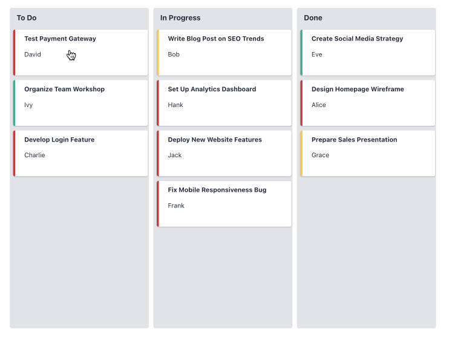

# Kanban

The **Kanban** widget provides a classic, agile tool for visualizing and managing workflows. It displays tasks or items as cards organized into columns that represent different stages of a process.

This widget is ideal for project management, task tracking, and any process-oriented application where you need a clear, visual overview of work in progress. Users can drag and drop cards between stages to update their status.

<figure><figcaption><p>A Kanban Board in Heisenware</p></figcaption></figure>

## Data Binding

Connect the widget to your application's logic by dragging the corresponding items from the Backend Builder.

### Input

| **Property**        | **Type** | **Description**                                                                                                                              |
| ------------------- | -------- | -------------------------------------------------------------------------------------------------------------------------------------------- |
| **`onCardChange`**  | `Object` | Fired when a user moves a card to a different stage. The payload is the complete data object for the moved card, with its stage key updated. |
| **`onColumnClick`** | `String` | Fired when a user clicks on a column (stage). The payload is the name of the stage that was clicked.                                         |
| **`onCardClick`**   | `Object` | Fired when a user clicks on any part of a card. The payload is the data object for that card.                                                |
| **`onTitleClick`**  | `Object` | Fired when a user clicks on a card's title, if the title is configured to be clickable. The payload is the data object for that card.        |

### Output

| **Property** | **Type** | **Description**                                                                                                                 |
| ------------ | -------- | ------------------------------------------------------------------------------------------------------------------------------- |
| **`cards`**  | `Array`  | An array of data objects, where each object is rendered as a card on the board. See the **Data Structure** section for details. |

#### Data Structure

To populate the Kanban board, you must provide an array of card objects. The widget uses key fields within each object to determine its stage, title, subtitle, and status color. You specify which fields in your data correspond to these roles in the configuration.

For example, if you configure `Stage Key` as `"stage"`, `Title Key` as `"taskName"`, and `Status Key` as `"priority"`, your data for a single card should look like this:

```json
{
  "id": 101,
  "taskName": "Design new login screen",
  "stage": "In Progress",
  "priority": "High"
}

```

## Configuration

### Kanban Board Settings

These properties control the overall structure and behavior of the board.

<table data-header-hidden><thead><tr><th width="155.9630126953125"></th><th width="275.815185546875"></th><th width="130.4815673828125"></th><th></th></tr></thead><tbody><tr><td><strong>Label</strong></td><td><strong>Description</strong></td><td><strong>Type</strong></td><td><strong>Property</strong></td></tr><tr><td><strong>Stages</strong></td><td>An array of strings that define the columns (stages) of the Kanban board, in order.</td><td>Array</td><td><code>stages</code></td></tr><tr><td><strong>Card List Width</strong></td><td>Sets the width of each column (stage) in pixels.</td><td>Number</td><td><code>cardWidth</code></td></tr><tr><td><strong>Card title is clickable</strong></td><td>If <code>true</code>, makes the title of each card a clickable link that fires the <code>onTitleClick</code> event.</td><td>Boolean</td><td><code>titleIsClickable</code></td></tr></tbody></table>

### Status Mappings

These properties define how your data fields are mapped to the card's visual elements, such as its title and status color.

<table data-header-hidden><thead><tr><th width="138.7037353515625"></th><th width="326.740966796875"></th><th width="103.926025390625"></th><th></th></tr></thead><tbody><tr><td><strong>Label</strong></td><td><strong>Description</strong></td><td><strong>Type</strong></td><td><strong>Property</strong></td></tr><tr><td><strong>Stage Key</strong></td><td>The name of the field in your card objects that determines which stage (column) the card belongs to.</td><td>String</td><td><code>stageKey</code></td></tr><tr><td><strong>Title Key</strong></td><td>The name of the field used for the main title of the card.</td><td>String</td><td><code>titleKey</code></td></tr><tr><td><strong>Subtitle Key</strong></td><td>The name of the field used for the subtitle or description on the card.</td><td>String</td><td><code>subTitleKey</code></td></tr><tr><td><strong>Status Key</strong></td><td>The name of the field whose value is used to look up the status color from the mappings below.</td><td>String</td><td><code>statusKey</code></td></tr><tr><td><strong>Status Mappings</strong></td><td>Defines a list of status values and their corresponding colors. This is used to display a colored border on each card.</td><td>Array</td><td><code>statusMappings</code></td></tr></tbody></table>

#### Status Mapping Properties

Each item in the `Status Mappings` array links a status value to a specific color.

<table data-header-hidden><thead><tr><th width="112.8514404296875"></th><th width="359.2962646484375"></th><th width="146.81494140625"></th><th></th></tr></thead><tbody><tr><td><strong>Label</strong></td><td><strong>Description</strong></td><td><strong>Type</strong></td><td><strong>Property</strong></td></tr><tr><td><strong>Status</strong></td><td>The specific status value from your data (e.g., "High," "Urgent," or "Low").</td><td>String</td><td><code>status</code></td></tr><tr><td><strong>Color</strong></td><td>The color to apply to the card's border when its status matches.</td><td>String (Color)</td><td><code>color</code></td></tr></tbody></table>

## Demo video


