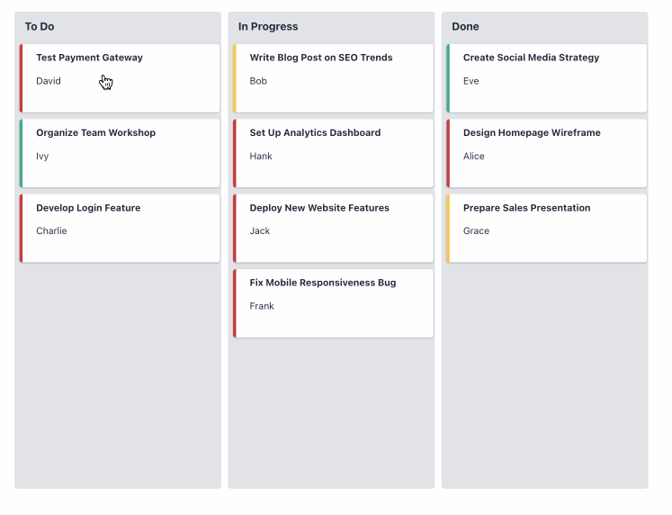

# Kanban

The kanban widget provides a visual tool for managing workflows and tracking operational progress. It displays data records as draggable cards organized into columns that represent different stages of a process.

<figure><figcaption><p>A kanban board in Heisenware</p></figcaption></figure>

## Data binding

### Function output or modifier to widget

| **Property** | **Description** | **Type** |
| :--- | :--- | :--- |
| `cards` | An array of data objects, where each object is rendered as a card on the board. | array |

### Widget to function input

| **Property** | **Description** | **Type** |
| :--- | :--- | :--- |
| `onCardChange` | Fires when a user moves a card to a different stage. The payload is the complete data object for the moved card, with its stage key updated. | object |
| `onColumnClick` | Fires when a user clicks a column (stage). The payload is the name of the stage that was clicked. | string |
| `onCardClick` | Fires when a user clicks any part of a card. The payload is the data object for that card. | object |
| `onTitleClick` | Fires when a user clicks a card's title, if the title is configured to be clickable. The payload is the data object for that card. | object |

### Data structure

To populate the kanban board, ensure the bound array of card objects includes key fields corresponding to the configured stage, title, subtitle, and status parameters.

For example, if you configure the Stage key as `stage`, Title key as `taskName`, and Status key as `priority`, a single card data object should follow this structure:

```json
{
  "id": 101,
  "taskName": "Design new login screen",
  "stage": "In Progress",
  "priority": "High"
}
```

## Configuration

### General settings

| **Property** | **Label** | **Description** | **Type** |
| :--- | :--- | :--- | :--- |
| `stages` | Stages | An array of strings that define the columns of the kanban board in order. | array |
| `titleIsClickable` | Card title is clickable | Makes the title of each card a clickable link that triggers the `onTitleClick` event. | boolean |

### Data fields

| **Property** | **Label** | **Description** | **Type** |
| :--- | :--- | :--- | :--- |
| `stageKey` | Stage key | The name of the field in the card objects that determines which stage the card belongs to. | string |
| `titleKey` | Title key | The name of the field used for the main title of the card. | string |
| `subTitleKey` | Subtitle key | The name of the field used for the subtitle or description on the card. | string |
| `statusKey` | Status key | The name of the field whose value is used to look up the status color from the status mappings. | string |

### Status mappings

| **Property** | **Label** | **Description** | **Type** |
| :--- | :--- | :--- | :--- |
| `statusMappings` | Status mappings | Defines a list of status values and their corresponding colors used to display a colored border on each card. | array |
| `status` | Status | The specific status value from the data (such as High, Urgent, or Low). | string |
| `color` | Color | The color applied to the card's border when its status matches. | string |

## Video demo


