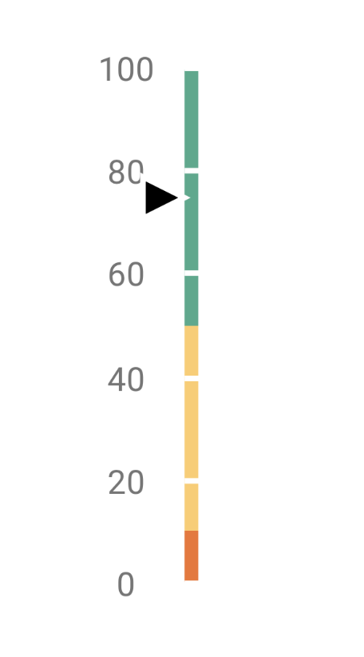

# Linear Gauge

The **Linear Gauge** widget provides a way to visualize a single value or a pair of values within a defined range. It's a highly customizable component that can be displayed either vertically or horizontally.

This widget is perfect for dashboards, reports, and any interface where you need to represent progress, levels, or measurements in a clear, graphical way.

<figure><figcaption></figcaption></figure>

## Data Binding

Connect the widget to your application's logic by dragging the corresponding items from the Backend Builder.

### Output

| **Property**   | **Type** | **Description**                                                        |
| -------------- | -------- | ---------------------------------------------------------------------- |
| **`value`**    | `Number` | Sets the value for the primary indicator on the gauge.                 |
| **`subValue`** | `Number` | Sets the value for the secondary (or subvalue) indicator on the gauge. |

## Configuration

### Frame

These properties control the main body and background of the gauge.

| **Label**            | **Description**                                                                                              | **Type**       | **Property**      |
| -------------------- | ------------------------------------------------------------------------------------------------------------ | -------------- | ----------------- |
| **Orientation**      | Sets the gauge to be displayed `Vertical` or `Horizontal`.                                                   | String         | `orientation`     |
| **Frame Width**      | The thickness of the gauge's frame in pixels.                                                                | Integer        | `width`           |
| **Background Color** | The background color of the gauge's range container.                                                         | String (Color) | `backgroundColor` |
| **Color Sections**   | Defines colored sections (ranges) on the gauge frame to represent different zones (e.g., low, medium, high). | Array          | `ranges`          |

### Indicator

Configure the pointers that display the `value` and `subValue` on the gauge.

| **Label**              | **Description**                                                  | **Type** | **Property**        |
| ---------------------- | ---------------------------------------------------------------- | -------- | ------------------- |
| **Primary Indicator**  | An object containing settings for the main value indicator.      | Object   | `valueIndicator`    |
| **Subvalue Indicator** | An object containing settings for the secondary value indicator. | Object   | `subvalueIndicator` |

#### Indicator Properties

Both the primary and subvalue indicators share these properties.

| **Label**                    | **Description**                                                                                                                 | **Type**       | **Property** |
| ---------------------------- | ------------------------------------------------------------------------------------------------------------------------------- | -------------- | ------------ |
| **Indicator Type**           | The shape of the indicator. Options include `Rectangle`, `Rhombus`, `Circle`, `Range Bar`, `Triangle Marker`, and `Text Cloud`. | String         | `type`       |
| **Color**                    | The color of the indicator.                                                                                                     | String (Color) | `color`      |
| **Custom distance to gauge** | A custom offset in pixels from the indicator to the gauge scale.                                                                | Number         | `offset`     |

Depending on the **Indicator Type**, additional properties are available:

* **For `Rectangle`, `Rhombus`, `Triangle Marker`**: `length`, `width`
* **For `Circle`**: `length` (for size)
* **For `Range Bar`**: `backgroundColor`, `size`
* **For `Text Cloud`**: `arrowLength`

### Scale

These properties control the scale, ticks, and labels that provide context to the gauge's values.

| **Label**       | **Description**                                               | **Type** | **Property** |
| --------------- | ------------------------------------------------------------- | -------- | ------------ |
| **Start Value** | The minimum value of the scale.                               | Number   | `startValue` |
| **End Value**   | The maximum value of the scale.                               | Number   | `endValue`   |
| **Label**       | An object containing settings for the scale's numeric labels. | Object   | `label`      |
| **Major Tick**  | An object containing settings for the major tick marks.       | Object   | `tick`       |
| **Minor Tick**  | An object containing settings for the minor tick marks.       | Object   | `minorTick`  |

#### Label and Tick Properties

| **Label**              | **Description**                                                                    | **Type**       | **Property** |
| ---------------------- | ---------------------------------------------------------------------------------- | -------------- | ------------ |
| **Display Label/Tick** | Toggles the visibility of the labels or ticks.                                     | Boolean        | `visible`    |
| **Font Size**          | (`Label` only) The font size of the labels.                                        | Integer        | `size`       |
| **Font Weight**        | (`Label` only) The font weight of the labels (e.g., 400 for normal, 700 for bold). | Integer        | `weight`     |
| **Font Color**         | (`Label` only) The color of the label text.                                        | String (Color) | `color`      |
| **Interval**           | (`Tick` only) The interval between major or minor ticks.                           | Number         | `interval`   |
| **Length**             | (`Tick` only) The length of the tick marks in pixels.                              | Integer        | `length`     |
