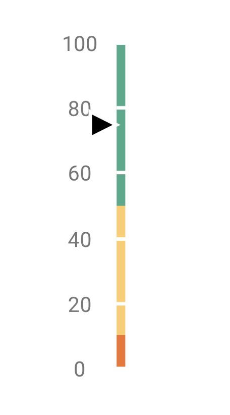

# Linear gauge

The linear gauge widget displays a single numeric value or a pair of values on a linear scale. It visualizes progress, operational levels, or measurements horizontally or vertically on your dashboards.

<figure><figcaption></figcaption></figure>

## Data binding

### Function output or modifier to widget

| **Property** | **Description** | **Type** |
| :--- | :--- | :--- |
| `value` | Sets the value for the primary indicator on the gauge. | number |
| `subValue` | Sets the value for the secondary subvalue indicator on the gauge. | number |

## Configuration

Set the widget's defaults in the settings panel.

### Frame

These settings control the main body, structural layout, and orientation of the gauge track.

| **Property** | **Label** | **Description** | **Type** |
| :--- | :--- | :--- | :--- |
| `orientation` | Orientation | Sets the layout direction of the gauge to vertical or horizontal. | string |
| `width` | Frame width | Sets the thickness of the gauge frame in pixels. | integer |
| `backgroundColor` | Background color | Sets the background color of the gauge range container. | string |
| `ranges` | Color sections | Defines color-coded threshold sections on the gauge frame to represent distinct operational zones. | array |

### Scale

Configure the numeric values, tick increments, and text formatting rules driving the scale context.

| **Property** | **Label** | **Description** | **Type** |
| :--- | :--- | :--- | :--- |
| `startValue` | Start value | The minimum mathematical boundary of the scale. | number |
| `endValue` | End value | The maximum mathematical boundary of the scale. | number |
| `label` | Label | Configuration object governing the scale's numeric text labels. | object |
| `tick` | Major tick | Configuration object governing the primary division tick marks. | object |
| `minorTick` | Minor tick | Configuration object governing the secondary subdivision tick marks. | object |

### Scale label and tick properties

These fields manage text formatting and tick distribution parameters nested inside the `label`, `tick`, and `minorTick` blocks.

| **Property** | **Label** | **Description** | **Type** |
| :--- | :--- | :--- | :--- |
| `visible` | Display label/tick | Toggles the layout visibility of the respective labels or tick marks. | boolean |
| `size` | Font size | (`label` only) Sets the font text size of the scale labels. | integer |
| `weight` | Font weight | (`label` only) Sets the typographical font thickness weight profile (such as `400` for regular or `700` for bold text). | integer |
| `color` | Font color | (`label` only) Sets the color of the label text. | string |
| `interval` | Interval | (`tick` and `minorTick` only) Sets the mathematical step interval sequence dividing scale marks. | number |
| `length` | Length | (`tick` and `minorTick` only) Sets the total line length of the tick marks in pixels. | integer |

### Indicator

Manage the pointers representing active metrics on the scale track.

| **Property** | **Label** | **Description** | **Type** |
| :--- | :--- | :--- | :--- |
| `valueIndicator` | Primary indicator | Configuration object defining the layout style for the main value pointer. | object |
| `subvalueIndicator` | Subvalue indicator | Configuration object defining the layout style for the secondary subvalue pointer. | object |

### Indicator properties

These configuration fields apply inside both the `valueIndicator` and `subvalueIndicator` parent blocks.

| **Property** | **Label** | **Description** | **Type** |
| :--- | :--- | :--- | :--- |
| `type` | Indicator type | The pointer layout shape style (options include `Rectangle`, `Rhombus`, `Circle`, `Range Bar`, `Triangle Marker`, or `Text Cloud`). | string |
| `color` | Color | The primary color code used to paint the pointer structure. | string |
| `offset` | Custom distance to gauge | Sets a physical pixel displacement offset air gap between the indicator and the gauge scale line. | number |
| `length` | Length | Sets the structural length dimension of the pointer (or size when using a `Circle`). | integer |
| `width` | Width | Sets the base structural thickness stroke of the pointer. | integer |
| `backgroundColor` | Background color | Sets the background fill color strictly when `type` is configured as a `Range Bar`. | string |
| `size` | Size | Enforces the tracking bar thickness dimension strictly when `type` is configured as a `Range Bar`. | number |
| `arrowLength` | Arrow length | Sets the extension tail structural length when displaying a callout `Text Cloud`. | integer |
