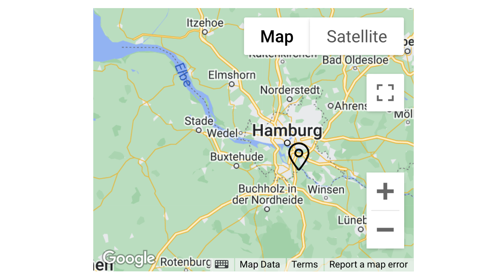

# Map

The **Map** widget provides a powerful way to visualize geographical data by displaying one or more markers on an interactive Google Map.

It's a highly versatile component for any application that needs to display locations, track assets, or show points of interest. The map can be configured with various controls, layers like traffic and transit, and custom marker styles.

<figure><figcaption></figcaption></figure>

## Data Binding

Connect the widget to your application's logic by dragging the corresponding items from the Flow Builder.

### Output

| **Property**  | **Type**                        | **Description**                                                                                                        |
| ------------- | ------------------------------- | ---------------------------------------------------------------------------------------------------------------------- |
| **`markers`** | `Array` or `Object` or `String` | Provides the location data to be displayed as markers on the map. See the **Marker Data Formats** section for details. |

#### Marker Data Formats

The `markers` property is highly flexible and accepts data in several formats.

1\. Single Location String:

A single string with comma-separated latitude and longitude.

"40.7128, -74.0060"

2\. Array of Location Strings:

\["40.7128, -74.0060", "34.0522, -118.2437"]

3\. Array with Latitude and Longitude:

A single array containing the latitude and longitude.

\[40.7128, -74.0060]

4\. Array of Coordinate Arrays:

\[\[40.7128, -74.0060], \[34.0522, -118.2437]]

**5. Object with `lat` and `lng` properties:**

```json
{ "lat": 40.7128, "lng": -74.0060 }

```

6\. Array of Location Objects:

This is the most powerful format, as it allows you to customize each marker individually.

```json
[
  { "lat": 40.7128, "lng": -74.0060, "icon": "fas fa-star", "iconColor": "gold" },
  { "lat": 34.0522, "lng": -118.2437, "icon": "fas fa-map-pin", "iconSize": 32 }
]

```

## Configuration

### Settings

These properties control the initial state, appearance, and features of the map.

| **Label**                    | **Description**                                                                                    | **Type**       | **Property**       |
| ---------------------------- | -------------------------------------------------------------------------------------------------- | -------------- | ------------------ |
| **Default Center**           | The initial center point of the map as a "latitude, longitude" string.                             | String         | `defaultCenter`    |
| **Default Zoom**             | The initial zoom level of the map (e.g., 1 is the whole world, 15 is city level).                  | Integer        | `defaultZoom`      |
| **Default Icon**             | The default icon to use for all markers (e.g., a Font Awesome class like `fas fa-map-marker-alt`). | String         | `defaultIcon`      |
| **Default Icon Size**        | The default size of the marker icons in pixels.                                                    | Integer        | `defaultIconSize`  |
| **Default Icon Color**       | The default color of the marker icons.                                                             | String (Color) | `defaultIconColor` |
| **Center on Markers**        | If `true`, the map will automatically adjust its center to fit all markers whenever they change.   | Boolean        | `centerOnMarkers`  |
| **Show Map Type Selectors**  | If `true`, displays controls for switching between map types (e.g., Satellite, Terrain).           | Boolean        | `showMapControls`  |
| **Show Traffic Information** | If `true`, overlays real-time traffic information on the map.                                      | Boolean        | `showTrafficLayer` |
| **Show Transit Information** | If `true`, overlays public transit routes and stations on the map.                                 | Boolean        | `showTransitLayer` |


When displaying multiple locations, if the setting "Center on markers" is active, the map will be centered on the midpoint between all the locations with the preset default zoom. Some markers may not be visible as a result of this. Changing the default zoom to an appropriate scale can get around the issue.

