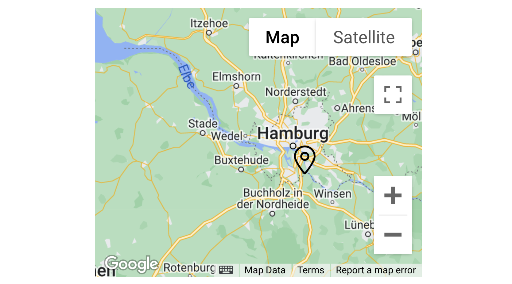

# Map

The map widget displays location markers on an interactive geographical map. It visualizes coordinate strings, location arrays, or asset data objects on your dashboards.

<figure><figcaption></figcaption></figure>

## Data binding

### Function output or modifier to widget

| **Property** | **Description** | **Type** |
| :--- | :--- | :--- |
| `markers` | Supplies the geographical coordinate data used to render location markers on the map canvas. Accepts strings, arrays, or objects. | string \| array \| object |

## Configuration

Set the widget's defaults in the settings panel.

### General settings

| **Property** | **Label** | **Description** | **Type** |
| :--- | :--- | :--- | :--- |
| `defaultCenter` | Default center | Sets the initial latitude and longitude center coordinate point of the map view. | string |
| `defaultZoom` | Default zoom | Sets the initial magnification zoom level of the map canvas. | integer |
| `defaultIcon` | Default icon | Sets the default icon style class applied to all plotted location markers. | string |
| `defaultIconSize` | Default icon size | Sets the default display text or icon size dimension for the markers in pixels. | integer |
| `defaultIconColor` | Default icon color | Sets the default text color hex code used to paint the marker icons. | string |
| `centerOnMarkers` | Center on markers | Dynamically recenters the map grid automatically to fit all active markers when their coordinates update. | boolean |
| `showMapControls` | Show map type selectors | Toggles the layout visibility of the user controls for switching map styles. | boolean |
| `showTrafficLayer` | Show traffic information | Overlays real-time traffic density conditions onto the active map track. | boolean |
| `showTransitLayer` | Show transit information | Overlays local public transportation routes and station networks onto the map. | boolean |

## Tips and tricks

The `markers` property accepts multiple flexible input formats depending on your backend data payload.

### Single coordinate string
A single text string containing comma-separated latitude and longitude coordinates:
`"40.7128, -74.0060"`

### Array of coordinate strings
Multiple location text strings grouped inside an array container:
`["40.7128, -74.0060", "34.0522, -118.2437"]`

### Single coordinate array
A flat numerical array listing latitude and longitude sequentially:
`[40.7128, -74.0060]`

### Array of coordinate arrays
Nested numerical arrays to plot multiple tracking points simultaneously:
`[[40.7128, -74.0060], [34.0522, -118.2437]]`

### Coordinate object
A structured object defining explicit `lat` and `lng` properties:
```json
{
  "lat": 40.7128,
  "lng": -74.0060
}
```

### Array of location objects
An advanced structure to customize individual markers with unique styles. Properties like `icon`, `iconColor`, and `iconSize` override the default widget configuration thresholds at runtime:
```json
[
  { "lat": 40.7128, "lng": -74.0060, "icon": "fas fa-star", "iconColor": "gold" },
  { "lat": 34.0522, "lng": -118.2437, "icon": "fas fa-map-pin", "iconSize": 32 }
]
```


#### Visibility with automatic recentering
When enabling *Center on markers*, the map calculates the geographic midpoint to position the view. This center calculation can push some markers outside the view boundary if the *Default zoom* scale is too restrictive. Adjust the *Default zoom* setting to fit all coordinate points into the visible display area.

