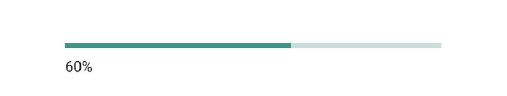

# Progress Bar

The **ProgressBar** widget provides a simple and effective way to visualize the status of a task or a specific value within a defined range. It displays a horizontal bar that fills from left to right to represent the current progress as a percentage.

It's an ideal component for showing loading states, task completion, or any value that needs to be tracked against a minimum and maximum.

<figure><figcaption>
A progress bar in Heisenware.
</figcaption></figure>

## Data Binding

Connect the widget to your application's logic by dragging the corresponding items from the Flow Builder.

### Output

| **Property** | **Type** | **Description**                                                                             |
| ------------ | -------- | ------------------------------------------------------------------------------------------- |
| **`value`**  | `Number` | Sets the current value of the progress bar, which determines how much of the bar is filled. |

## Configuration

### Settings

These properties control the range of the progress bar.

| **Label**   | **Description**                                           | **Type** | **Property** |
| ----------- | --------------------------------------------------------- | -------- | ------------ |
| **Minimum** | The minimum value of the progress bar, representing 0%.   | Integer  | `min`        |
| **Maximum** | The maximum value of the progress bar, representing 100%. | Integer  | `max`        |


The percentage is calculated as `value * 100 / (max-min)`

The color of the progress bar is the theme accent color by default and cannot be changed currently.

