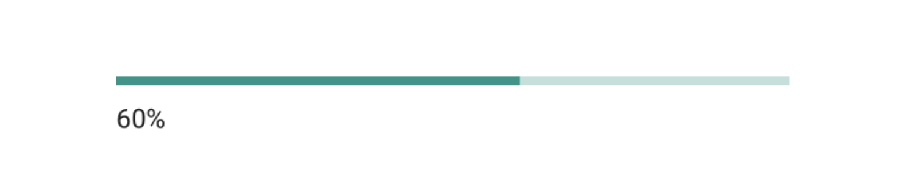

# Progress bar

The progress bar widget visualizes the operational status of a task or a specific metric within a defined range[cite: 24, 25]. It displays a horizontal bar that fills from left to right to represent progress as a percentage in your Apps[cite: 25].

<figure><figcaption>
A progress bar in Heisenware
</figcaption></figure>

## Data binding

### Function output or modifier to widget

| **Property** | **Description** | **Type** |
| :--- | :--- | :--- |
| `value` | Sets the current numeric value determining how much of the bar is filled[cite: 24, 25]. | number |
| `min` | Sets the minimum boundary value corresponding to 0% progress[cite: 24, 25]. | number |
| `max` | Sets the maximum boundary value corresponding to 100% progress[cite: 24, 25]. | number |
| `showStatus` | Toggles the layout visibility of the percentage text label inside the progress bar[cite: 24]. | boolean |

## Configuration

Set the widget's defaults in the settings panel.

### General settings

| **Property** | **Label** | **Description** | **Type** |
| :--- | :--- | :--- | :--- |
| `min` | Minimum | The default minimum value of the progress bar, representing 0%[cite: 25]. | integer |
| `max` | Maximum | The default maximum value of the progress bar, representing 100%[cite: 25]. | integer |
| `showStatus` | Show status | Toggles the visibility of the percentage text label when checked[cite: 24]. | boolean |

## Tips and tricks


#### Percentage calculation and theme styling
The widget automatically calculates the fill percentage using the formula: `(value * 100) / (max - min)`[cite: 25]. 

The progress bar fill color matches your active theme accent color configuration and cannot be modified independently[cite: 25].

