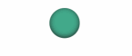
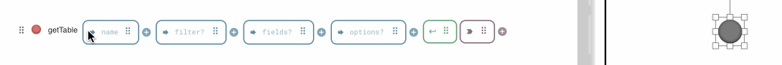

# Status Lamp

The **StatusLamp** widget provides a simple, visual indicator of a state or condition, similar to an LED light. It displays a colored circle that can change based on the data it receives.

This widget is perfect for dashboards, monitoring screens, and any interface where you need a clear, at-a-glance indication of status, such as online/offline, success/failure, or active/inactive.

<figure><figcaption>
A Status Lamp
</figcaption></figure>

## Data Binding

Connect the widget to your application's logic by dragging the corresponding items from the Backend Builder.

### Output

| **Property** | **Type**             | **Description**                                                                                                                                                                                              |
| ------------ | -------------------- | ------------------------------------------------------------------------------------------------------------------------------------------------------------------------------------------------------------ |
| **`value`**  | `String` or `Object` | Determines the lamp's color based on the configured mappings. If a string is provided, it's matched directly. If an object is provided, the widget looks for a `status` property within the object to match. |


The Status Lamp only accepts single values in the `value` field. To associate ranges of numbers to a mapping, you will first need to create the groupings.

This can be done using [Filters](https://docs.heisenware.com/building-apps/data-processing/function-extensions/filter).


## Configuration

### Settings

These properties define the mapping between status values and the lamp's appearance.

| **Label**           | **Description**                                                                | **Type** | **Property** |
| ------------------- | ------------------------------------------------------------------------------ | -------- | ------------ |
| **Status Mappings** | Defines a list of status values and their corresponding colors and hover text. | Array    | `mappings`   |

#### Status Mapping Properties

Each item in the `Status Mappings` array links a specific value to a color and an optional tooltip.

| **Label**      | **Description**                                                                                           | **Type**       | **Property** |
| -------------- | --------------------------------------------------------------------------------------------------------- | -------------- | ------------ |
| **Value**      | The specific status value from your data that will trigger this mapping (e.g., "online", "error", "200"). | String         | `value`      |
| **Color**      | The color the lamp will display when its input value matches.                                             | String (Color) | `color`      |
| **Hover Text** | Optional text that will appear in a tooltip when a user hovers over the lamp.                             | String         | `hoverText`  |

## Monitoring the status of a function

The status lamp can also be used to monitor the status of a function in the Backend Builder.&#x20;

This is particularly useful when handling many integrations and data connections, to have an easy way to monitor whether these are active.

To link a function status to the status lamp, simply drag the status indicator to the left of the function onto the widget.

<figure><figcaption></figcaption></figure>

