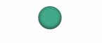
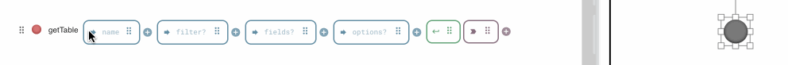

# Status lamp

The status lamp widget provides a visual indicator of states or conditions, displaying single or multiple status indicators similar to LED lights. It visualizes status strings, numeric values, or explicit color arrays in your Apps.

<figure><figcaption>
A status lamp
</figcaption></figure>

## Data binding

### Function output or modifier to widget

| **Property** | **Description** | **Type** |
| :--- | :--- | :--- |
| `value` | Determines the lamp color based on the configured status mappings. Accepts a single status value or an array of values to render multiple lamps. | string \| number \| array |
| `color` | Overrides mappings to apply explicit hex color codes or decimal color values directly. Accepts a single color or an array of colors. | string \| number \| array |

### Widget to function input

| **Property** | **Description** | **Type** |
| :--- | :--- | :--- |
| `onClick` | Fires when a user clicks the status lamp. The payload carries the configured context object or string. | string \| object |

### Data formats

The `value` and `color` properties can accept either single items or array structures to dynamically render multiple indicators inside a single widget container.

**Single status value**
Passes a standalone value evaluated against the configuration mappings:
`"online"`

**Array of status values**
Passes multiple status values to draw multiple sequential lamps inside the same widget layout:
`["online", "offline", "error"]`

**Explicit color array**
Passes direct decimal numbers or hex color strings into the `color` property to bypass the settings panel mappings entirely:
`["#FF0000", "#00FF00", 65280]`

## Configuration

Set the widget's defaults in the settings panel.

### General settings

| **Property** | **Label** | **Description** | **Type** |
| :--- | :--- | :--- | :--- |
| `mappings` | Status mappings | Defines the list of status values and their associated color rules. | array |
| `shape` | Shape | Sets the geometric visual layout profile of the indicators (options include `circle` or `rectangle`). | string |
| `spacing` | Spacing | Sets the pixel layout gap distribution distance between items when the shape is configured as a rectangle. | number |

### Status mapping properties

These configuration options define each individual rule item nested inside the `mappings` array.

| **Property** | **Label** | **Description** | **Type** |
| :--- | :--- | :--- | :--- |
| `value` | Value | The explicit data value string or number that triggers this mapping rule (such as `online`, `error`, or `200`). | string |
| `color` | Color | The color hex code applied to the lamp frame when the bound input matches. | string |

## Tips and tricks

### Monitoring the status of a function
The status lamp can monitor the live execution status of a function node inside the Backend Builder. This provides an easy way to check if your integrations or data connections are actively running.

To link a function node status to the widget, drag the status indicator circle located directly to the left of the function node on the canvas onto the status lamp widget workspace slot.

<figure><figcaption></figcaption></figure>
