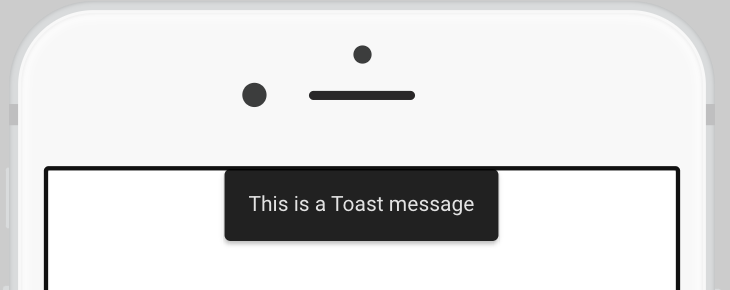
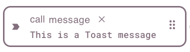

# Toast

The toast is a timed, temporary notification that displays a message at the top or bottom of the screen when triggered.

<figure><figcaption></figcaption></figure>

## Settings

All customization options in the toast widget are in the Settings tab :gear:.

### Notification type

There are 4 types of toast: `Info`, `Warning`, `Error` and `Success`. The type can be selected in the `Notification Type` dropdown and the color of each type is set in the Theme Builder.&#x20;

<figure><figcaption>
Toast types in the default theme colors
</figcaption></figure>

The Info, Warning, Error and Success colors are the same throughout the app and across different widgets (eg. Buttons).

### Display Time

The `Display Time` is the amout of time the toast will be visible for in milliseconds. You can type the display time in the number box. The default is 3 seconds.

### Position

You can choose where the Toast appears on the screen. There are 6 options: either at the top or bottom of the screen, and right, left or center.

## Setting the Toast message

<figure><figcaption>
Toast widget  in build mode
</figcaption></figure>

When adding the toast widget to the app Frontend Builder, it will look like a small message icon. The icon disappears on the deployed app or in test mode, so the location of the widget doesn't matter.&#x20;

To set the toast message, drag an output onto the widget. The only action that can be performed is "call message".

<figure><figcaption></figcaption></figure>

The content of the output is the message in the toast, and the `call message` action is triggered when the output is updated.

Multiple outputs can be connected to the same toast widget, and the toast will only display the message in the output that was triggered.&#x20;


**Note:** Messages that are linked to the same toast **and** are triggered at the same time will all appear stacked in the same spot. To avoid that, it's advisable to either stagger the trigger events or set up extra toasts.


## Video Demo


