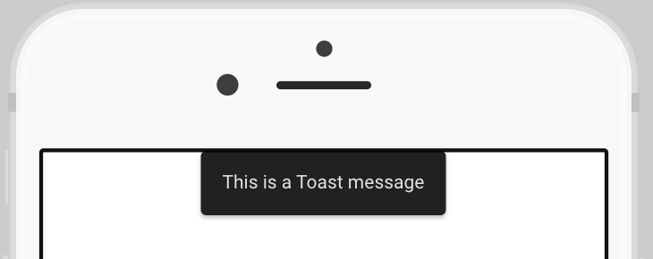
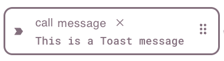

# Toast

The toast widget displays temporary, timed notification messages at specified positions on the screen. It visualizes alert text strings or detailed event error objects triggered by backend logic in your Apps.

<figure><figcaption></figcaption></figure>

## Data binding

### Function output or modifier to widget

| **Property** | **Description** | **Type** |
| :--- | :--- | :--- |
| `message` | Supplies the text string or structured object block to be broadcast as a temporary notification. | string \| object |

### Data formats

The `message` property accepts either a flat string or a structured object to dynamically append cause diagnostics to the notification framework.

**Plain text message**
A standalone string printed directly within the notification body:
`"Operation completed successfully."`

**Structured message object**
An object containing explicit `message` and optional `cause` properties. If a `cause` is provided, the widget appends it to the display layout automatically as `${message}, because: ${cause}`:
```json
{
  "message": "Database write failed",
  "cause": "Connection timeout"
}
```

<figure><figcaption></figcaption></figure>

## Configuration

Set the widget's defaults in the settings panel.

<div align="center"><figure><figcaption><p>Toast widget in build mode</p></figcaption></figure></div>

### General settings

| **Property** | **Label** | **Description** | **Type** |
| :--- | :--- | :--- | :--- |
| `type` | Notification type | Sets the notification alert category style (options include `info`, `warning`, `error`, or `success`). Visual color schemes are managed globally within the Theme Editor. | string |
| `displayTime` | Display time | Sets the duration in milliseconds that the notification stays visible on screen before automatically fading out. Defaults to `3000` (3 seconds). | integer |
| `position` | Position | Sets the display anchor placement region on the screen viewport (such as top right, top center, top left, bottom right, bottom center, bottom left). | string |

<figure><figcaption><p>Toast types in the default theme colors</p></figcaption></figure>

## Tips and tricks


#### Message stacking and mobile viewport scaling
When multiple backend parameters trigger the same toast widget simultaneously, the individual notifications stack on top of each other in the same position. To maintain absolute layout clarity, stagger your upstream trigger event timings or instantiate separate toast widgets.

On mobile phone viewports, the widget automatically ignores external structural parameters and optimizes its dimensions to fill the width of the screen minus 32 pixels.


## Video demo


