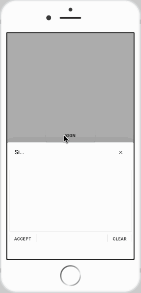

# Signature

The **Signature** widget provides a canvas for capturing handwritten signatures. It can be displayed either as an inline pad or as a popup window launched by a button.

This widget is ideal for forms and documents that require user authorization, such as contracts, agreements, or delivery confirmations. The captured signature is saved as a PNG image.

<figure><figcaption></figcaption></figure>

<figure><figcaption></figcaption></figure>

## Data Binding

Connect the widget to your application's logic by dragging the corresponding items from the Flow Builder.

### Input

| **Property**    | **Type** | **Description**                                                                                                                                                         |
| --------------- | -------- | ----------------------------------------------------------------------------------------------------------------------------------------------------------------------- |
| **`signature`** | `String` | Fired when the user accepts a signature. The payload is a Base64-encoded string representing the signature as a PNG image, without the `data:image/png;base64,` prefix. |

## Configuration

### Settings

These properties control the appearance and text of the signature pad.

| **Label**        | **Description**                                                                                                                                                | **Type**       | **Property**  |
| ---------------- | -------------------------------------------------------------------------------------------------------------------------------------------------------------- | -------------- | ------------- |
| **Pen Color**    | Sets the color of the signature ink.                                                                                                                           | String (Color) | `penColor`    |
| **Pad Color**    | Sets the background color of the signature pad.                                                                                                                | String (Color) | `padColor`    |
| **Display Mode** | Determines how the signature pad is displayed. `Inline` shows the pad directly on the page, while `Popup` shows a button that opens the pad in a popup window. | String         | `displayMode` |
| **Accept Text**  | The text displayed on the button for confirming and saving the signature.                                                                                      | String         | `acceptText`  |
| **Clear Text**   | The text displayed on the button for clearing the signature pad.                                                                                               | String         | `clearText`   |
| **Button Text**  | The text displayed on the main button when `Display Mode` is set to `Popup`.                                                                                   | String         | `buttonText`  |

