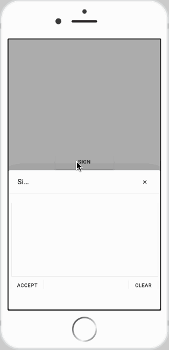

# Signature

The signature widget provides a canvas for capturing handwritten signatures. It appears either as an inline pad or as a popup window that a button opens.

It suits forms and documents that need user authorization, such as contracts, agreements, or delivery confirmations. Heisenware saves the captured signature as a PNG image.

<figure><figcaption></figcaption></figure>

## Data binding

Link this widget to your logic by dragging items from the [Backend Builder](../../../build-backend/) onto it.

### Input

| **Property**    | **Type** | **Description**                                                                                                                                                         |
| --------------- | -------- | ----------------------------------------------------------------------------------------------------------------------------------------------------------------------- |
| **`signature`** | `String` | Fired when the user accepts a signature. The payload is a Base64-encoded string representing the signature as a PNG image, without the `data:image/png;base64,` prefix. |

## Configuration

Set these in the widget's settings panel to control the signature pad's appearance and text. Some can also be driven dynamically through [data binding](./#configuration-and-data-binding).

| **Label**        | **Description**                                                                                                                                                | **Type**       | **Property**  |
| ---------------- | -------------------------------------------------------------------------------------------------------------------------------------------------------------- | -------------- | ------------- |
| **Pen color**    | Sets the color of the signature ink.                                                                                                                           | String (Color) | `penColor`    |
| **Pad color**    | Sets the background color of the signature pad.                                                                                                                | String (Color) | `padColor`    |
| **Display mode** | Determines how the signature pad is displayed. `Inline` shows the pad directly on the page, while `Popup` shows a button that opens the pad in a popup window. | String         | `displayMode` |
| **Accept text**  | The text displayed on the button for confirming and saving the signature.                                                                                      | String         | `acceptText`  |
| **Clear text**   | The text displayed on the button for clearing the signature pad.                                                                                               | String         | `clearText`   |
| **Button text**  | The text displayed on the main button when display mode is set to `Popup`.                                                                                     | String         | `buttonText`  |
