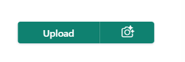
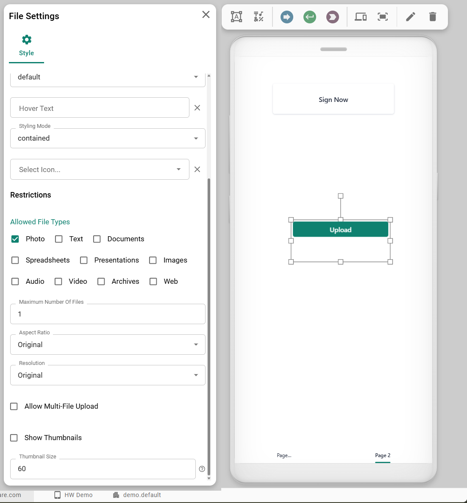

# Upload

The upload widget provides a full interface for file and photo uploads. Users can select one or multiple files, which can be stored either as physical files on the server or as Base64-encoded buffers within your data.

The widget includes features like file type restriction, multi-file selection, and thumbnail previews.

<figure><figcaption></figcaption></figure>

<figure><figcaption><p>A full and an empty upload widget</p></figcaption></figure>

## Data binding

Connect the widget to your application's logic by dragging the corresponding items from the [Backend Builder](../../../build-backend/).

### Input

| **Property** | **Type** | **Description**                                                                                                                                            |
| ------------ | -------- | ---------------------------------------------------------------------------------------------------------------------------------------------------------- |
| **`files`**  | `Array`  | Fired whenever files are successfully uploaded or deleted. The payload is an array of file objects. See the **File object structure** section for details. |

### Output

| **Property** | **Type**  | **Description**                                         |
| ------------ | --------- | ------------------------------------------------------- |
| **`clear`**  | `Boolean` | When `true`, clears all uploaded files from the widget. |

#### File object structure

The structure of the file objects in the `files` array depends on the configured storage type.

**If `storageType` is `File`:**

```json
{
  "lastModified": 1678886400000,
  "name": "document.pdf",
  "size": 102400,
  "type": "application/pdf",
  "path": "/shared/runtime-files/a1b2c3d4e5.pdf"
}
```

**If `storageType` is `Buffer`:**

```json
{
  "lastModified": 1678886400000,
  "name": "image.png",
  "size": 51200,
  "type": "image/png",
  "base64": "iVBORw0KGgoAAAANSUhEUgA..."
}
```

## Configuration

### Settings

Set these properties in the widget's settings panel to control the behavior and appearance of the upload widget. Some can also be driven dynamically through [data binding](./#configuration-and-data-binding).

| **Label**                   | **Description**                                                                                         | **Type** | **Property**      |
| --------------------------- | ------------------------------------------------------------------------------------------------------- | -------- | ----------------- |
| **Storage type**            | Determines how the uploaded file is stored: as a physical `File` on the server or as a Base64 `Buffer`. | String   | `storageType`     |
| **Restrict file types**     | Restricts the selectable file types. Users can select one or more predefined categories.                | Array    | `accept`          |
| **Allow multi-file upload** | If `true`, users can select and upload multiple files at once.                                          | Boolean  | `multiple`        |
| **Maximum number of files** | The total number of files that can be uploaded to the widget.                                           | Integer  | `maxFiles`        |
| **Show thumbnails**         | If `true`, displays a preview thumbnail for uploaded image files.                                       | Boolean  | `showThumbnails`  |
| **Thumbnail size**          | Sets the height (in pixels) of the preview thumbnails.                                                  | Number   | `thumbnailHeight` |

### Taking photos exclusively

<div align="left"><figure><figcaption></figcaption></figure></div>

When only the `Photo` category is selected (see the dedicated [Photo](photo.md) widget for camera-only capture), modern devices like mobile phones and tablets open the camera directly when the user taps the widget's button. To allow a combination of file and camera uploads, select all the categories you want to permit while leaving `Photo` active.

### Button configuration

The file selection is triggered by a button. You can customize its appearance using standard button properties. Common properties include:

* **`text`**: The text displayed on the button (e.g., "Upload File").
* **`icon`**: The icon displayed on the button (e.g., "upload").
* **`type`**: The button's style type (`normal`, `default`, `success`, `danger`).
* **`stylingMode`**: The visual style of the button (`text`, `outlined`, `contained`).

These properties are configured within a `button` object.
