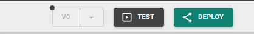

# Deploy & Maintain

[Building logic](build-backend/) and [designing UI](build-frontend/) is only half the battle. Heisenware provides tools to test your work in real-time, save snapshots of your progress, and eventually deploy your [apps to production](https://app.gitbook.com/s/E5Ketpww1s7TauSAJrJ8/production-apps).

## App Testing (Test Mode)

Before you deploy, you can use Test Mode to verify your logic and UI directly inside the App Builder. When active, the UI preview becomes fully interactive, and all backend logic goes "live."

* **How to start**: Click the Test button in the top toolbar.
* **Behavior**: The app will start polling data from connected sources or writing to databases. Form inputs become clickable, and buttons will trigger their connected flows.
* **Manual triggers**: Even in Test Mode, you can still manually click triggers on Function blocks in the Backend Builder to force-start a sequence.

<figure><figcaption>
TEST button
</figcaption></figure>

## Versioning Tags (Snapshots)

A versioning tag is a snapshot of your app's entire state, including all backend logic, UI elements, and data bindings.

<figure><figcaption></figcaption></figure>


**What is NOT in a tag?**

Tags do not store external files (from the file server), database table data, or global themes.


### Why use tags?

* **Undo/restore**: Create a "Save Point" before trying a risky logic change.
* **Templates**: Export a tag as a `.hwt` file to use it as a starting point for a new app.
* **Sharing**: Share your app configuration with other Heisenware accounts.

### Managing tags

* Manual creation: Click the Tag icon and give your snapshot a name.
* **Auto-Tags**: Heisenware automatically creates a tag every time you deploy an app.
* **Import/export**: Use the Download and Import icons in the tag history to move `.hwt` files between your computer and the platform.


**Recommendation**

Before importing, create a new tag of your current app state. This gives you a rollback point if the imported tag isn't what you expected.


### **Video demo versioning tags**



## Deployment

Deployment makes your app available to your users. To push your latest changes live, click DEPLOY in the upper-right corner.

<figure><figcaption>
DEPLOY button
</figcaption></figure>

* **Downtime**: Depending on the app's complexity, it may be offline for 10 to 30 seconds during a fresh deployment.
* **Distribution**: Click the version number after a successful deploy to find your unique app URL for sharing.


Too frequent deployments are not recommended for live production environments, as users will be prompted to reload the app when a new version is pushed.


<figure><figcaption></figcaption></figure>
