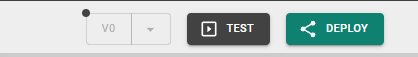

# Deploy and maintain

[Building logic](build-backend/) and [designing the UI](build-frontend/) is only half the job. Heisenware also lets you test your work in real time, snapshot your progress, and deploy your [Apps to production](https://app.gitbook.com/s/E5Ketpww1s7TauSAJrJ8/production-apps).

## App testing (test mode)

Before you deploy, test mode verifies your logic and UI directly inside the App Builder. Turn it on and the UI preview becomes fully interactive while all backend logic runs live.

* **How to start**: Click the Test button in the Top Bar.
* **Behavior**: The App starts polling data from connected sources or writing to databases. Form inputs become clickable, and buttons trigger their connected flows.
* **Manual triggers**: Even in test mode, click a trigger on any function block in the [Backend Builder](build-backend/) to force-start a sequence.

<figure><figcaption>
TEST button
</figcaption></figure>

## Tags (snapshots)

A tag is a snapshot of your App's entire state, including all backend logic, UI elements, and data bindings.

<figure><figcaption>
Tag icon in the App Builder
</figcaption></figure>


#### What is not in a tag?

Tags do not store external files (from the [File Explorer](build-backend/file-explorer.md)), database table data, or global themes.


### Why use tags?

* **Undo/restore**: Create a save point before trying a risky logic change.
* **Templates**: Export a tag as a `.hwt` file to use it as a starting point for a new App.
* **Sharing**: Share your App configuration with other Heisenware accounts.

### Managing tags

* **Manual creation**: Click the tag icon and give your snapshot a name.
* **Auto-tags**: Heisenware automatically creates a tag every time you deploy an App.
* **Import/export**: Use the Download and Import icons in the tag history to move `.hwt` files between your computer and the platform.


#### Recommendation

Before importing, create a new tag of your current App state. This gives you a rollback point if the imported tag isn't what you expected.


### Video demo



## Deployment

Deployment makes your App available to your users. To push your latest changes live, click DEPLOY in the Top Bar.

<figure><figcaption>
DEPLOY button
</figcaption></figure>

* **Downtime**: Depending on the App's complexity, it may be offline for 10 to 30 seconds during a fresh deployment.
* **Distribution**: Click the version number in the Top Bar after a successful deploy to find your unique App URL for sharing.


Avoid frequent deployments in live production environments. Every new version prompts users to reload the App.


<figure><figcaption></figcaption></figure>
