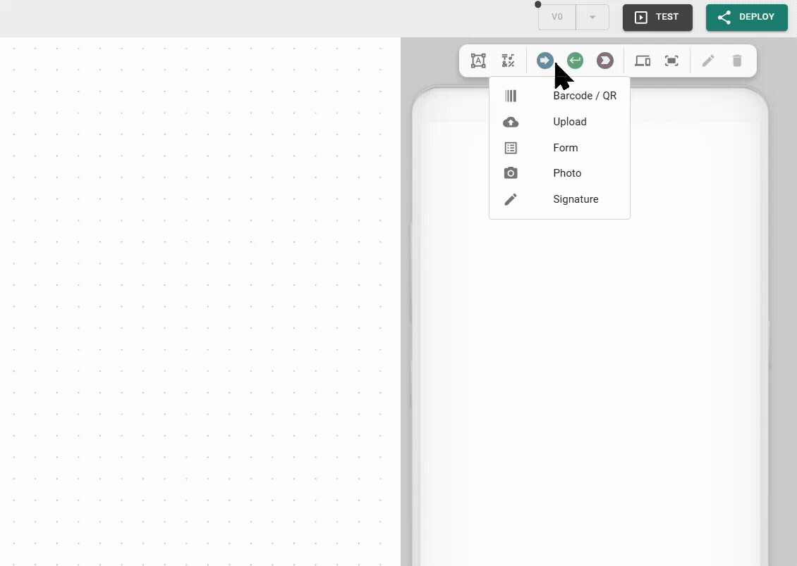

# Page editor

The UI is what users of your Apps see and interact with. It ranges from simple dashboards and data visualizations to interactive Apps for user input, file management, and more.


#### Optional user interface

The UI is optional. You can build headless Apps that use pure backend logic, like a data bridge between a PLC and a SQL database, running silently with no visual frontend.


## Core UI components

* [**Widgets**](../reference/widgets/README.md): The functional components of your App. They display live data, capture user input, or trigger logic.
* [**Pages**](explorers/pages.md): The individual screens of your App. Create multiple pages and subpages to structure your App logically, then configure navigation elements so users can move between them.
* [**Text, icons, and images**](page-editor.md): Mostly static elements used for branding, instructions, and non-interactive content.
* [**PDF templates**](template-editor.md): Visual layouts for generating dynamic documents. Map variables onto a document background, then populate them from your backend logic.
* [**Theme**](theme-editor.md): The global visual DNA of your App. Ensures a consistent look across all widgets and pages.

## Working in the Page editor

Turn backend logic into a functional, user-facing App inside the Page editor. Place static elements for context and dynamic widgets on each page, then configure them using backend logic.

Build Apps for any screen size and switch the preview as you go to verify that your layout holds up on everything from a smartphone to a large desktop monitor.

### The toolbar

The toolbar serves as your main kit for composing the interface. It holds buttons and icons to:

* Add a text box, icon, or widget.
* Switch the screen preview.
* Extend page height to enable scrolling and scale the view.
* Edit or delete the selected widget. These icons (pen and trash) activate only when you select a widget or UI element.

<figure><figcaption></figcaption></figure>

### Placing and moving elements

Add an element by selecting it from the toolbar and clicking anywhere on the canvas. Once placed, you can:

* **Move**: Drag the element to a new position on the canvas.
* **Resize or rotate**: Use the grab markers on the corners and edges to change the element's dimensions or orientation.
* **Open settings**: Double-click the widget, or select it and click the pen icon in the toolbar.
* **Align with snaplines**: Snaplines appear automatically to help align widgets and other UI elements with each other.
* **Pixel-perfect positioning**: Hold the Shift key while moving an element to temporarily disable snaplines for precise placement.
* **Adjust layers and layout**: Right-click any element to adjust the stacking order of overlapping items, stretch it to full width, or toggle tile view.

<figure><figcaption>
Page editor basics
</figcaption></figure>


#### Screen-specific layout saving

Heisenware saves changes to an element's position or size per device size. Always check other screen previews to ensure the layout stays clean across all hardware.


### Context menu tools

Right-click any element to open a menu for quick layout actions and layer management.

* _Order_: Adjust the stacking of overlapping elements to control which item appears in the foreground or background.
* _Full width_: Instantly stretches the element to fill the entire horizontal space of your current screen preview.
* _Toggle tile view_: Switches the element into a tiled display mode.

### Screen preview and responsive behavior

[Heisenware Apps](https://app.gitbook.com/s/E5Ketpww1s7TauSAJrJ8/production-apps) are responsive by nature and adapt to different screen sizes automatically. Control exactly how your App behaves on different hardware using these toolbar tools:

* **Switching previews**: Click the screens icon (<i class="fa-laptop-mobile">:laptop-mobile:</i>) and click a device icon to switch to the corresponding UI editor and adapt your layout.

<figure><figcaption></figcaption></figure>

* **Enable or disable screens**: Right-click any device icon to enable or disable specific screen sizes. By default, only the phone, tablet, and laptop are active. When a user opens your App on a disabled screen size, Heisenware scales the layout from the nearest active device size. The preview never stays on a disabled screen: disable the one you are editing and the builder moves to the App's reference screen, or to the nearest enabled one.
* **Content alignment (L and XL)**: On large monitors, decide how the overall content sits on the screen. Right-click the L or XL icons to choose between left-aligned or centered layouts.

<figure><figcaption></figcaption></figure>

* **Scaling**: Use the scaling bar to zoom the current preview in or out. This serves as a design-time aid only and does not change the App's actual size for the user.
* **Extend height**: Use the page height icon (<i class="fa-arrows-up-down">:arrows-up-down:</i>) in the toolbar to add vertical space and enable scrolling for the selected device size. This lets you scroll on mobile while keeping a fixed dashboard on desktop. If a page height does not change when you reduce it, a widget is likely positioned outside the valid area. Move or delete that widget first.

### Pin a setting to one screen

Position and size are always saved per screen. Every other widget setting is shared across screens until you pin it: hover a field in the widget's settings and click the pin (<i class="fa-thumbtack">:thumbtack:</i>) to give the selected screen its own value for that one field. A solid pin marks a field that is pinned on the screen you are editing; a faded pin marks one that is pinned on another screen, and its tooltip names them. Click a solid pin to share the field again.

Some settings are pinned by nature because their right value depends on the screen, not on the data: column counts, font sizes, spacing, legend placement, chart orientation. These always belong to the screen you set them on, and the other screens keep the widget's default until you set them there. They show a pin you cannot switch off.

One of them is on every widget: the **Visible** switch at the top of the General tab. Switch it off to drop the widget from the screen you are editing; it stays on every other screen. A hidden widget takes no space in the deployed App, and in the builder it stays as a faded ghost you can still select and switch back on. Hiding a group hides its members with it; a member inside a group follows its group.

Widgets inside a [group](../reference/widgets/layout/group.md) have no pins: the group's tile is one thing on every screen (a narrow screen shows it zoomed down), so every setting of a member is shared, the ones pinned by nature included, and their fields show no pin. Grouping keeps what you see: the values pinned on the screen you group on become the members' shared values, and pins on other screens go.


#### Workflow best practices

1. **Start on the reference screen**: Design the layout on the screen the App is mainly used on. Every other screen follows it automatically.
2. **Visit each enabled screen**: Move and resize where the automatic layout is not good enough; that screen keeps its own layout from then on.
3. **Pin what differs**: Where a phone needs one column and a large font while the desktop needs three and a small one, the setting is pinned by nature - set it on each screen. Pin any other field yourself when one screen needs its own value.


## Text, icons and images

Text, icons, and images add visual design, branding, and instructions to your interface. They are static, non-interactive elements, though you can turn an icon into a navigation link.

### Text box

Use text boxes for titles, labels, and detailed instructions.

* **Add**: Click the text box icon in the Page editor toolbar and click the canvas to place it.
* **Edit**: Double-click the text box to open its settings. The *Content* tab is the text editor, where you type and format text, insert static tables, quotes, code, and rules; *Look & feel* sets the vertical alignment.
* **Look**: Headings, lists, tables, quotes, and code render in one consistent style that takes its colors from the App theme, so a text box looks right in light and dark themes alike.

The AI assistant writes text boxes in Markdown, including tables. Pictures belong to the [image widget](../reference/widgets/trigger/image.md).

<figure><figcaption></figcaption></figure>

### Icons

Use icons as visual cues or navigation shortcuts.

* **Add**: Click the icon button in the Page editor toolbar, pick an icon from the library, and click the canvas to place it.
* **Style**: Double-click the icon to open its settings, where you switch styles (solid, regular, light, thin, duotone), change the color, and apply a background.
* **Navigation**: Turn an icon into a button by dragging a page from the Page Explorer directly onto it.

<figure><figcaption></figcaption></figure>

### Images

Use images for machine photos, company logos, or other visual elements.

* **Upload**: Upload your image file to the [File Explorer](explorers/files.md).
* **Place**: Drag the file from the File Explorer and drop it onto the UI canvas.

<figure><figcaption>
Add Image to UI
</figcaption></figure>


##### Dynamic use

Beyond the UI, your backend logic can also take an uploaded image as an input.

