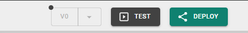

# Test and deploy

[Building logic](flowboard/README.md) and [designing the UI](page-editor.md) is only half the job. Heisenware also lets you test your work in real time, save checkpoints, and deploy your Apps to your [users](../app-player/README.md).

## Test mode

Before you deploy, test mode verifies your logic and UI directly inside the App Builder. Turn it on and the UI preview becomes fully interactive while all backend logic runs live.

* **How to start**: Click **Test** in the top bar.
* **Behavior**: The App starts polling data from connected sources or writing to databases. Form inputs become clickable, and buttons trigger their connected flows.
* **Manual triggers**: Even in test mode, click the trigger of any executor on the [Flowboard](flowboard/README.md) to force-start a sequence.

<figure><figcaption>
<strong>Test</strong> button
</figcaption></figure>

## Versions and checkpoints

A checkpoint is a saved version of your App's entire state, including all backend logic, UI elements, and links. The Builder lists checkpoints under **Tags**.

<figure><figcaption>
Tag icon in the App Builder
</figcaption></figure>


#### What is not in a checkpoint?

Checkpoints do not store files (from the [Files explorer](explorers/files.md)), database table data, or global themes.


### Why use checkpoints?

* **Undo/restore**: Create a checkpoint before trying a risky logic change.
* **Bundles**: Export a checkpoint as a bundle (`.hwt`) to start a new App from it.
* **Sharing**: Share your App configuration with other Heisenware accounts.

### Managing checkpoints

* **Manual creation**: Click the tag icon and name the checkpoint.
* **Releases**: Heisenware saves a version every time you deploy an App.
* **Import/export**: Use the Download and Import icons in the **Tags** list to move bundles between your computer and the platform. An imported bundle appears as a new checkpoint named after the file; your App does not change until you click it and confirm the switch.
* **What a bundle contains**: your App's configuration plus every file from the `uploads` and `project` folders it references (images, CSVs, documents), so the App looks and works the same on another server. Code that builds a file name at runtime, such as `'/shared/uploads/icons/' + name`, takes the whole `icons` folder along; keep such files in a folder of their own rather than directly under `uploads`. Files that already exist on the target keep their local copy. Runtime files and backups are not included. **Secrets never travel**: secret variables and secret inputs arrive empty, and the import summary lists the ones you have to enter, together with any agents the App uses that the target server does not have yet.


#### Recommendation

Before switching to an imported checkpoint, create a checkpoint of your current App state. It is your way back if the import isn't what you expected.


### Video demo



## Deployment

Deployment makes your App available to your users. To push your latest changes live, click **Deploy** in the top bar.

<figure><figcaption>
<strong>Deploy</strong> button
</figcaption></figure>

* **Downtime**: Depending on the App's complexity, it may be offline for 10 to 30 seconds during a fresh deployment.
* **Distribution**: Click the version number in the top bar after a successful deploy to find your unique App URL for sharing.


Avoid frequent deployments while users work with the App. Every new version prompts users to reload the App.


<figure><figcaption></figcaption></figure>
