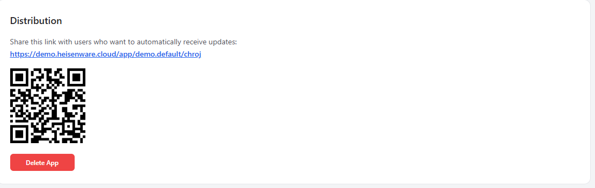

# App Manager tour

The App Manager is the administrative center of your Heisenware account. Here you create new Apps, monitor account usage, and manage your members.

<figure><figcaption></figcaption></figure>

## Key features

The App Manager has five main areas:

* [**Apps**](README.md#apps): The default landing page where you create, configure, and deploy Apps. From here, you can also [manage App access and your users](users-and-access.md).
* [**Dashboard**](README.md#dashboard): A real-time summary of account-wide performance and user metrics.
* [**Members**](members.md): The interface for inviting and managing your members.
* [**Agents**](agents/README.md): Build, update, restart and roll out builds to the [Agents](../concepts/agents-and-where-code-runs.md) installed on your hosts.
* [**Integrations (inbound)**](integrations.md): Monitor and authorize data from MQTT and VRPC clients and MCP connectors.

## Apps

Manage Apps, their settings, and users inside the Apps panel.

### Create a new App



#### Initialize

Click the plus icon in the top bar to create a new App container.

<figure><figcaption></figcaption></figure>



#### Configure

Enter a name and description, upload an icon, and define your initial [Users and access](users-and-access.md) settings.

<figure><figcaption></figcaption></figure>



#### Start building

Click Start App Builder on the App card to open the development environment in a new tab.

<figure><figcaption></figcaption></figure>




The total number of Apps you can create depends on your plan. [Contact us](mailto:support@heisenware.com) if you need additional Apps for your plan.

An App beyond the plan's quota cannot be opened by anyone: the platform refuses to register it for access, and its page says so instead of loading. The App Manager's create button and the AI assistant's `create_app` refuse at the quota, naming the plan and the limit; delete an App or raise the plan under Plan & Billing, and the platform registers the waiting App within a minute.


### App settings

* **Name**: The visible title on desktops, home screens, and browser tabs. Keep this under 10 characters for the best mobile display.
* **Description**: Optional internal notes. These are not visible to users.
* **Icon**: The logo used for the favicon and home screen icon. Works best as a square image. Leave padding around the logo, since mobile devices often apply a circular cutout.
* **Language**: The one language the App speaks: the texts of its widgets (grid messages, editors, validation), the player's own screens (sign-in, connection notices, the install prompt) and the document language. The browser's language plays no role once the App is known. Every language DevExtreme ships a dictionary for is available; the setting lives here only, the App Builder shows it. To offer an App in several languages, create one App per language: export the reference App as a bundle, import it as a new App with its own URL and translate its texts (the AI assistant can help), then link the Apps to each other.

### App status and control

Each App card shows its current availability:

* <mark style="background-color:green;">**RUNNING**</mark>: The App is live and reachable via its URL.
* <mark style="background-color:orange;">**EXITED**</mark>: The App has been manually stopped.
* **CREATED**: The App container exists but has never been deployed.
* <mark style="background-color:red;">**UNAVAILABLE**</mark>: An error has occurred. Try to redeploy.

### Delete an App

Click the red Delete App button to remove an App.


#### Deleting an App is irreversible

There is no undo. Save a [tag](../app-builder/test-and-deploy.md#tags-snapshots) (`.hwt` file) from the App Builder before deleting if you want to preserve your work.


<figure><figcaption></figcaption></figure>

### Distribution

Each App is distributed via a unique URL or QR code, both found directly on the App card in the Apps panel.

<figure><figcaption></figcaption></figure>

### Maintenance

To take an App offline, use the action switch on the card to toggle between Run and Stop.

<figure><figcaption></figcaption></figure>

## Dashboard

The Dashboard panel gives you a real-time summary of your account's performance, including usage stats like total App views and unique users across all Apps.
