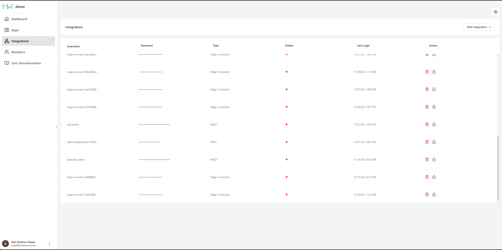

# Integrations (inbound)

The Integrations panel gives you a central overview of every inbound data connection from external systems. Whatever sends data to Heisenware, an IoT sensor, a custom Python script, or a Heisenware Agent, shows up here.

<figure><figcaption>
Integrations panel
</figcaption></figure>

## Integration types

Heisenware connects external data three ways:

### Native or Docker Agent

[Agents](../app-builder/build-backend/function-explorer/agents/) securely bridge data from private networks (on-premises servers, local databases) to the cloud.

* **Setup**: You create and deploy Native Agents directly in the App Builder. You download and deploy Docker Agents via Docker.
* **Management**: Once deployed, an Agent entry appears in the Integrations panel for monitoring. No manual credentials required.

### MQTT client

The standard choice for general IoT use cases. Use this for sensors or devices that push data to Heisenware's MQTT broker.

### [VRPC](../advanced/vrpc/) client

An advanced method for connecting custom code and proprietary libraries, the most powerful option for specialized software integrations.

## Connecting MQTT and VRPC clients

Agents connect automatically, but MQTT and VRPC clients need authorization one of two ways:

### Method 1: Manual credential creation

Use this method to pre-configure your external client with a fixed username and password.



#### Create

Click Create in the Integrations panel.



#### Select type

Select if you need an MQTT or VRPC client.



#### Edit/copy credentials

Copy the generated credentials or edit them to your needs.



#### Connect

Paste these credentials into your external client's configuration.



### Method 2: Smart onboarding

The preferred, passwordless method. The external client sends a request, and you approve it in the App Builder. For a detailed guide, see the [smart onboarding section](../app-builder/build-backend/function-explorer/#smart-onboarding).

## Integrate custom code via VRPC

To integrate your code, write a [Code Adapter](../account/hosting-and-architecture.md#custom-code-adapters) around your existing functions, then load it as a Custom Extension.

* **Supported languages**: Arduino (ESP32), C++, Node.js, and Python.
* **Use cases**: Integrating legacy systems, running complex algorithms, or using specialized software libraries.


#### Technical implementation

For details, examples, and adapter setup, visit our [VRPC developer section](../advanced/vrpc/).

