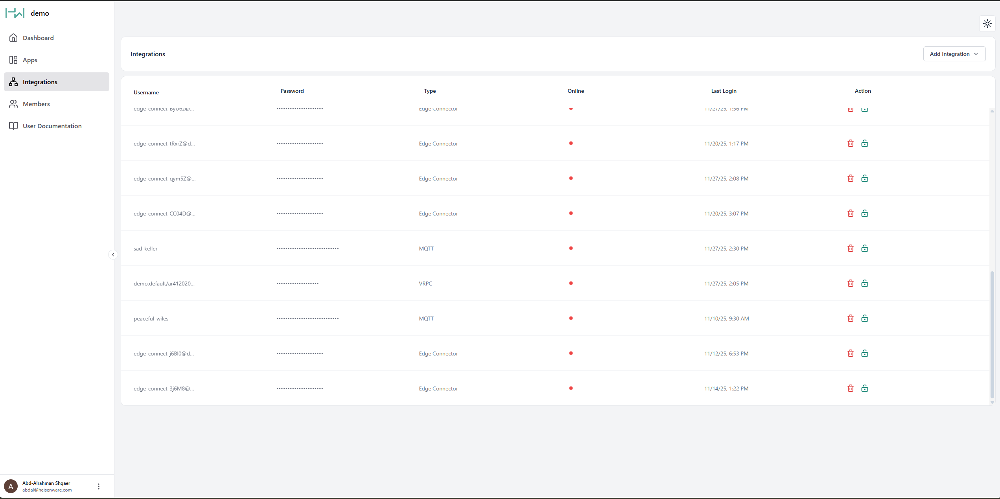

# Integrations (Inbound Connections)

The Integrations panel provides a centralized overview of all inbound data connections from external systems. Every external system that sends data to Heisenware (whether it is an IoT sensor, a custom Python script, or a Heisenware Agent) is tracked here.

<figure><figcaption>
Integrations panel
</figcaption></figure>

## Integration Types

Heisenware supports three primary methods for connecting external data:

### Heisenware Native or Docker Agent&#x20;

[Agents](../app-builder/build-backend/function-explorer/agents/) are used for securely bridging data from private networks (on-premise servers, local databases) to the cloud.

* **Setup**: Native Agents are created and deployed directly within the App Builder. Docker Agents can be downloaded and deployed via Docker.
* **Management**: Once deployed, the Edge Agent entry is automatically generated in the Integrations panel for monitoring. No manual credentials are required.

### MQTT Client

The standard choice for general IoT use cases. Use this for sensors or devices that push data to Heisenware's MQTT broker.

### [VRPC](../developers/vrpc/) Client

An advanced method used to connect custom code and proprietary libraries. This is the most powerful option for specialized software integrations.

## Connecting MQTT and VRPC Clients

While Agents connect automatically, MQTT and VRPC clients require authorization via one of two methods:

### Method 1: Manual Credential Creation

Use this method when you want to pre-configure your external client with a fixed username and password.



#### Create

Click Create in the Integrations panel.



#### Select type

Select if you need an MQTT or VRPC client.



#### Edit/copy credentials

Copy the automatically created credentials or edit them according to your needs.



#### Connect

Paste these credentials into your external client's configuration.



### Method 2: Smart Onboarding

The preferred "passwordless" method. The external client initiates a request, which you simply approve within the App Builder.&#x20;

For a detailed guide on this process, please refer to the [smart onboarding section](../app-builder/build-backend/function-explorer/).

## Integrate Custom Code via VRPC

To integrate your code, you must write a [Code Adapter](../account/hosting-and-architecture.md#custom-code-adapters) around your existing functions (which can then be loaded as a Custom Extension).

* **Supported Languages**: Arduino, C++, Node.js, Python, R, and React.
* **Use Cases**: Integrating legacy systems, running complex algorithms, or using specialized software libraries.


#### Technical Implementation

For details, examples, and adapter setup, visit our [VRPC developer section](../developers/vrpc/).

