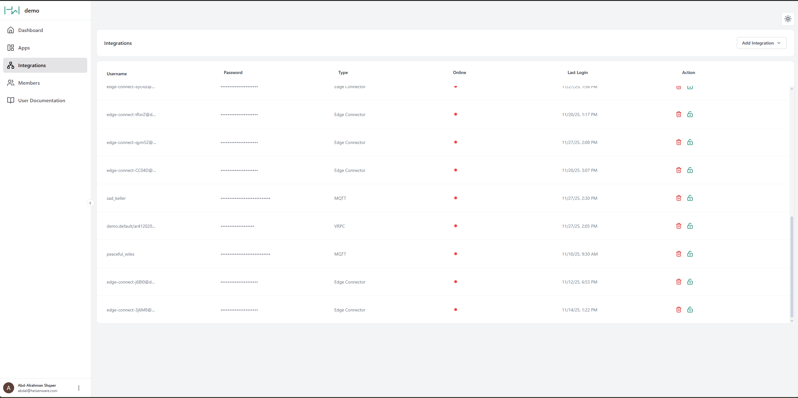

# Integrations

The Integrations panel gives you a central overview of every inbound data connection from external systems: an IoT sensor, a custom Python script, or an MCP client. Native agents have their own panel, [Agents](agents/README.md), where they are built, updated and restarted.

<figure><figcaption>
Integrations panel
</figcaption></figure>

## Integration types

Heisenware connects external data three ways:

### Native or Docker agent

[Agents](../concepts/agents-and-where-code-runs.md) securely bridge data from private networks (on-premises servers, local databases) to the cloud.

* **Setup**: You create and deploy native agents directly in the App Builder. You download and deploy Docker agents via Docker.
* **Management**: Once deployed, an agent entry appears in the Integrations panel for monitoring. No manual credentials required.

### MQTT client

The standard choice for general IoT use cases. Use this for sensors or devices that push data to Heisenware's MQTT broker. Inside your Apps, the [MQTT client connector](../reference/functions/connectors/mqtt-client.md) handles these messages. For a full walkthrough, see [Connect an external MQTT client](../labs/connect-an-external-mqtt-client.md).

### [VRPC](../developers/vrpc/README.md) client

An advanced method for connecting custom code and proprietary libraries, the most powerful option for specialized software integrations.

### Native agent

Native agents are built, listed and updated in the [Agents panel](agents/README.md). Their credentials are created there too; this panel does not show them.

### MCP connector

Lets your own AI client (Claude Code, Claude Desktop, any MCP client) drive the platform; see [MCP server](../assistant/mcp-server.md). The panel builds a package with the integration's credentials inside and hands you the lines to paste. Tick _read-only_ for a production-support connector that cannot change anything.

## The integration and its executable

An MCP connector is an integration with a package attached. The **Executable** column shows the file the platform built; click it to see its size and build time, download it, or copy a link with a twelve-hour access ticket, together with the lines to paste into the client.

The **Executables** list below the integrations shows every package the platform serves from its `mcp` zone, whether or not an integration claims it. Each can be shown, downloaded and deleted from there; deleting a file does not touch the clients that already installed it, and it can be built again. The view also offers **Rebuild**: after a platform update the package is built again from the current connector, with the same credentials, so the client only needs a fresh link. Changing the password rebuilds the package, deleting the integration deletes it, and deactivating the integration stops the package at its next login. Every integration holds one authority, shown in the **Access** column: full access to its workspace.

## Connecting MQTT and VRPC clients

Agents connect automatically, but MQTT and VRPC clients need authorization one of two ways:

### Method 1: Manual credential creation

Use this method to pre-configure your external client with a fixed username and password.



#### Create

Click Create in the Integrations panel.



#### Select type

Select if you need an MQTT or VRPC client.



#### Edit/copy credentials

Copy the generated credentials or edit them to your needs.



#### Connect

Paste these credentials into your external client's configuration.



### Method 2: Smart onboarding

The preferred, passwordless method. The external client sends a request, and you approve it in the App Builder. For a detailed guide, see the [smart onboarding section](../app-builder/explorers/functions.md).

## Integrate custom code via VRPC

To integrate your code, write a [code adapter](../self-hosting/README.md#code-adapters-add-ons) around your existing functions, then load it as a custom add-on.

* **Supported languages**: Arduino (ESP32), C++, Node.js, and Python.
* **Use cases**: Integrating legacy systems, running complex algorithms, or using specialized software libraries.


#### Technical implementation

For details, examples, and adapter setup, visit our [VRPC developer section](../developers/vrpc/README.md).

