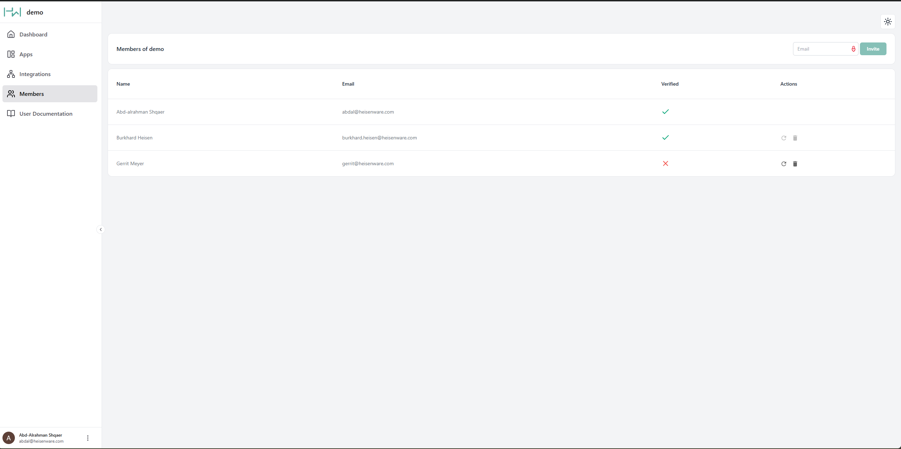

# Members

Members are the developers and admins who build and manage apps in a Heisenware account. Navigate to the Members panel to manage your team.


#### Members vs. App Users

Members build the apps. App users are the end-users who use your published applications. To manage permissions for your end-users, see the [access and users management](access-and-user-management.md) page.


To manage members, navigate to the Members panel. Here you can:

* **Invite**: Enter an email address in the top-right box and click Invite.
* **Verify**: If a teammate didn't get their email, click the resend icon (<i class="fa-arrow-rotate-right">:arrow-rotate-right:</i>).
* **Delete**: Click the trash icon (<i class="fa-trash">:trash:</i>) to remove a member.

<figure><figcaption></figcaption></figure>
