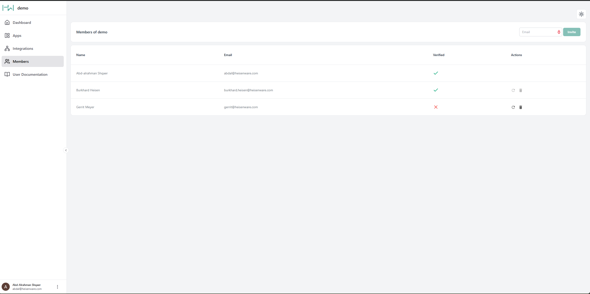

# Members

Members are the developers and admins who build and manage Apps in a Heisenware account. Navigate to the Members panel to manage your team.


#### Members vs. users

Members build the Apps. Users are the people who use your published Apps. To manage permissions for your users, see [Users and access](access-and-user-management.md).


To manage members, navigate to the Members panel. Here you can:

* **Invite**: Enter an email address in the top-right box and click Invite.
* **Verify**: If a member didn't receive their invite email, click the resend icon (<i class="fa-arrow-rotate-right">:arrow-rotate-right:</i>).
* **Delete**: Click the trash icon (<i class="fa-trash">:trash:</i>) to remove a member. This immediately revokes their access to the account.

<figure><figcaption></figcaption></figure>
