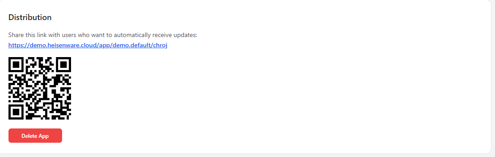

# Overview

The App Manager is the administrative center of your Heisenware account. It is used to initialize new projects, monitor account usage, and manage your development team.

<figure><figcaption></figcaption></figure>

## Key Features

The App Manager is divided into four primary functional areas:

* [**App Management**](overview.md#apps): The default landing page where you create, configure, and deploy applications. From here, you can also [manage app access and your end-users](access-and-user-management.md).
* [**Dashboard**](overview.md#dashboard): A real-time summary of account-wide performance and user metrics.
* [**Members**](members.md): The interface for inviting and managing your development team.
* [**Integrations (Inbound Connections)**](integrations-inbound-connections.md): Monitoring and authorizing data from Edge Agents, MQTT, and VRPC clients.

## App Management

Manage apps, their settings, and users inside the apps panel.

### Create a New App



#### Initialize

Click the plus icon in the top bar to create a new application container.

<figure><figcaption></figcaption></figure>



#### Configure

Enter a name and description, upload an icon, and define your initial [access management](access-and-user-management.md) settings.

<figure><figcaption></figcaption></figure>



#### Start building

Click Start App Builder on the app card to open the development environment in a new tab.

<figure><figcaption></figcaption></figure>




The total number of apps that you can create depends on your plan. [Contact us](mailto:support@heisenware.com) if you require additional apps for your plan.


### App Settings

* **Name**: The visible title on desktops, home screens, and browser tabs. Keep this under 10 characters for the best mobile display.
* **Description**: Optional internal notes. These are not visible to end-users.
* **Icon**: The logo used for the favicon and home screen icon. Works best if you use a square image. Leave padding around the logo, as mobile devices often apply a circular cutout.
* **Language (Beta)**: Heisenware can automatically translate your app using AI. Supported reference languages include English, German, French, Turkish, Italian, and Spanish.  [Contact us](mailto:support@heisenware.com) for access to this feature.

### App Status & Control

Each app card displays its current availability:

* <mark style="background-color:green;">**RUNNING**</mark>: The app is live and reachable via its URL.
* <mark style="background-color:orange;">**EXITED**</mark>: The app has been manually stopped.
* **CREATED**: The app container exists but has never been deployed.
* <mark style="background-color:red;">**UNAVAILABLE**</mark>: An error has occurred. Try to redeploy.

### Delete an App

Click the red Delete App button to remove an application. This action is irreversible. Always save a [versioning tag (`.hwt` file)](../app-builder/deploy-and-maintain.md#versioning-tags-snapshots) from the App Builder before deleting if you wish to preserve your work.

<figure><figcaption></figcaption></figure>

### Distribution

Apps are distributed via a unique URL or a QR code. Both are found directly on the app card in the Apps panel.

<figure><figcaption></figcaption></figure>

### Maintenance

To take an app offline, use the Action Switch on the card to toggle between Run and Stop.

<figure><figcaption></figcaption></figure>

## Dashboard

The Dashboard panel provides a real-time summary of your account's performance including usage stats like total app views and unique users across all applications.
